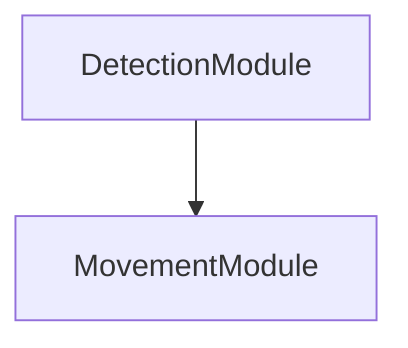
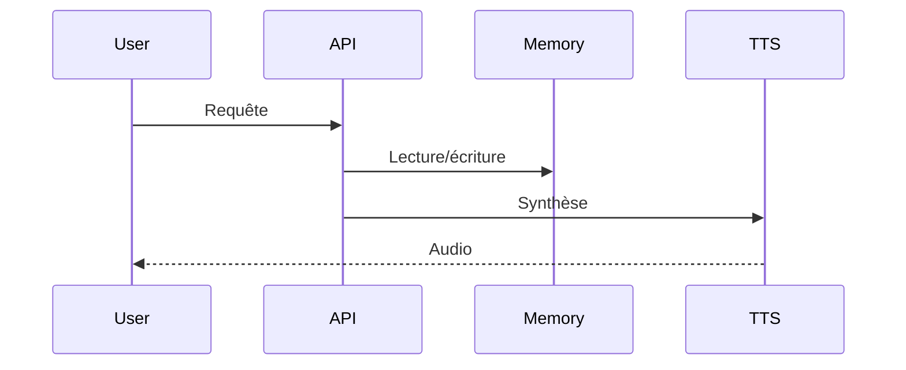

# Documentation technique
*Généré automatiquement le 2025-07-17 02:49*

## Description
Projet d'un balon bleu flottant qui peut détecter et suivre le vent

## Modules
- DetectionModule
- MovementModule

## Dépendances
- numpy
- opencv-python
- matplotlib

## Structure
- data/
- models/
- src/
- tests/

## Endpoints/API
### DetectionModule
- Endpoint : /api/DetectionModule
- Méthode : POST
- Payload : {"data": "..."}
- Réponse : {"result": "..."}
### MovementModule
- Endpoint : /api/MovementModule
- Méthode : POST
- Payload : {"data": "..."}
- Réponse : {"result": "..."}

## Dépendances (Mermaid)

## Séquence principale (Mermaid)
