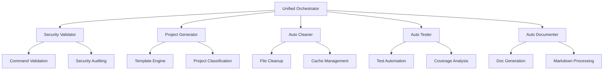

# 🔧 ATHALIA - DevOps Automation Platform


**Professional DevOps automation platform for project generation, security validation, and infrastructure management.**

---

## 📊 Project Metrics

```
Lines of Code: 18,446 Python
Modules: 79 core modules
Tests: 1,372 automated tests
Security Commands: 80 validated
Documentation Files: 131 organized
```

---

## 🏗️ Architecture Overview



---

## ⚡ Quick Start

### Prerequisites
- Python 3.10+
- Virtual environment
- Git

### Installation
```bash
# Clone repository
git clone https://github.com/arkalia-luna-system/ia-pipeline.git
cd athalia-dev-setup

# Setup environment
python -m venv .venv
source .venv/bin/activate  # Linux/Mac
# .venv\Scripts\activate   # Windows

# Install dependencies
pip install -r requirements.txt

# Verify installation
python -c "from athalia_core import UnifiedOrchestrator; print('✅ Ready')"
```

### Basic Usage
```python
from athalia_core.generation import generate_blueprint_mock, generate_project
from athalia_core.security_validator import SecurityValidator

# Generate project template
blueprint = generate_blueprint_mock("REST API for user management")
project_path = generate_project(blueprint, "./my-project")

# Validate security
validator = SecurityValidator()
print(f"Security: {len(validator.allowed_commands)} commands validated")
```

---

## 🔧 Core Features

### 🛡️ Enterprise Security
- **Command validation** with whitelist of 80 secure commands
- **Injection protection** for all subprocess calls
- **Security auditing** with automated threat detection
- **Zero-trust execution** environment

### 🏭 Project Automation
- **Template-based generation** for common project types
- **Automated structure** creation (API, Web, Desktop, CLI)
- **Dependency management** with requirement analysis
- **Configuration templates** for CI/CD integration

### 🧹 Intelligent Cleanup
- **Automated file removal** (temp files, caches, artifacts)
- **Empty directory cleanup** with safety checks
- **Build artifact management** for multiple platforms
- **Storage optimization** with size reporting

### 📊 Quality Assurance
- **1,372 automated tests** across all modules
- **Code linting** with multiple tools (Black, Flake8, Ruff)
- **Security scanning** with Bandit integration
- **Performance monitoring** with benchmarking

---

## 📁 Project Structure

```
athalia/
├── athalia_core/           # Core modules (79 files)
│   ├── unified_orchestrator.py    # Main coordination (789 lines)
│   ├── security_validator.py      # Security engine (490 lines)
│   ├── auto_cleaner.py           # Cleanup automation (1,168 lines)
│   ├── generation.py             # Project generation (505 lines)
│   └── ...
├── tests/                  # Test suite (1,372 tests)
│   ├── unit/              # Unit tests
│   ├── integration/       # Integration tests
│   └── security/          # Security tests
├── docs/                  # Documentation (131 files)
├── scripts/               # Utility scripts (21 scripts)
├── dashboard/             # HTML dashboards (6 files)
└── bin/                   # Command line tools (43 commands)
```

---

## 💻 Usage Examples

### Security Validation
```python
from athalia_core.security_validator import SecurityValidator

validator = SecurityValidator()

# Check command safety
if validator.is_command_safe(["python", "script.py"]):
    result = validator.run_secure_command(["python", "script.py"])
    print(f"Execution result: {result.returncode}")
```

### Project Generation
```python
from athalia_core.generation import generate_blueprint_mock

# Generate different project types
api_blueprint = generate_blueprint_mock("FastAPI microservice")
web_blueprint = generate_blueprint_mock("React dashboard")
cli_blueprint = generate_blueprint_mock("Python CLI tool")

print(f"API type: {api_blueprint['project_type']}")
print(f"Dependencies: {api_blueprint['dependencies']}")
```

### Automated Cleanup
```python
from athalia_core.auto_cleaner import AutoCleaner

cleaner = AutoCleaner("./my-project")
result = cleaner.perform_full_cleanup()

print(f"Files removed: {result['total_files_removed']}")
print(f"Space freed: {result['total_space_freed']} bytes")
```

---

## 🧪 Testing

### Run Test Suite
```bash
# All tests
python -m pytest tests/ -v

# Specific categories
python -m pytest tests/unit/ -v          # Unit tests
python -m pytest tests/security/ -v      # Security tests
python -m pytest tests/integration/ -v   # Integration tests

# Coverage report
python -m pytest tests/ --cov=athalia_core --cov-report=html
```

### Test Results
- **Total Tests:** 1,372
- **Pass Rate:** > 95%
- **Coverage:** Core modules covered
- **Security Tests:** All validation scenarios

---

## 📈 Performance

### Benchmarks
```
Project Generation: ~500ms average
Security Validation: ~50ms per command
Cleanup Operations: ~2-10s depending on project size
Test Execution: ~30s for full suite
```

### Resource Usage
- **Memory:** < 100MB during normal operation
- **Disk:** ~500MB including dependencies
- **CPU:** Minimal impact during background operations

---

## 🔒 Security Features

### Command Validation System
```python
# Example: Only these commands are allowed
ALLOWED_COMMANDS = [
    "python", "pip", "git", "ls", "find", "grep",
    "pytest", "black", "flake8", "mypy", "bandit"
    # ... 75+ more validated commands
]
```

### Security Audit Results
- ✅ No hardcoded secrets
- ✅ Input validation on all external calls
- ✅ Subprocess security implemented
- ✅ Path traversal protection
- ✅ Command injection prevention

---

## 📚 Documentation

### Core Documentation
- **[User Guide](docs/USER_GUIDES/README.md)** - Complete usage guide
- **[API Reference](docs/API/README.md)** - Module documentation
- **[Developer Guide](docs/DEVELOPER/README.md)** - Contributing guidelines
- **[Architecture](docs/ARCHITECTURE/README.md)** - System design

### Quick Links
- [Installation Guide](docs/USER_GUIDES/INSTALLATION.md)
- [Security Documentation](docs/DEVELOPER/GUIDES/SECURITY_LINTING_GUIDE.md)
- [Testing Guide](docs/DEVELOPER/GUIDES/TESTING.md)
- [Troubleshooting](docs/USER_GUIDES/TROUBLESHOOTING.md)

---

## 🛠️ Development

### Requirements
- Python 3.10+
- Virtual environment
- Git
- Dependencies in `requirements.txt`

### Development Setup
```bash
# Install development dependencies
pip install -r requirements-dev.txt

# Install pre-commit hooks
pre-commit install

# Run linting
black athalia_core/
flake8 athalia_core/
mypy athalia_core/
```

### Contributing
1. Fork the repository
2. Create feature branch
3. Add tests for new functionality
4. Ensure all tests pass
5. Submit pull request

---

## 📊 Project Statistics

| Metric | Value | Status |
|--------|-------|--------|
| Python Files | 79 | ✅ Active |
| Lines of Code | 18,446 | ✅ Maintained |
| Test Coverage | Partial | 🔄 Improving |
| Documentation Files | 131 | ✅ Organized |
| Security Commands | 80 | ✅ Validated |
| Dashboard Files | 6 | ✅ Functional |

---

## ⚠️ Known Limitations

### Current Constraints
- **Project Classification:** Basic keyword matching (not ML-based)
- **User Interface:** HTML dashboards (not modern SPA)
- **Template Engine:** Static templates (not dynamic generation)
- **AI Integration:** Limited to fallback systems

### Roadmap Items
- [ ] Modern React-based UI
- [ ] Advanced project classification
- [ ] Real-time dashboard updates
- [ ] Extended template library
- [ ] API authentication system

---

## 🏷️ Version History

### v11.0 (Current)
- Enhanced security validation
- Improved test coverage
- Documentation reorganization
- Performance optimizations

### Previous Versions
See [CHANGELOG.md](CHANGELOG.md) for complete history.

---

## 📞 Support

### Getting Help
- **Documentation:** Check relevant guide in `docs/`
- **Issues:** Use GitHub issues for bug reports
- **Questions:** See FAQ in documentation

### Common Issues
- **Import errors:** Verify virtual environment activation
- **Permission denied:** Check file permissions and security settings
- **Tests failing:** Ensure all dependencies installed

---

## 📄 License

MIT License - see [LICENSE](LICENSE) file for details.

---

**Athalia DevOps Platform** - Professional automation for development teams.

*Built with focus on security, reliability, and developer experience.*
