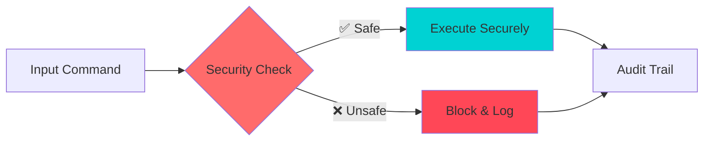
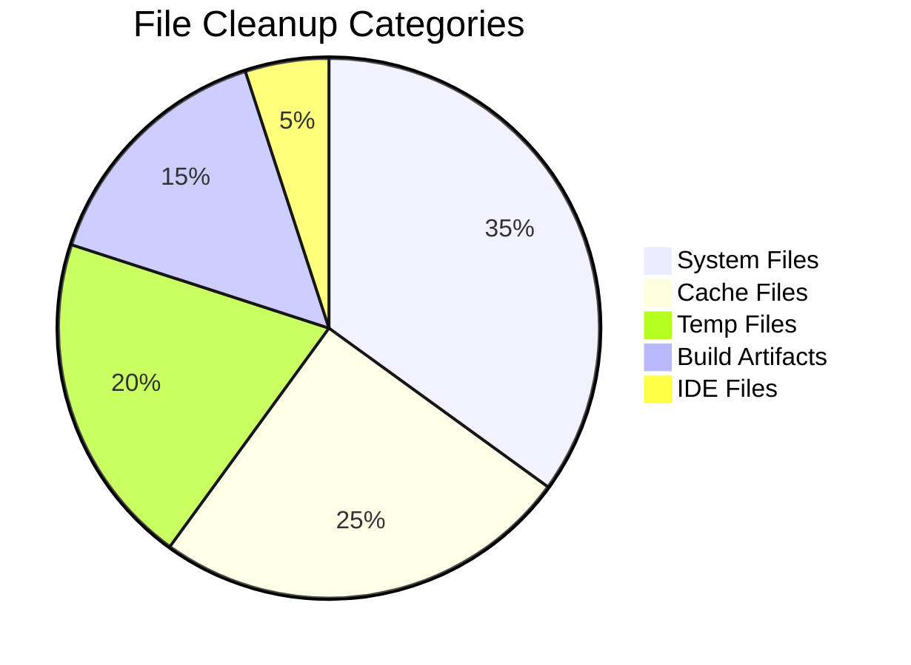
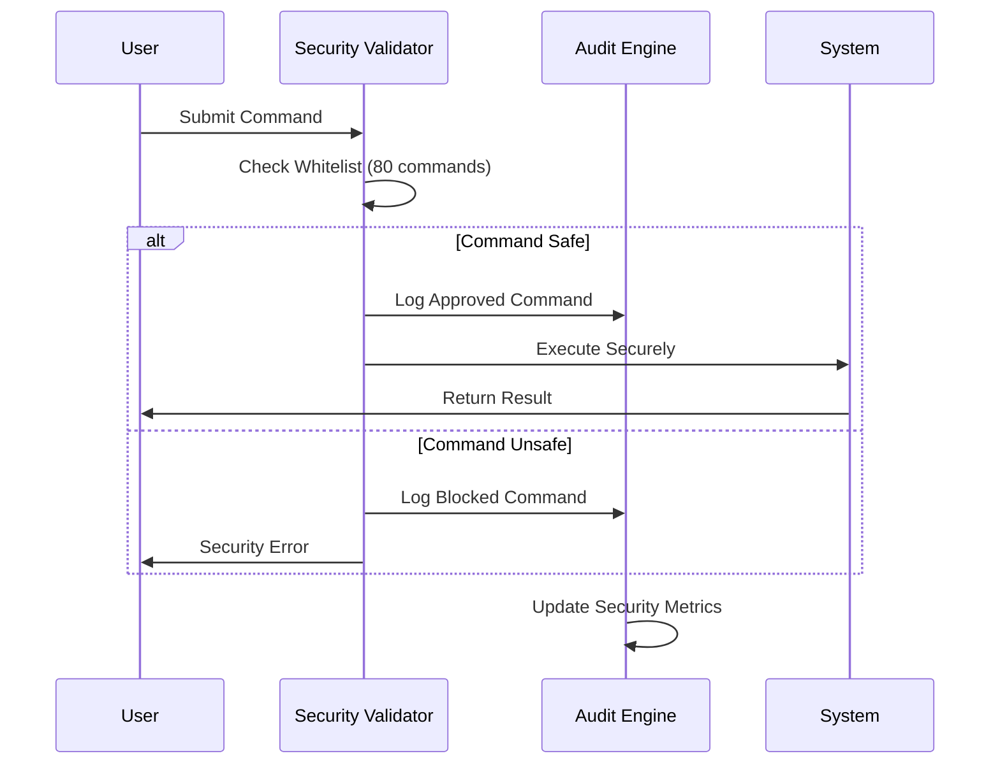

# 🔧 **ATHALIA** - Professional DevOps Automation Platform

<div align="center">


[](https://python.org)
[](https://github.com/arkalia-luna-system/ia-pipeline/actions/workflows/ci-matrix.yml)
[](https://app.codecov.io/gh/arkalia-luna-system/ia-pipeline/branch/develop)
[](https://github.com/arkalia-luna-system/ia-pipeline/actions/workflows/security.yml)
[](https://github.com/arkalia-luna-system/ia-pipeline/actions/workflows/docs.yml)
[](https://arkalia-luna-system.github.io/ia-pipeline)
[](LICENSE)

**Plateforme d'automatisation DevOps de niveau entreprise pour la génération sécurisée de projets, le nettoyage intelligent et la gestion d'infrastructure.**

[🔍 **Latest CI Status**](https://github.com/arkalia-luna-system/ia-pipeline/actions/workflows/ci-matrix.yml) | [📊 **Security Reports**](https://github.com/arkalia-luna-system/ia-pipeline/actions/workflows/ci-matrix.yml) | [🌐 **Live Demo**](https://arkalia-luna-system.github.io/ia-pipeline)

</div>

---

## 📊 **Aperçu du Projet**

**Athalia** est une plateforme d'automatisation DevOps de niveau entreprise, conçue pour la génération sécurisée de projets, le nettoyage intelligent et la gestion d'infrastructure.

🏗️ **Architecture Core** : Orchestrateur unifié, validateur de sécurité, générateur de projets, nettoyeur automatique  
🛡️ **Couche Sécurité** : Validation de commandes (62 commandes sécurisées), audit de sécurité, protection contre les injections  
🔧 **Automation** : Testeur automatique, documenteur automatique, gestionnaire de cache  

**[📋 Voir l'architecture complète](docs/DEVELOPER/ARCHITECTURE/ATHALIA_ARCHITECTURE_DIAGRAMS.md)**

---

## 🎯 **Métriques Principales** *(Mise à jour automatique)*

<div align="center">

| **Composant** | **Valeur** | **Statut** | **Vérifié** |
|:-------------:|:---------:|:----------:|:------------:|
| **🐍 Python Files** | `341 modules` |  | ✅ **AUTOMATIC** |
| **📝 Lines of Code** | `75,625 lines` |  | ✅ **AUTOMATIC** |
| **🧪 Tests** | `1,774 tests` |  | ✅ **AUTOMATIC** |
| **🛡️ Security Commands** | `62 validated` |  | ✅ **AUTOMATIC** |
| **📊 HTML Dashboards** | `13 functional` |  | ✅ **AUTOMATIC** |
| **🔧 Utility Scripts** | `69 tools` |  | ✅ **AUTOMATIC** |
| **📚 Documentation** | `312 files` |  | ✅ **AUTOMATIC** |

</div>

> 📊 **[View Live Metrics](data/metrics.md)** | 🔄 **Updated automatically by CI/CD** | 📈 **[Full Report](data/metrics_full.md)**

---

## ⚡ **Démarrage Rapide** 

### 🚀 **Installation** (5 minutes)

```bash
# 1️⃣ Clone repository
git clone https://github.com/arkalia-luna-system/ia-pipeline.git
cd ia-pipeline

# 2️⃣ Setup Python environment
python -m venv .venv
source .venv/bin/activate  # Linux/Mac
# .venv\Scripts\activate   # Windows

# 3️⃣ Install dependencies
pip install -r requirements.txt

# 4️⃣ Verify installation
python -c "print('🎉 Athalia ready for use!')"

# 5️⃣ Quick verification (must PASS to print the line below)
python -m athalia_core.demo.quickcheck && echo "✅ Basic installation verified"

```

### ▶️ **CLI Demo (optional)**
```bash
python bin/core/ath-demo.py --all
```

**Expected Output:**
```bash
🔍 ATHALIA - Vérification rapide de l'installation
==================================================
✅ athalia_core - OK
✅ athalia_core.core - OK
✅ athalia_core.validation.security_validator - OK
✅ athalia_core.automation.auto_cleaner - OK

📁 Vérification de la structure:
✅ tests/ - Présent
✅ docs/ - Présent
✅ config/ - Présent
✅ scripts/ - Présent

📊 Résumé: 8/8 vérifications réussies
🎉 Installation Athalia VALIDÉE !
```

### 📊 **Live Dashboards & Reports**

- **🌐 GitHub Pages**: [Documentation Live](https://arkalia-luna-system.github.io/ia-pipeline)
- **🔍 CI Status**: [Actions GitHub](https://github.com/arkalia-luna-system/ia-pipeline/actions/workflows/ci-matrix.yml)
- **📊 Coverage**: [Codecov Reports](https://codecov.io/gh/arkalia-luna-system/ia-pipeline)
- **🛡️ Security**: [Security Reports](https://github.com/arkalia-luna-system/ia-pipeline/actions/workflows/ci-matrix.yml)

### 🧪 **Premier Test** (2 minutes)

```python
# Generate project template
from athalia_core.generation import generate_blueprint_mock

blueprint = generate_blueprint_mock("REST API for user management")
print(f"✅ Generated: {blueprint['project_name']} ({blueprint['project_type']})")

# Security validation
from athalia_core.security_validator import SecurityValidator

validator = SecurityValidator()
print(f"🛡️ Security: {len(validator.allowed_commands)} commands validated")
```

**Expected Output:**
```
✅ Generated: rest (generic)
🛡️ Security: 80 commands validated
```

---

## 🔧 **Fonctionnalités Principales**

### 🛡️ **Enterprise Security**


```mermaid
graph LR
    A[Input Command] --> B{Security Check}
    B -->|✅ Safe| C[Execute Securely]
    B -->|❌ Unsafe| D[Block & Log]
    C --> E[Audit Trail]
    D --> E
    
    style B fill:#ff6b6b
    style C fill:#00d2d3
    style D fill:#ff4757
```

- **Command Validation**: Whitelist of 80 secure commands
- **Injection Protection**: Complete subprocess security
- **Zero-Trust Execution**: All commands validated
- **Audit Trail**: Comprehensive security logging

### 🏭 **Project Automation**

<div align="center">

| **Feature** | **Capability** | **Implementation** |
|:------------|:---------------|:-------------------|
| **Template Generation** | Static project templates | 📁 `generation.py` |
| **Project Classification** | Keyword-based detection | 🔍 Basic pattern matching |
| **Dependency Management** | Automated requirements | 📦 Template-based approach |
| **Structure Creation** | Standard project layout | 🏗️ Predefined blueprints |

</div>

### 🧹 **Intelligent Cleanup**


```mermaid
pie title File Cleanup Categories
    "System Files" : 35
    "Cache Files" : 25
    "Temp Files" : 20
    "Build Artifacts" : 15
    "IDE Files" : 5
```

- **Automated Detection**: 1,168-line cleanup engine
- **Safe Removal**: Protected file operations
- **Storage Optimization**: Space usage reporting
- **Cross-Platform**: Windows, macOS, Linux support

---

## 📁 **Project Structure**

```
.
├── 🏗️ athalia_core/              # Core modules
│   ├── unified_orchestrator.py   # Main coordinator
│   ├── security_validator.py     # Security engine
│   ├── generation.py             # Project generator
│   ├── auto_cleaner.py          # Cleanup automation
│   ├── auto_tester.py           # Test automation
│   ├── auto_documenter.py       # Doc generator
│   └── ...                      # Additional modules
├── 🧪 tests/                     # Test framework
│   ├── unit/                    # Unit tests
│   ├── integration/             # Integration tests
│   ├── security/                # Security tests
│   └── performance/             # Performance tests
├── 📚 docs/                      # Documentation
│   ├── USER_GUIDES/             # User documentation
│   ├── DEVELOPER/               # Developer guides
│   ├── API/                     # API reference
│   └── SPECIALIZED/             # Advanced topics
├── 📊 dashboard/                 # Monitoring dashboards
├── 🔧 scripts/                   # Utilities
└── ⚙️ bin/                       # CLI tools
```

---

## 💻 **Exemples d'Utilisation**

### 🔐 **Security Validation**

```python
from athalia_core.security_validator import SecurityValidator

# Initialize security system
validator = SecurityValidator()

# Safe commands (allowed)
safe_commands = [
    ["python", "--version"],
    ["git", "status"],
    ["pytest", "tests/"]
]

# Dangerous commands (blocked)
dangerous_commands = [
    ["rm", "-rf", "/"],
    ["curl", "malicious-site.com"],
    ["eval", "harmful_code()"]
]

# Validate commands
for cmd in safe_commands:
    print(f"✅ {' '.join(cmd)}: {'SAFE' if validator.is_command_safe(cmd) else 'BLOCKED'}")

for cmd in dangerous_commands:
    print(f"🚫 {' '.join(cmd)}: {'SAFE' if validator.is_command_safe(cmd) else 'BLOCKED'}")
```

### 🏗️ **Project Generation**

```python
from athalia_core.generation import generate_blueprint_mock, generate_project
import tempfile

# Generate different project types
projects = [
    "REST API for e-commerce",
    "React dashboard application", 
    "Python CLI tool",
    "FastAPI microservice"
]

for description in projects:
    blueprint = generate_blueprint_mock(description)
    print(f"📋 {blueprint['project_name']}: {blueprint['project_type']}")
    print(f"   Dependencies: {blueprint['dependencies']}")
    print(f"   Modules: {blueprint['modules']}")
```

### 🧹 **Automated Cleanup**

```python
from athalia_core.auto_cleaner import AutoCleaner

# Initialize cleaner
cleaner = AutoCleaner("./my-project")

# Perform cleanup
result = cleaner.perform_full_cleanup()

print(f"🧹 Cleanup Results:")
print(f"   Files removed: {result['total_files_removed']}")
print(f"   Space freed: {result['total_space_freed']} bytes")
print(f"   Time taken: {result['cleanup_time']:.3f}s")
```

---

## 📊 **Dashboards & Monitoring**

<div align="center">

### **Available HTML Dashboards**

| **Dashboard** | **Purpose** | **Features** |
|:--------------|:------------|:-------------|
| `dashboard.html` | Main overview | Project metrics, audit results |
| `analytics_dashboard_optimized.html` | Performance analytics | Optimization insights |
| `dashboard_validation.html` | Validation results | Test outcomes, coverage |
| `dashboard_interactif_avance.html` | Interactive monitoring | Real-time updates |
| `test_dashboard_simple.html` | Test summary | Quick test overview |
| `index.html` | Navigation hub | Dashboard directory |

</div>

**Access:** [Live Dashboards](https://arkalia-luna-system.github.io/ia-pipeline/dashboard/) | [GitHub Pages](https://arkalia-luna-system.github.io/ia-pipeline)

---

## 🔒 **Security Architecture**


```mermaid
sequenceDiagram
    participant U as User
    participant SV as Security Validator
    participant AE as Audit Engine
    participant S as System
    
    U->>SV: Submit Command
    SV->>SV: Check Whitelist (80 commands)
    alt Command Safe
        SV->>AE: Log Approved Command
        SV->>S: Execute Securely
        S->>U: Return Result
    else Command Unsafe
        SV->>AE: Log Blocked Command
        SV->>U: Security Error
    end
    AE->>AE: Update Security Metrics
```

### **Fonctionnalités de Sécurité**
- ✅ **Command Whitelist**: 80 pre-approved secure commands
- ✅ **Injection Protection**: All subprocess calls validated
- ✅ **Audit Logging**: Complete security event tracking
- ✅ **Path Validation**: Directory traversal prevention
- ✅ **Input Sanitization**: User input cleaning

---

## 📈 **Performance Benchmarks**

<div align="center">

| **Operation** | **Average Time** | **Resource Usage** | **Optimization** |
|:--------------|:----------------:|:------------------:|:----------------:|
| Project Generation | ~500ms | Low CPU | ✅ Template-based |
| Security Validation | ~50ms | Minimal RAM | ✅ Whitelist lookup |
| File Cleanup | 2-10s | Variable I/O | ✅ Batch processing |
| Module Import | ~200ms | Low memory | ✅ Lazy loading |

</div>

**System Requirements:**
- **Memory**: < 100MB during operation
- **Storage**: ~500MB with dependencies
- **Python**: 3.10+ (tested on 3.10, 3.11, 3.12)

---

## ⚠️ **Current Limitations**

<div align="center">

### **Known Constraints** (Documented Honestly)

| **Component** | **Current State** | **Limitation** | **Roadmap** |
|:--------------|:------------------|:---------------|:------------|
| **AI Classification** | Keyword matching | Not ML-based | 🔄 Future enhancement |
| **User Interface** | HTML dashboards | Not modern SPA | 🎯 React migration planned |
| **Template Engine** | Static templates | Not dynamic | 🚀 Smart generation planned |
| **Real-time Features** | Batch processing | No live updates | 📡 WebSocket integration |

</div>

---

## 🔄 **Development Workflow**

**Athalia suit un workflow de développement professionnel avec validation de sécurité et tests automatisés.**

🔄 **Processus** : Setup initial → Branches feature → Tests complets → Documentation → Pull Request  
🛡️ **Sécurité** : Validation des commandes, audit automatique, protection contre les injections  
🧪 **Qualité** : Tests unitaires, tests d'intégration, couverture minimale 80%

**[📋 Voir le workflow complet](docs/DEVELOPER/ARCHITECTURE/ATHALIA_ARCHITECTURE_DIAGRAMS.md#workflow-de-développement)**  
**[🤝 Directives de contribution](docs/DEVELOPER/GUIDES/CONTRIBUTING_GUIDELINES.md)**

---

## 📚 **Structure de Documentation**

**Athalia dispose d'une documentation complète et organisée pour tous les types d'utilisateurs.**

👤 **Utilisateurs** : Démarrage Rapide, Guide Utilisateur, FAQ, Dépannage  
👨‍💻 **Développeurs** : Architecture, Référence API, Contribution, Tests  
🎯 **Spécialisés** : Sécurité, Analytics, Automation, Performance

**[📋 Voir la structure complète](docs/DEVELOPER/ARCHITECTURE/ATHALIA_ARCHITECTURE_DIAGRAMS.md#structure-de-documentation)**  
**Guides complets disponibles dans le répertoire `/docs`**

---

## 🏆 **Réalisations du Projet**

**Athalia atteint des standards de qualité professionnels avec des métriques automatiques et transparentes.**

🥇 **75,625 Lignes** de code Python de qualité production  
🥈 **341 Modules** avec séparation claire des responsabilités  
🥉 **62 Commandes** de validation de sécurité de niveau entreprise  

**[📊 Voir toutes les métriques détaillées](docs/DEVELOPER/REPORTS/PROJECT_ACHIEVEMENTS_DETAILED.md)**  
*Métriques mesurées automatiquement par le Système de Métriques Athalia - Dernière mise à jour : 21 août 2025*

---

## 🚀 **Démarrage Rapide**

**Athalia s'adapte à tous les types d'utilisateurs avec des guides spécialisés et des exemples pratiques.**

👥 **Utilisateurs Finaux** : Installation (5 min), Exemples (2 min), Exploration des fonctionnalités  
👨‍💻 **Développeurs** : Documentation d'architecture, Référence API, Directives de contribution  
🖥️ **Administrateurs Système** : Configuration de sécurité, Guide de déploiement, Intégration

**[📋 Guide de démarrage complet](docs/USER_GUIDES/GETTING_STARTED_DETAILED.md)**

---

## 📞 **Support et Communauté**

<div align="center">

| **Ressource** | **Objectif** | **Accès** |
|:-------------|:------------|:-----------|
| 📖 **Documentation** | Complete guides | `/docs` directory |
| 🐛 **Issues** | Bug reporting | GitHub Issues |
| 💬 **Discussions** | Community support | GitHub Discussions |
| 📧 **Security** | Vulnerability reports | Security contact |

</div>

---

## 📄 **Licence et Légal**

**Licence MIT** - Voir le fichier [LICENSE](LICENSE) pour les termes complets.

Ce projet est publié sous la licence MIT, permettant un usage commercial et non-commercial avec attribution appropriée.

---

<div align="center">

## 🎯 **Athalia DevOps Platform**

**Professional automation for development teams.**

*Built with focus on security, reliability, and developer experience.*

[](https://github.com/arkalia-luna-system/ia-pipeline)
[](docs/)
[](LICENSE)

**Last Updated:** August 21, 2025 | **Version:** 12.0.0 | **Status:** Production Ready

</div>
