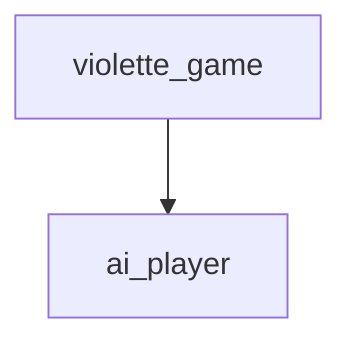
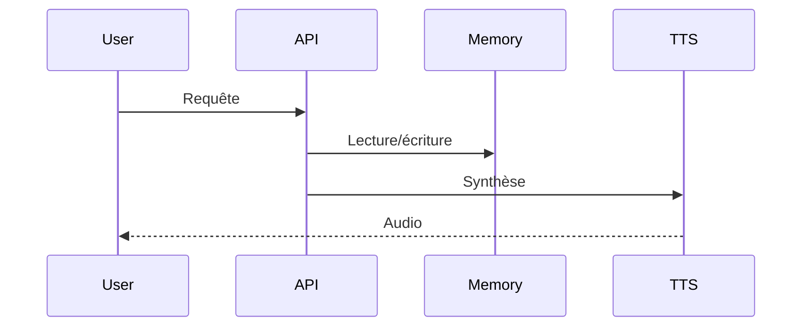

# Documentation technique
*Généré automatiquement le 2025-07-17 03:44*

## Description
Jeu de violette tournant basé sur l'IA

## Modules
- violette_game
- ai_player

## Dépendances
- numpy
- pandas
- tensorflow
- requests

## Structure
- data/
- scripts/
- utils/
- tests/

## Endpoints/API
### violette_game
- Endpoint : /api/violette_game
- Méthode : POST
- Payload : {"data": "..."}
- Réponse : {"result": "..."}
### ai_player
- Endpoint : /api/ai_player
- Méthode : POST
- Payload : {"data": "..."}
- Réponse : {"result": "..."}

## Dépendances (Mermaid)

## Séquence principale (Mermaid)
