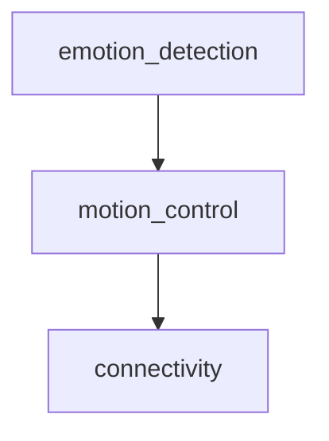
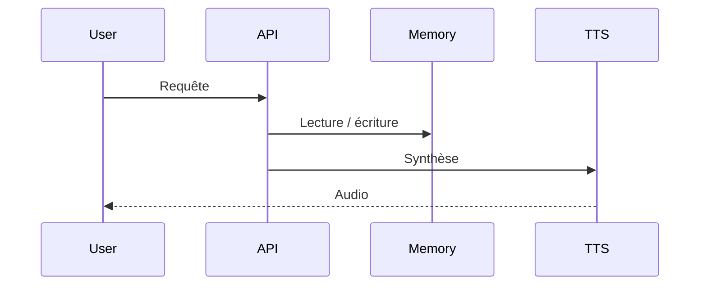

# Documentation technique
*Généré automatiquement le 2025-07-17ict_data 08:18*

## Description
Projet de création d'yeux robotic wireless capables de détecter les émotions humaines et de s'y répondre en bougeant grâce à l'IA.

## Modules
- emotion_detection
- motion_control
- connectivity

## Dépendances
- numpy
- pandas
- tensorflow
- scikit-learn
- requests
- pytz

## Structure
- data/
- src/_emotion_detection/
- motion_control/
- connectivity/
- tests/
- docs/
- .gitignore

## Endpoints / API
### emotion_detection
- Endpoint : /api/emotion_detection
- Méthode : POST
- Payload : {"data": "..."}
- Réponse : {"result": "..."}
### motion_control
- Endpoint : /api/motion_control
- Méthode : POST
- Payload : {"data": "..."}
- Réponse : {"result": "..."}
### connectivity
- Endpoint : /api/connectivity
- Méthode : POST
- Payload : {"data": "..."}
- Réponse : {"result": "..."}

## Dépendances (Mermaid)

## Séquence principale (Mermaid)
