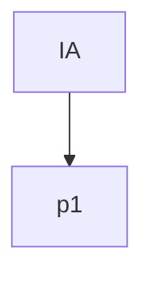
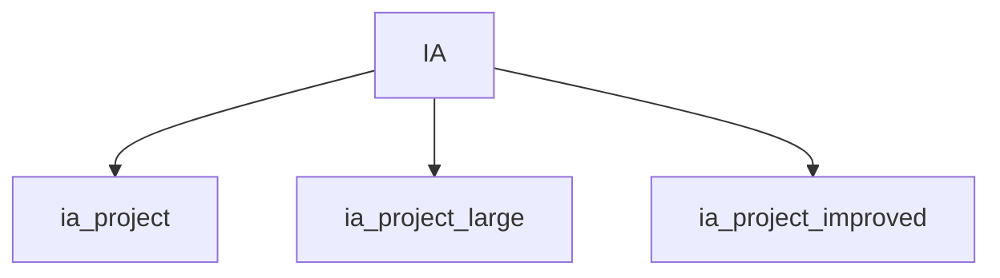
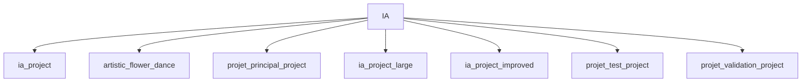

# Dashboard Audit/Qualité Projets IA

> Le dashboard principal est désormais généré automatiquement en HTML (dashboard.html).
> Consultez ce fichier pour la vue interactive, les liens vers les docs, GENESIS, et l’audit multi-projets.

*(Ce fichier Markdown est conservé pour l’historique, mais n’est plus mis à jour automatiquement.)*

## Architecture multi-projets/agents (Mermaid)

## Architecture multi-projets/agents (Mermaid)

## Architecture multi-projets/agents (Mermaid)

## Architecture multi-projets/agents (Mermaid)

## Architecture multi-projets/agents (Mermaid)

## Architecture multi-projets/agents (Mermaid)

## Architecture multi-projets/agents (Mermaid)

## Architecture multi-projets/agents (Mermaid)

## Architecture multi-projets/agents (Mermaid)

## Architecture multi-projets/agents (Mermaid)

## Architecture multi-projets/agents (Mermaid)

## Architecture multi-projets/agents (Mermaid)

