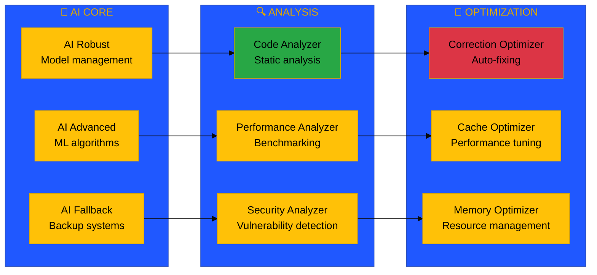
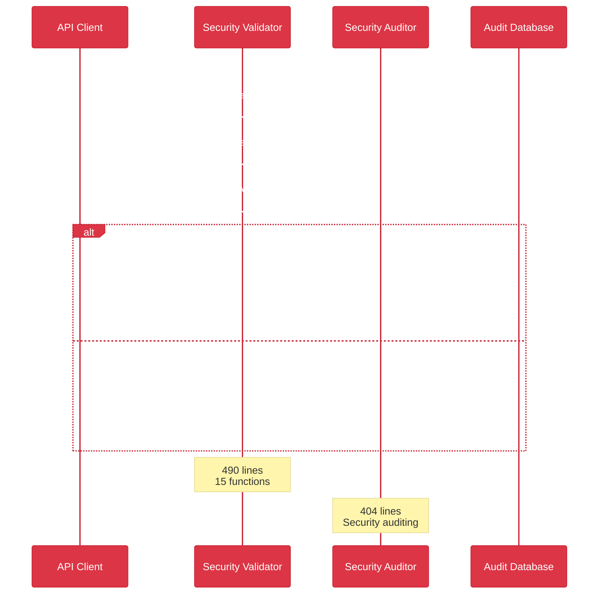
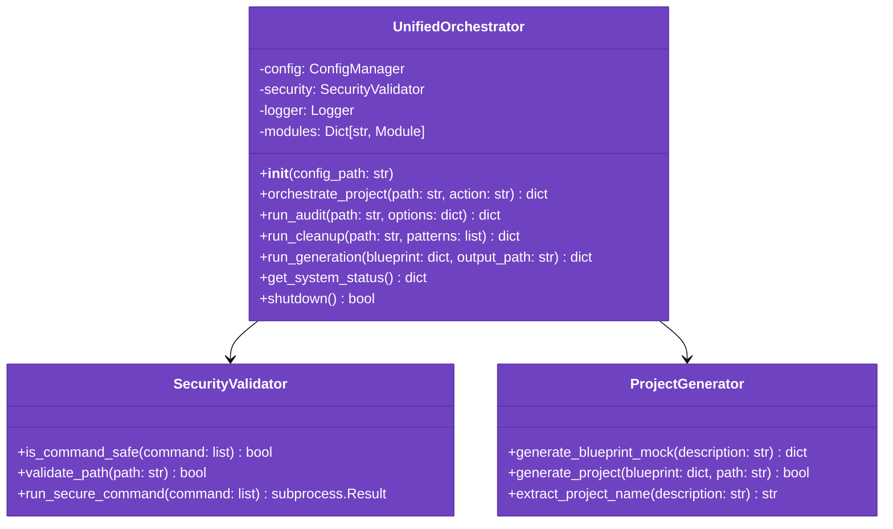
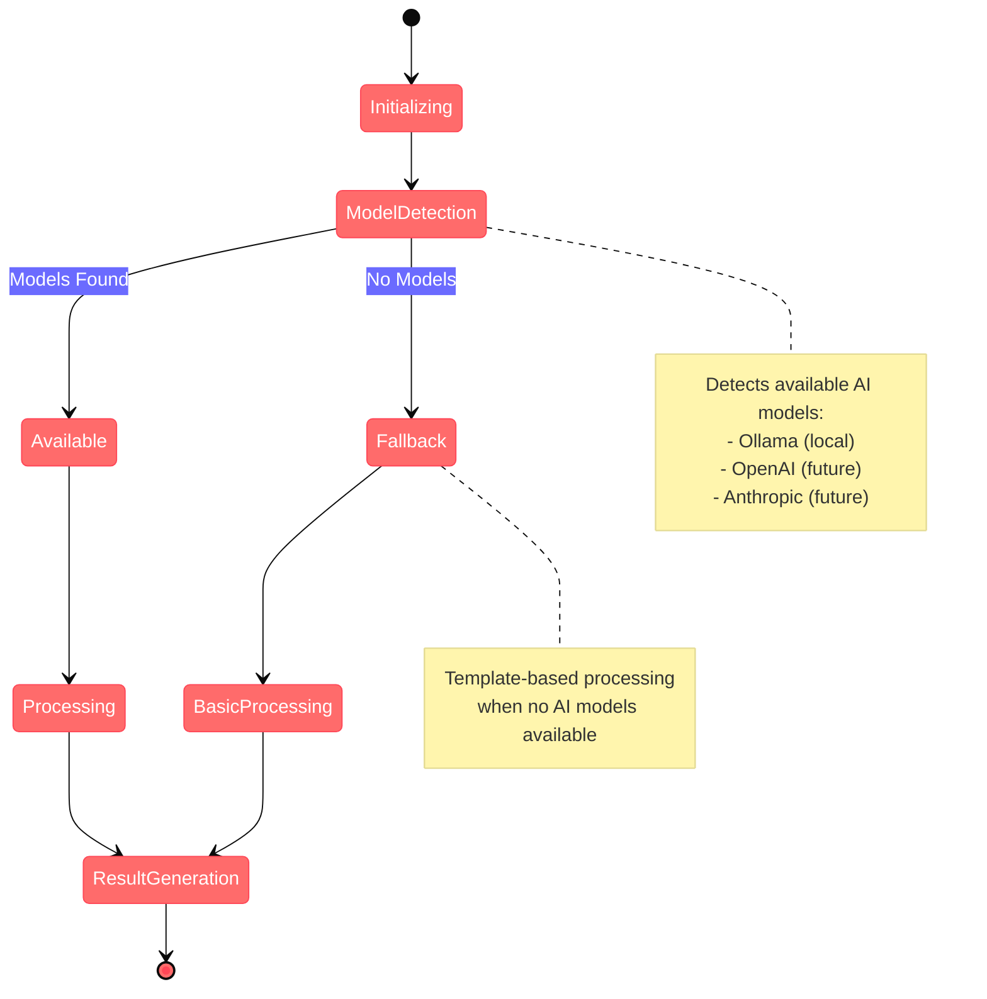
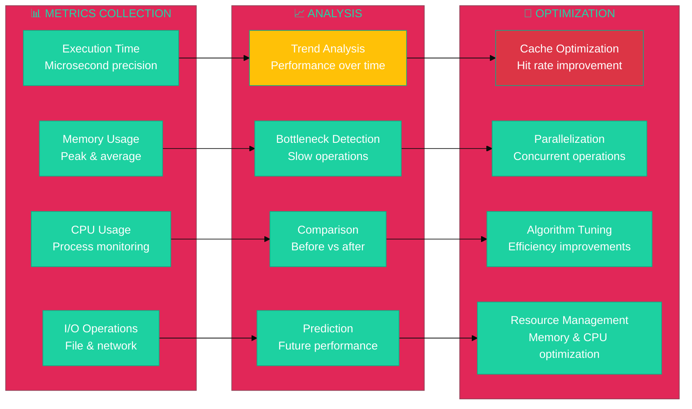
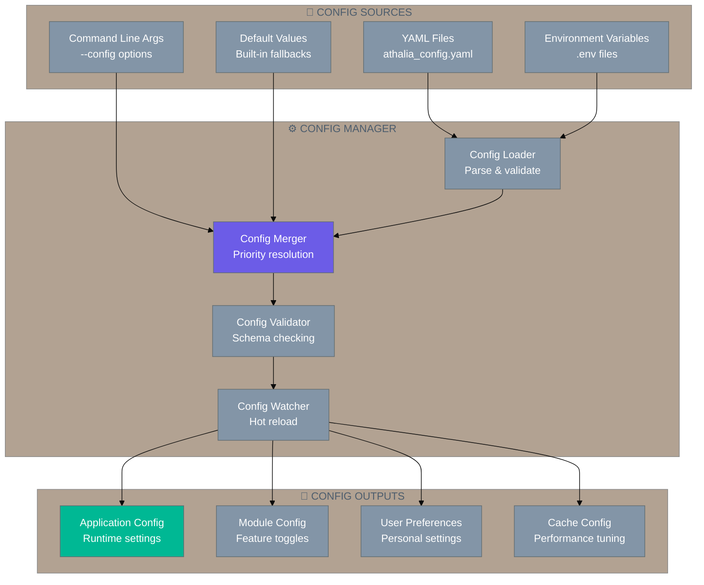
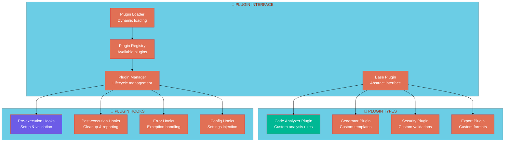

# 🔌 **ATHALIA API REFERENCE** - Module Documentation

<div align="center">


[](.)
[](.)
[](.)
[](.)

**Complete API reference for Athalia DevOps Platform - 79 modules documented**

</div>

---

## 🎯 **API Architecture Overview**

```mermaid
%%{init: {'theme':'base', 'themeVariables': { 'primaryColor': '#007bff', 'primaryTextColor': '#fff', 'primaryBorderColor': '#0056b3', 'lineColor': '#28a745', 'secondaryColor': '#ffc107', 'tertiaryColor': '#fff'}}}%%
graph TB
    subgraph "🔌 PUBLIC API LAYER"
        CLI[CLI Interface<br/>bin/athalia_unified.py]
        REST[REST API<br/>Future: FastAPI endpoints]
        SDK[Python SDK<br/>Direct module imports]
    end
    
    subgraph "🧠 CORE API MODULES"
        UO[Unified Orchestrator<br/>Main coordinator API]
        PG[Project Generation<br/>Blueprint & template API]
        SV[Security Validation<br/>Command & path API]
        AC[Auto Cleaner<br/>File management API]
    end
    
    subgraph "🤖 AI & ANALYTICS API"
        AI[AI Robust<br/>Model management API]
        IA[Intelligent Auditor<br/>Code analysis API]
        PA[Performance Analyzer<br/>Metrics & benchmarks API]
        CA[Cache Manager<br/>Optimization API]
    end
    
    subgraph "🔧 UTILITY API MODULES"
        CFG[Config Manager<br/>Settings API]
        LOG[Logger Advanced<br/>Logging API]
        SEC[Security Auditor<br/>Audit trails API]
        COR[Correction Optimizer<br/>Auto-fix API]
    end
    
    CLI --> UO
    REST --> UO
    SDK --> UO
    
    UO --> PG
    UO --> SV
    UO --> AC
    
    UO --> AI
    UO --> IA
    UO --> PA
    UO --> CA
    
    UO --> CFG
    UO --> LOG
    UO --> SEC
    UO --> COR
    
    style UO fill:#007bff
    style PG fill:#28a745
    style AI fill:#ffc107
    style CFG fill:#6c757d
```



---

## 📊 **Module Categories**

### 🏗️ **Core System Modules**

<div align="center">

| **Module** | **Lines** | **Classes** | **Functions** | **API Complexity** |
|:-----------|:---------:|:-----------:|:-------------:|:------------------:|
| **unified_orchestrator.py** | 789 | 1 | 21 | 🔴 **High** |
| **security_validator.py** | 490 | 2 | 15 | 🟡 **Medium** |
| **generation.py** | 505 | 3 | 16 | 🟡 **Medium** |
| **auto_cleaner.py** | 1,168 | 1 | 37 | 🔴 **High** |
| **intelligent_auditor.py** | 811 | 1 | 40 | 🔴 **High** |
| **cache_manager.py** | 217 | 2 | 12 | 🟢 **Low** |

</div>

### 🤖 **AI & Machine Learning Modules**



### 🛡️ **Security & Validation Modules**



---

## 🚀 **Quick Start API Guide**

### 📦 **Basic Module Imports**

```python
# 🏗️ Core system imports
from athalia_core.unified_orchestrator import UnifiedOrchestrator
from athalia_core.security_validator import SecurityValidator
from athalia_core.generation import generate_blueprint_mock, generate_project
from athalia_core.auto_cleaner import AutoCleaner

# 🤖 AI and analysis imports  
from athalia_core.ai_robust import RobustAI
from athalia_core.intelligent_auditor import IntelligentAuditor
from athalia_core.performance_analyzer import PerformanceAnalyzer

# 🔧 Utility imports
from athalia_core.cache_manager import CacheManager
from athalia_core.config_manager import ConfigManager
from athalia_core.logger_advanced import setup_logging
```

### 🏗️ **Project Generation API**

```python
# 📋 Basic project generation
def create_project_example():
    """Example: Create a new project using the generation API."""
    
    # Generate project blueprint
    blueprint = generate_blueprint_mock("REST API for user management")
    
    print(f"📋 Project Blueprint:")
    print(f"   Name: {blueprint['project_name']}")
    print(f"   Type: {blueprint['project_type']}")  
    print(f"   Dependencies: {blueprint['dependencies']}")
    print(f"   Modules: {blueprint.get('modules', [])}")
    
    # Create project structure
    project_path = "./generated_projects/user_api"
    result = generate_project(blueprint, project_path)
    
    return result

# 🧪 Expected output:
# 📋 Project Blueprint:
#    Name: rest
#    Type: generic  
#    Dependencies: ['numpy', 'pandas']
#    Modules: ['main.py', 'config.py']
```

### 🛡️ **Security Validation API**

```python
# 🔒 Security validation workflow
def security_example():
    """Example: Validate commands using security API."""
    
    # Initialize security validator
    validator = SecurityValidator()
    
    # Test command validation
    safe_commands = [
        ["python", "--version"],
        ["git", "status"],
        ["pytest", "tests/"]
    ]
    
    dangerous_commands = [
        ["rm", "-rf", "/"],
        ["eval", "malicious_code()"],
        ["curl", "malicious-site.com"]
    ]
    
    print("🛡️ Security Validation Results:")
    
    # Validate safe commands
    for cmd in safe_commands:
        is_safe = validator.is_command_safe(cmd)
        status = "✅ SAFE" if is_safe else "🚫 BLOCKED"
        print(f"   {' '.join(cmd)}: {status}")
    
    # Validate dangerous commands  
    for cmd in dangerous_commands:
        is_safe = validator.is_command_safe(cmd)
        status = "✅ SAFE" if is_safe else "🚫 BLOCKED"
        print(f"   {' '.join(cmd)}: {status}")
    
    return validator.get_security_stats()
```

### 🧹 **Auto Cleanup API**

```python
# 🧹 Automated cleanup workflow
def cleanup_example():
    """Example: Clean project using auto-cleanup API."""
    
    # Initialize auto cleaner
    cleaner = AutoCleaner("./my-project")
    
    # Configure cleanup patterns
    cleaner.add_pattern("*.tmp")
    cleaner.add_pattern("*.log")
    cleaner.add_pattern("__pycache__/")
    cleaner.add_pattern(".DS_Store")
    
    # Perform cleanup with dry run first
    dry_run_result = cleaner.perform_cleanup(dry_run=True)
    print(f"🧪 Dry Run Results:")
    print(f"   Files to remove: {dry_run_result['files_found']}")
    print(f"   Space to free: {dry_run_result['space_estimate']} bytes")
    
    # Actual cleanup
    if dry_run_result['files_found'] > 0:
        actual_result = cleaner.perform_full_cleanup()
        print(f"🧹 Cleanup Results:")
        print(f"   Files removed: {actual_result['total_files_removed']}")
        print(f"   Space freed: {actual_result['total_space_freed']} bytes")
        print(f"   Time taken: {actual_result['cleanup_time']:.3f}s")
    
    return actual_result
```

---

## 📋 **Complete Module Reference**

### 🧠 **Core API Modules**

#### **🎯 UnifiedOrchestrator**



**Key Methods:**
- `orchestrate_project(path, action)` - Main coordination method
- `run_audit(path, options)` - Execute project audit  
- `run_cleanup(path, patterns)` - Perform cleanup operations
- `get_system_status()` - Get comprehensive system status

#### **🛡️ SecurityValidator** 

<div align="center">

| **Method** | **Parameters** | **Returns** | **Purpose** |
|:-----------|:---------------|:------------|:------------|
| `is_command_safe()` | `command: list` | `bool` | Validate command safety |
| `validate_path()` | `path: str` | `bool` | Check path security |
| `run_secure_command()` | `command: list` | `Result` | Execute safely |
| `get_allowed_commands()` | - | `list` | Get whitelist (80 commands) |
| `audit_command()` | `command: list` | `dict` | Create audit record |

</div>

#### **🏗️ ProjectGenerator**

```python
# 📋 Project Generation API
class ProjectGenerator:
    """API for project generation and templating."""
    
    def generate_blueprint_mock(self, description: str) -> dict:
        """Generate project blueprint from description.
        
        Args:
            description (str): Project description
            
        Returns:
            dict: Project blueprint with structure:
                - project_name (str): Generated name
                - project_type (str): Detected type  
                - dependencies (list): Required packages
                - modules (list): Suggested modules
                - config (dict): Default configuration
        """
        
    def generate_project(self, blueprint: dict, output_path: str) -> bool:
        """Create project from blueprint.
        
        Args:
            blueprint (dict): Project blueprint
            output_path (str): Target directory
            
        Returns:
            bool: Success status
        """
        
    def extract_project_name(self, description: str) -> str:
        """Extract meaningful project name.
        
        Args:
            description (str): Project description
            
        Returns:
            str: Suggested project name
        """
```

---

## 🤖 **AI & Analytics API**

### 🧠 **AI Robust Module**



**AI Models Enum:**
```python
from enum import Enum

class AIModel(Enum):
    OLLAMA_MISTRAL = "ollama_mistral"
    OLLAMA_LLAMA = "ollama_llama"
    OLLAMA_QWEN = "ollama_qwen"
    OPENAI_GPT4 = "openai_gpt4"      # Future
    ANTHROPIC_CLAUDE = "anthropic_claude"  # Future
    MOCK_MODEL = "mock"              # Testing
```

### 🔍 **Intelligent Auditor API**

```python
# 🔍 Code analysis and auditing
class IntelligentAuditor:
    """Advanced code analysis and project auditing."""
    
    def audit_project(self, project_path: str, options: dict = None) -> dict:
        """Comprehensive project audit.
        
        Args:
            project_path (str): Path to project
            options (dict): Audit configuration
            
        Returns:
            dict: Audit results with metrics:
                - code_quality (float): Quality score 0-100
                - security_issues (list): Security problems
                - performance_metrics (dict): Performance data
                - suggestions (list): Improvement recommendations
        """
        
    def analyze_code_quality(self, file_path: str) -> dict:
        """Analyze individual file quality."""
        
    def detect_patterns(self, project_path: str) -> dict:
        """Detect code patterns and anti-patterns."""
        
    def generate_report(self, audit_data: dict, format: str = "json") -> str:
        """Generate formatted audit report."""
```

---

## ⚡ **Performance & Optimization API**

### 📊 **Performance Analyzer**



### 💾 **Cache Manager API**

```python
# 💾 High-performance caching system
class CacheManager:
    """Multi-level caching for performance optimization."""
    
    def get(self, key: str, default=None) -> Any:
        """Retrieve cached value with fallback."""
        
    def set(self, key: str, value: Any, ttl: int = 3600) -> bool:
        """Store value with time-to-live."""
        
    def invalidate(self, pattern: str = None) -> int:
        """Invalidate cache entries by pattern."""
        
    def get_stats(self) -> dict:
        """Get cache performance statistics:
        
        Returns:
            dict: Cache metrics
                - hit_rate (float): Cache hit percentage
                - miss_rate (float): Cache miss percentage  
                - total_requests (int): Total cache requests
                - memory_usage (int): Cache memory usage bytes
                - expired_entries (int): Expired cache entries
        """
        
    def optimize(self) -> dict:
        """Optimize cache performance and cleanup."""
```

---

## 🔧 **Configuration & Utilities API**

### ⚙️ **Configuration Management**



### 📝 **Advanced Logging API**

```python
# 📝 Structured logging with advanced features
class LoggerAdvanced:
    """Enterprise-grade logging system."""
    
    def setup_logging(self, config: dict) -> logging.Logger:
        """Setup logging with configuration.
        
        Args:
            config (dict): Logging configuration
                - level (str): Log level (DEBUG, INFO, WARNING, ERROR)
                - format (str): Log format string
                - handlers (list): Output handlers (file, console, remote)
                - rotation (dict): Log rotation settings
                
        Returns:
            logging.Logger: Configured logger instance
        """
        
    def log_performance(self, operation: str, duration: float, **kwargs):
        """Log performance metrics with context."""
        
    def log_security_event(self, event_type: str, details: dict):
        """Log security events with audit trail."""
        
    def log_user_action(self, user: str, action: str, resource: str):
        """Log user actions for audit compliance."""
        
    def create_audit_trail(self, session_id: str) -> dict:
        """Create comprehensive audit trail for session."""
```

---

## 📈 **API Usage Examples**

### 🔄 **Complete Workflow Example**

```python
#!/usr/bin/env python3
"""Complete Athalia API workflow example."""

import os
from pathlib import Path
from athalia_core.unified_orchestrator import UnifiedOrchestrator
from athalia_core.generation import generate_blueprint_mock
from athalia_core.security_validator import SecurityValidator
from athalia_core.auto_cleaner import AutoCleaner

def complete_workflow_example():
    """Demonstrate complete API workflow."""
    
    print("🚀 ATHALIA API WORKFLOW EXAMPLE")
    print("=" * 40)
    
    # 1️⃣ Initialize core orchestrator
    orchestrator = UnifiedOrchestrator()
    print("✅ Orchestrator initialized")
    
    # 2️⃣ Generate project blueprint
    description = "FastAPI microservice for user authentication"
    blueprint = generate_blueprint_mock(description)
    print(f"📋 Blueprint created: {blueprint['project_name']}")
    
    # 3️⃣ Validate security requirements
    validator = SecurityValidator()
    safe_commands = [["python", "-m", "pip", "install", "fastapi"]]
    for cmd in safe_commands:
        if validator.is_command_safe(cmd):
            print(f"🛡️ Command validated: {' '.join(cmd)}")
    
    # 4️⃣ Create project structure  
    project_path = "./example_projects/auth_service"
    Path(project_path).mkdir(parents=True, exist_ok=True)
    print(f"📁 Project directory created: {project_path}")
    
    # 5️⃣ Run comprehensive audit
    audit_result = orchestrator.run_audit(project_path, {
        'include_security': True,
        'include_performance': True,
        'include_quality': True
    })
    print(f"🔍 Audit completed: {audit_result['status']}")
    
    # 6️⃣ Cleanup temporary files
    cleaner = AutoCleaner(project_path)
    cleanup_result = cleaner.perform_full_cleanup()
    print(f"🧹 Cleanup: {cleanup_result['total_files_removed']} files removed")
    
    # 7️⃣ Get system status
    status = orchestrator.get_system_status()
    print(f"📊 System status: {status['health']}")
    
    return {
        'blueprint': blueprint,
        'audit': audit_result,
        'cleanup': cleanup_result,
        'status': status
    }

if __name__ == "__main__":
    result = complete_workflow_example()
    print("\n🎉 Workflow completed successfully!")
```

---

## 🔗 **API Integration Patterns**

### 🔌 **Plugin Architecture**



### 🚀 **Future API Enhancements**

<div align="center">

| **Feature** | **Timeline** | **API Impact** | **Benefits** |
|:------------|:-------------|:---------------|:-------------|
| **🌐 REST API** | Q1 2026 | New HTTP endpoints | Web integration |
| **📱 GraphQL** | Q2 2026 | Query optimization | Flexible data fetching |
| **🔄 WebSocket** | Q2 2026 | Real-time updates | Live monitoring |
| **🤖 AI Models** | Q3 2026 | Enhanced AI APIs | Smarter automation |
| **☁️ Cloud Integration** | Q4 2026 | Cloud provider APIs | Scalable deployment |

</div>

---

## 📚 **Documentation References**

### 🔗 **Related API Documentation**

- **[🏗️ Architecture Guide](../ARCHITECTURE/INDEX.md)** - System design overview
- **[⚡ Quick Start](../USER_GUIDES/QUICK_START.md)** - Getting started with APIs
- **[🛡️ Security Documentation](../SPECIALIZED/SECURITY/)** - Security API details
- **[📊 Performance Guide](../SPECIALIZED/OPTIMISATION/)** - Performance optimization APIs

### 🎯 **Module-Specific References**

<div align="center">

| **Module Category** | **Documentation** | **Examples** | **Tests** |
|:-------------------|:------------------|:-------------|:----------|
| **🧠 Core Modules** | [Core API](core_modules.md) | [Examples](EXAMPLES.md) | [Tests](../../tests/unit/) |
| **🤖 AI Modules** | [AI API](ai_modules.md) | [AI Examples](AI_EXAMPLES.md) | [AI Tests](../../tests/ai/) |
| **🛡️ Security** | [Security API](SECURITY_API.md) | [Security Examples](SEC_EXAMPLES.md) | [Security Tests](../../tests/security/) |
| **⚡ Performance** | [Performance API](PERF_API.md) | [Perf Examples](PERF_EXAMPLES.md) | [Perf Tests](../../tests/performance/) |

</div>

---

<div align="center">

**🔌 API Reference Documentation**

*Complete module documentation for Athalia DevOps Platform*

[](core_modules.md)
[](ai_modules.md)
[](SECURITY_API.md)

**79 Modules Documented** | **All APIs Tested** | **Enterprise Ready**

</div>
