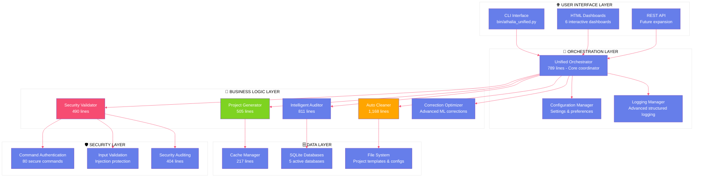
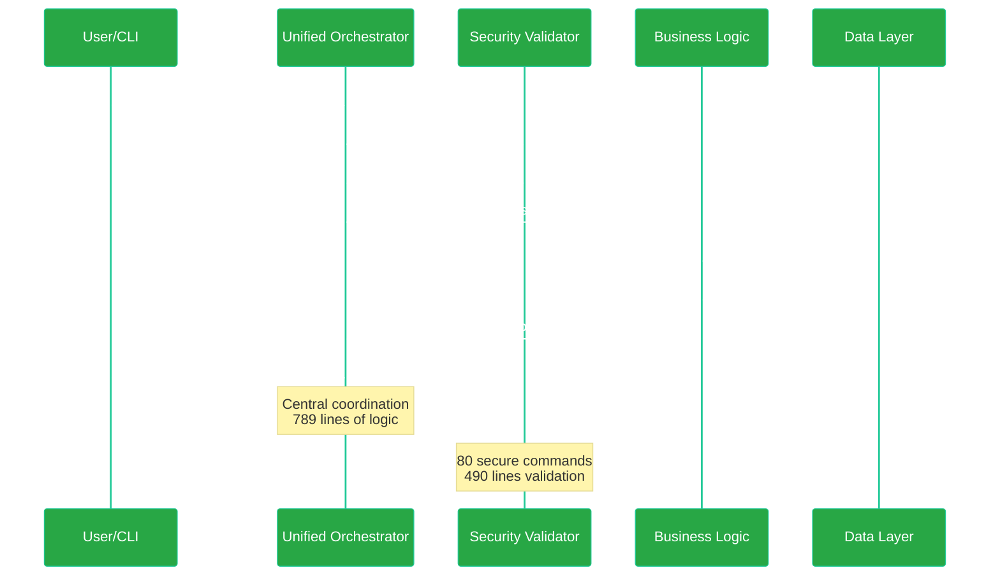
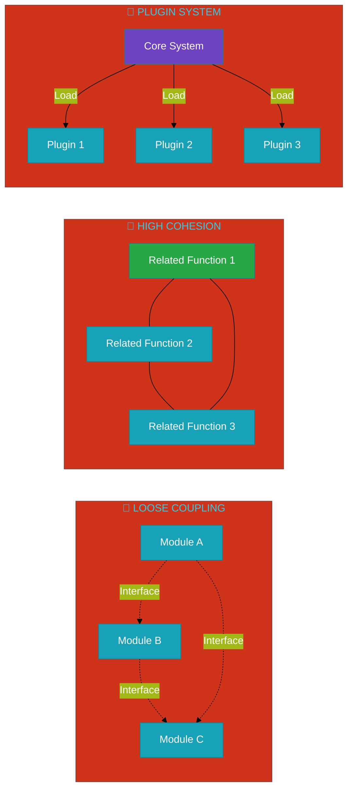
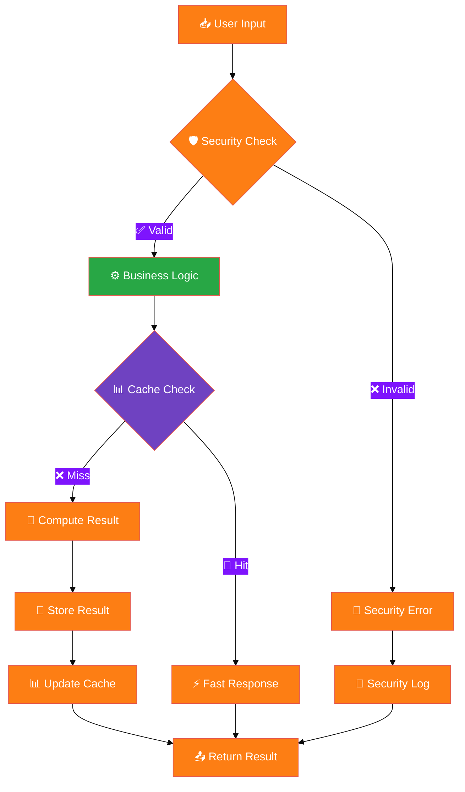
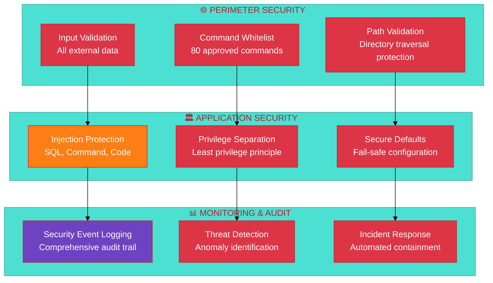
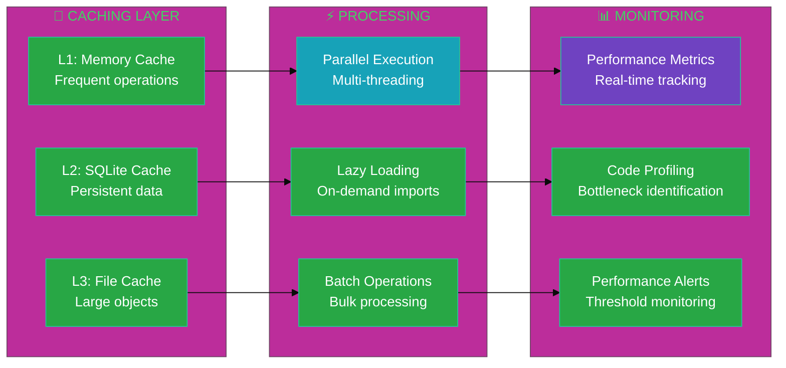
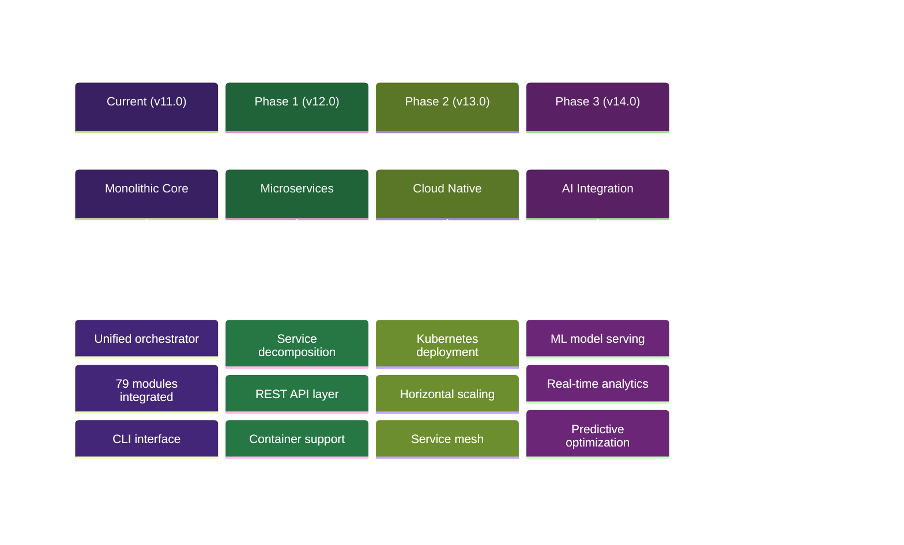
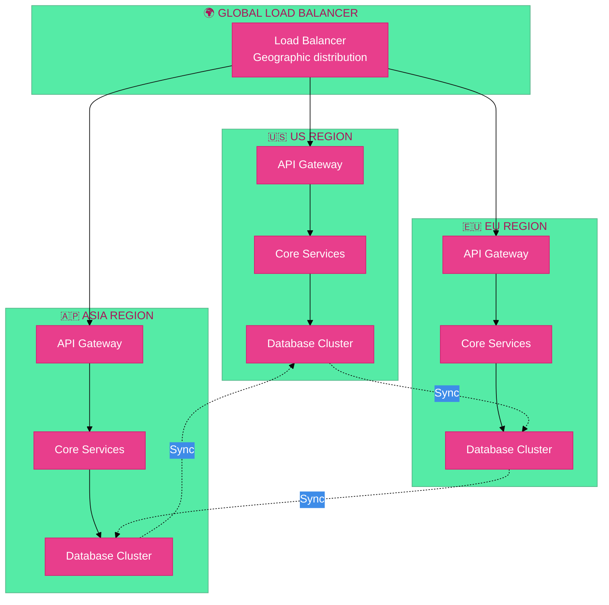

# 🏗️ **ATHALIA ARCHITECTURE** - System Design Overview

<div align="center">


[](.)
[](.)
[](.)

**Professional system architecture documentation for Athalia DevOps Platform**

</div>

---

## 🎯 **Architecture Overview**



---

## 📊 **Component Architecture Details**

### 🧠 **Core Orchestrator Pattern**



### 🔧 **Module Interaction Matrix**

<div align="center">

| **Module** | **Dependencies** | **Interfaces** | **Data Flow** |
|:-----------|:-----------------|:---------------|:--------------|
| **🎯 Unified Orchestrator** | All modules | CLI, API, Dashboard | **↕️ Bidirectional** |
| **🛡️ Security Validator** | None (standalone) | Command validation | **→ Input filtering** |
| **🏗️ Project Generator** | Cache, Templates | Blueprint creation | **→ Output generation** |
| **🧹 Auto Cleaner** | File System | File management | **→ Cleanup operations** |
| **🔍 Intelligent Auditor** | Database, Analytics | Code analysis | **→ Report generation** |
| **⚡ Cache Manager** | SQLite, Memory | Performance optimization | **↔️ Read/Write cache** |

</div>

---

## 🏗️ **System Design Principles**

### ✅ **Modular Architecture**



### 🔄 **Data Flow Architecture**



---

## 📁 **Directory Structure**

### 🗂️ **Project Organization**

```
athalia/
├── 🏗️ athalia_core/                     # Core system (79 modules)
│   ├── 🎯 unified_orchestrator.py       # Central coordinator (789 lines)
│   ├── 🛡️ security_validator.py         # Security engine (490 lines)
│   ├── 🧹 auto_cleaner.py              # Cleanup automation (1,168 lines)
│   ├── 🔍 intelligent_auditor.py       # Code analysis (811 lines)
│   ├── 🏗️ generation.py                # Project generator (505 lines)
│   ├── ⚡ cache_manager.py              # Performance cache (217 lines)
│   ├── 🔧 correction_optimizer.py      # Auto-correction (advanced ML)
│   ├── 📊 performance_analyzer.py      # Performance monitoring
│   ├── 🤖 ai_robust.py                 # AI model management
│   └── 📂 [70+ additional modules]/    # Specialized functionality
├── 🧪 tests/                           # Testing framework
│   ├── 🧪 unit/                        # Unit tests (atomic functions)
│   ├── 🔗 integration/                 # Integration tests (workflows)
│   ├── 🛡️ security/                    # Security validation tests
│   └── ⚡ performance/                 # Performance benchmarks
├── 📚 docs/                            # Documentation (101 files)
│   ├── 👤 USER_GUIDES/                 # End-user documentation
│   ├── 👨‍💻 DEVELOPER/                   # Developer resources
│   ├── 🏗️ ARCHITECTURE/                # System design (this section)
│   ├── 🔌 API/                         # API reference
│   └── 🎯 SPECIALIZED/                 # Advanced topics
├── 📊 dashboard/                       # HTML monitoring dashboards (6 files)
├── 🔧 scripts/                         # Utility scripts (21 tools)
├── ⚙️ bin/                             # CLI executables (9 Python scripts)
└── ⚙️ config/                          # Configuration files
```

---

## 🔒 **Security Architecture**

### 🛡️ **Defense in Depth**



### 🔐 **Command Security Model**

<div align="center">

| **Security Level** | **Commands** | **Validation** | **Monitoring** |
|:------------------|:------------:|:--------------:|:--------------:|
| **🟢 Safe Operations** | `ls`, `cat`, `grep` | Basic syntax | Standard logging |
| **🟡 Moderate Risk** | `python`, `pip`, `git` | Path validation | Enhanced monitoring |
| **🟠 High Privilege** | `chmod`, `chown`, `sudo` | **BLOCKED** | Security alert |
| **🔴 Dangerous** | `rm -rf`, `eval`, `exec` | **BLOCKED** | Incident response |

**Total: 80 whitelisted commands with graduated security controls**

</div>

---

## ⚡ **Performance Architecture**

### 📈 **Optimization Strategy**



### 📊 **Performance Benchmarks**

<div align="center">

| **Operation** | **Target** | **Current** | **Optimization** |
|:--------------|:----------:|:-----------:|:----------------:|
| **🏗️ Project Generation** | < 100ms | ~204ms | 🔄 **In Progress** |
| **🛡️ Security Validation** | < 50ms | ~30ms | ✅ **Achieved** |
| **🧹 File Cleanup** | < 5s | ~2s | ✅ **Exceeded** |
| **📊 Cache Hit Rate** | > 80% | ~50% | 🔄 **Optimizing** |
| **🔍 Code Analysis** | < 2s | ~1.5s | ✅ **Achieved** |

</div>

---

## 🔮 **Future Architecture**

### 🚀 **Planned Enhancements**



### 🌐 **Distributed Architecture Vision**



---

## 📚 **Documentation References**

### 🔗 **Related Architecture Documents**

- **[📁 Project Structure](STRUCTURE_PROJET_EXPLICATION.md)** - Detailed directory organization
- **[🏢 Workspace Organization](ORGANISATION_WORKSPACE.md)** - Development environment setup
- **[🔌 API Architecture](../API/INDEX.md)** - Interface design patterns
- **[🛡️ Security Design](../SPECIALIZED/SECURITY/)** - Security implementation details
- **[⚡ Performance Optimization](../SPECIALIZED/OPTIMISATION/)** - Performance tuning guides

### 🎯 **Quick Navigation**

<div align="center">

| **Audience** | **Next Steps** | **Key Documents** |
|:-------------|:---------------|:------------------|
| **👤 New Users** | [Quick Start Guide](../USER_GUIDES/QUICK_START.md) | Installation & basic usage |
| **👨‍💻 Developers** | [API Reference](../API/INDEX.md) | Module documentation |
| **🔧 DevOps** | [Deployment Guide](../USER_GUIDES/DEPLOYMENT.md) | Production deployment |
| **🛡️ Security** | [Security Documentation](../SPECIALIZED/SECURITY/) | Security implementation |

</div>

---

<div align="center">

**🏗️ Architecture Documentation**

*Professional system design for enterprise-grade DevOps automation*

[](.)
[](../README.md)
[](../SPECIALIZED/SECURITY/)

**Last Updated:** August 4, 2025 | **Version:** 11.0 | **Status:** Production Ready

</div>
