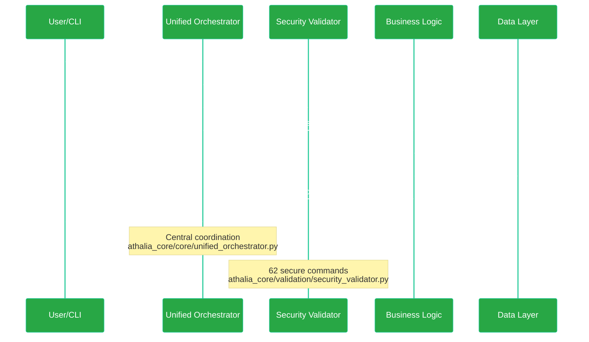
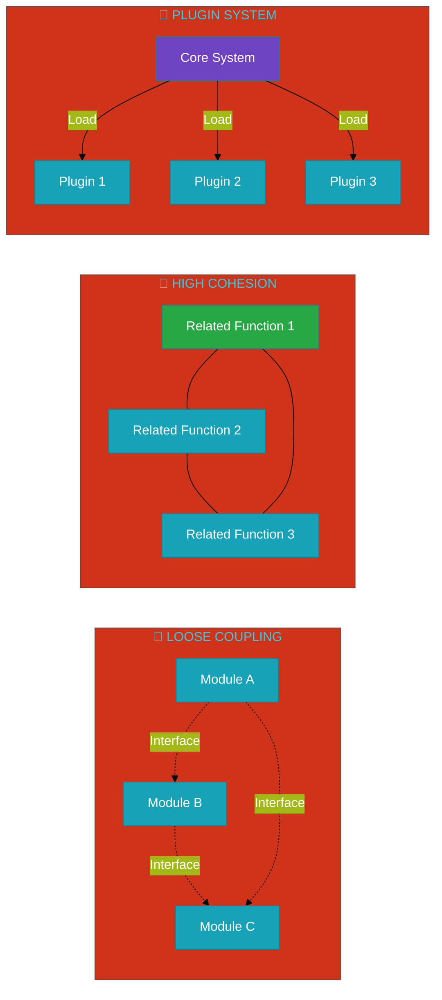
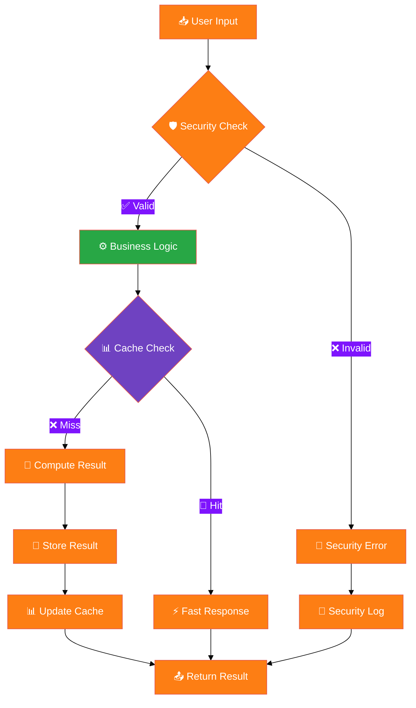
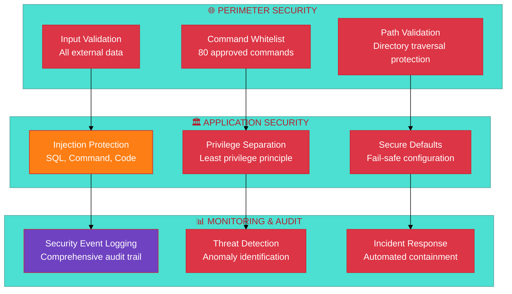
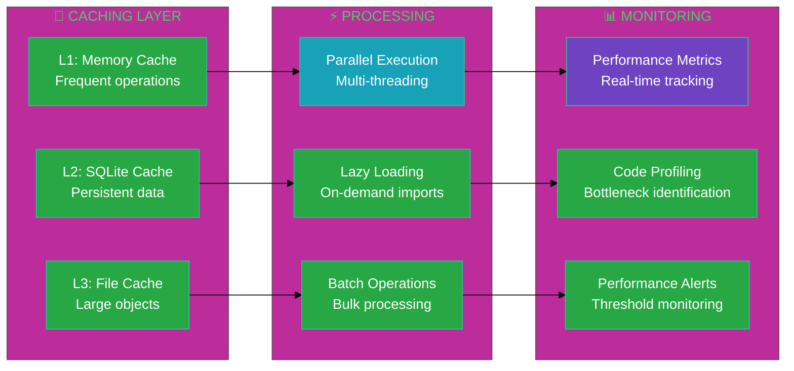
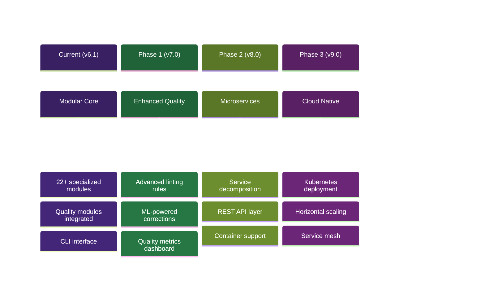
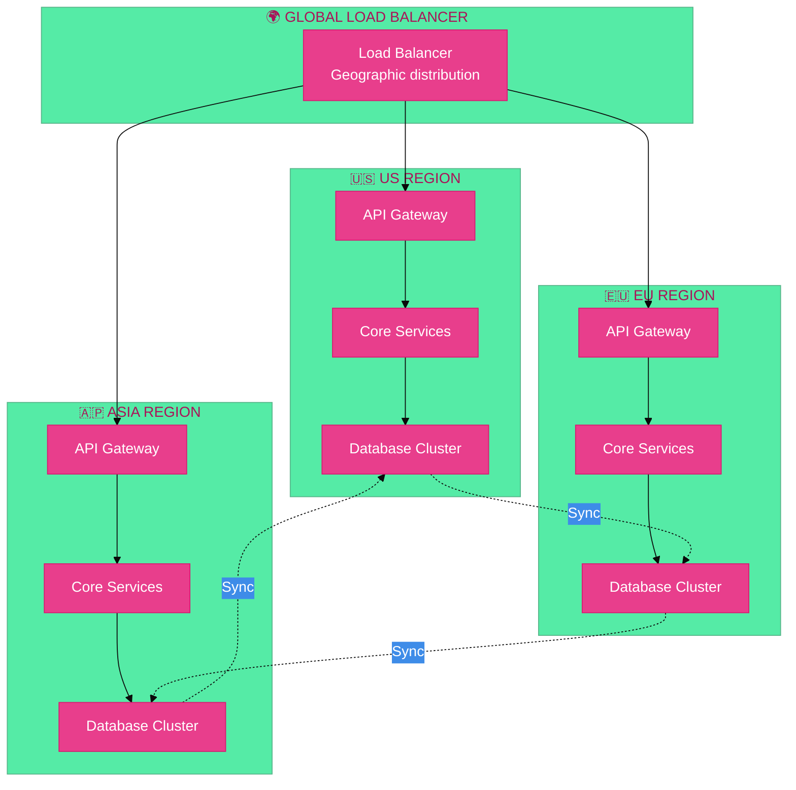

# Architecture Athalia

**Dernière mise à jour :** février 2026 · **Version :** v12.0

Vue d’ensemble du système : couches (interface, orchestration, logique métier, données, sécurité).

## Aperçu


```mermaid
%%{init: {'theme':'base', 'themeVariables': { 'primaryColor': '#667eea', 'primaryTextColor': '#fff', 'primaryBorderColor': '#764abc', 'lineColor': '#f64c72', 'secondaryColor': '#7ed321', 'tertiaryColor': '#fff'}}}%%
graph TB
    subgraph "🌐 USER INTERFACE LAYER"
        CLI[CLI Interface<br/>bin/core/athalia_unified.py]
        DASH[HTML Dashboards<br/>6 interactive dashboards]
        API[REST API<br/>Future expansion]
    end
    
    subgraph "🧠 ORCHESTRATION LAYER"
        UO[Unified Orchestrator<br/>athalia_core/core/unified_orchestrator.py]
        CM[Configuration Manager<br/>athalia_core/core/config_manager.py]
        LM[Logging Manager<br/>Advanced structured logging]
    end
    
    subgraph "🔧 BUSINESS LOGIC LAYER"
        PG[Project Generator<br/>athalia_core/core/generation.py]
        AC[Auto Cleaner<br/>athalia_core/automation/auto_cleaner.py]
        SV[Security Validator<br/>athalia_core/validation/security_validator.py]
        IA[Intelligent Auditor<br/>athalia_core/analysis/intelligent_analyzer.py]
        CO[Correction Optimizer<br/>athalia_core/quality/correction_optimizer.py]
        CL[Code Linter<br/>athalia_core/quality/code_linter.py]
    end
    
    subgraph "🗄️ DATA LAYER"
        CACHE[Cache Manager<br/>athalia_core/core/cache_manager.py]
        DB[SQLite Databases<br/>5 active databases]
        FS[File System<br/>Project templates & configs]
    end
    
    subgraph "🛡️ SECURITY LAYER"
        AUTH[Command Authentication<br/>62 secure commands]
        VAL[Input Validation<br/>Injection protection]
        AUDIT[Security Auditing<br/>athalia_core/audit/security_auditor.py]
    end
    
    CLI --> UO
    DASH --> UO
    API --> UO
    
    UO --> PG
    UO --> AC
    UO --> SV
    UO --> IA
    UO --> CO
    UO --> CL
    
    UO --> CM
    UO --> LM
    
    PG --> CACHE
    AC --> FS
    SV --> AUTH
    IA --> DB
    
    SV --> VAL
    SV --> AUDIT
    
    style UO fill:#667eea
    style SV fill:#f64c72
    style PG fill:#7ed321
    style AC fill:#ffa500
    style CL fill:#17a2b8
```

---

## 📊 **Component Architecture Details**

### 🧠 **Core Orchestrator Pattern**


```mermaid
%%{init: {'theme':'base', 'themeVariables': { 'primaryColor': '#28a745', 'primaryTextColor': '#fff', 'primaryBorderColor': '#20c997'}}}%%
sequenceDiagram
    participant U as User/CLI
    participant UO as Unified Orchestrator
    participant SV as Security Validator
    participant BL as Business Logic
    participant DL as Data Layer
    
    U->>UO: Request (generate/clean/audit)
    UO->>SV: Validate Security
    SV->>UO: Security Approved
    UO->>BL: Execute Business Logic
    BL->>DL: Data Operations
    DL->>BL: Data Response
    BL->>UO: Operation Result
    UO->>U: Final Response
    
    Note over UO: Central coordination<br/>athalia_core/core/unified_orchestrator.py
    Note over SV: 62 secure commands<br/>athalia_core/validation/security_validator.py
```

### 🔧 **Module Interaction Matrix**

<div align="center">

| **Module** | **Dependencies** | **Interfaces** | **Data Flow** |
|:-----------|:-----------------|:---------------|:--------------|
| **🎯 Unified Orchestrator** | All modules | CLI, API, Dashboard | **↕️ Bidirectional** |
| **🛡️ Security Validator** | None (standalone) | Command validation | **→ Input filtering** |
| **🏗️ Project Generator** | Cache, Templates | Blueprint creation | **→ Output generation** |
| **🧹 Auto Cleaner** | File System | File management | **→ Cleanup operations** |
| **🔍 Intelligent Auditor** | Database, Analytics | Code analysis | **→ Report generation** |
| **⚡ Cache Manager** | SQLite, Memory | Performance optimization | **↔️ Read/Write cache** |
| **🔧 Code Linter** | Quality standards | Code analysis | **→ Quality reports** |
| **⚡ Correction Optimizer** | ML models | Auto-correction | **→ Code improvement** |

</div>

---

## 🏗️ **System Design Principles**

### ✅ **Modular Architecture**


```mermaid
%%{init: {'theme':'base', 'themeVariables': { 'primaryColor': '#17a2b8', 'primaryTextColor': '#fff', 'primaryBorderColor': '#138496'}}}%%
graph LR
    subgraph "🧩 LOOSE COUPLING"
        A[Module A] -.->|Interface| B[Module B]
        B -.->|Interface| C[Module C]
        A -.->|Interface| C
    end
    
    subgraph "🔗 HIGH COHESION"
        D[Related Function 1]
        E[Related Function 2]
        F[Related Function 3]
        D --- E
        E --- F
        F --- D
    end
    
    subgraph "🔌 PLUGIN SYSTEM"
        G[Core System]
        H[Plugin 1]
        I[Plugin 2]
        J[Plugin 3]
        G -->|Load| H
        G -->|Load| I
        G -->|Load| J
    end
    
    style A fill:#17a2b8
    style D fill:#28a745
    style G fill:#6f42c1
```

### 🔄 **Data Flow Architecture**


```mermaid
%%{init: {'theme':'base', 'themeVariables': { 'primaryColor': '#fd7e14', 'primaryTextColor': '#fff', 'primaryBorderColor': '#e55a4e'}}}%%
flowchart TD
    INPUT[📥 User Input] --> VALIDATE{🛡️ Security Check}
    VALIDATE -->|✅ Valid| PROCESS[⚙️ Business Logic]
    VALIDATE -->|❌ Invalid| ERROR[🚫 Security Error]
    
    PROCESS --> CACHE{📊 Cache Check}
    CACHE -->|💾 Hit| FAST[⚡ Fast Response]
    CACHE -->|❌ Miss| COMPUTE[🧮 Compute Result]
    
    COMPUTE --> STORE[💽 Store Result]
    STORE --> CACHE_UPDATE[📊 Update Cache]
    CACHE_UPDATE --> RESPONSE[📤 Return Result]
    
    FAST --> RESPONSE
    ERROR --> LOG[📝 Security Log]
    LOG --> RESPONSE
    
    style VALIDATE fill:#fd7e14
    style PROCESS fill:#28a745
    style CACHE fill:#6f42c1
```

---

## 📁 **Directory Structure**

### 🗂️ **Project Organization**

```
athalia/
├── 🏗️ athalia_core/                     # Core system (22+ modules)
│   ├── 🎯 core/                         # Core modules
│   │   ├── unified_orchestrator.py      # Central coordinator
│   │   ├── cache_manager.py             # Performance cache
│   │   ├── config_manager.py            # Configuration management
│   │   └── performance_analyzer.py      # Performance monitoring
│   ├── 🛡️ validation/                   # Sécurité et validation
│   │   ├── security_validator.py        # Security engine
│   │   └── plugins_validator.py         # Plugin validation
│   ├── 🔧 quality/                      # Qualité et linting (NOUVEAU)
│   │   ├── code_linter.py               # Analyse et qualité du code
│   │   └── correction_optimizer.py      # Auto-correction (ML avancé)
│   ├── 🧹 automation/                   # Automation modules
│   │   ├── auto_cleaner.py              # Automatisation du nettoyage
│   │   ├── auto_cicd.py                 # Automatisation CI/CD
│   │   ├── auto_tester.py               # Automatisation des tests
│   │   └── auto_documenter.py           # Automatisation de la documentation
│   ├── 🔍 analysis/                     # Analysis modules
│   │   ├── intelligent_analyzer.py      # Analyse de code
│   │   ├── intelligent_memory.py        # Mémoire d'apprentissage
│   │   └── ast_analyzer.py              # Analyse AST
│   ├── 🤖 ai/                           # AI modules
│   │   ├── ai_robust.py                 # Gestion des modèles IA
│   │   └── ai_robust_enhanced.py        # IA améliorée
│   ├── 🚀 utilities/                    # Utility modules
│   │   ├── cli.py                       # Interface CLI
│   │   ├── dashboard.py                 # Système de tableau de bord
│   │   └── generation.py                # Générateur de projets
│   ├── 🤖 robotics/                     # Robotics modules
│   │   ├── reachy_auditor.py            # Auditeur robot Reachy
│   │   ├── ros2_validator.py            # Validation ROS2
│   │   ├── docker_robotics.py           # Robotique Docker
│   │   ├── rust_analyzer.py             # Analyse Rust
│   │   └── robotics_ci.py               # CI/CD robotique
│   ├── 🧠 agents/                        # Intelligent agents
│   │   ├── audit_agent.py               # Agent d'audit
│   │   └── context_prompt.py            # Agent de contexte
│   ├── ⚡ distillation/                  # Distillation modules
│   │   ├── adaptive_distillation.py     # Distillation adaptative
│   │   └── audit_distiller.py           # Distillation d'audit
│   ├── 🏷️ classification/                # Classification modules
│   │   ├── project_classifier.py        # Classification de projets
│   │   └── project_types.py             # Types de projets
│   ├── 🎨 templates/                     # Template modules
│   │   ├── artistic_templates.py        # Modèles artistiques
│   │   └── base_templates.py            # Modèles de base
│   ├── ⌨️ autocomplete/                   # Autocomplete modules
│   │   ├── autocomplete_engine.py       # Moteur d'autocomplétion
│   │   └── autocomplete_server.py       # Serveur d'autocomplétion
│   ├── 📊 analytics/                     # Analytics modules
│   │   ├── analytics.py                 # Analytics de base
│   │   └── advanced_analytics.py        # Analytics avancés
│   ├── 🔍 audit/                         # Audit modules
│   │   ├── audit.py                     # Audit de base
│   │   ├── security_auditor.py          # Auditeur de sécurité
│   │   └── intelligent_auditor.py       # Auditeur intelligent
│   ├── 🌐 i18n/                          # Internationalization
│   │   ├── en.py                        # Anglais
│   │   └── fr.py                        # Français
│   ├── 🔌 plugins/                       # Système de plugins
│   ├── 🚀 advanced_modules/              # Modules avancés
│   │   ├── auto_correction_advanced.py  # Auto-correction avancée
│   │   ├── dashboard_unified.py         # Tableau de bord unifié
│   │   └── user_profiles_advanced.py    # Profils utilisateur avancés
│   └── 📝 logs/                          # Système de journalisation
├── 🧪 tests/                           # Framework de tests
│   ├── 🧪 unit/                        # Tests unitaires (fonctions atomiques)
│   │   ├── modules/                     # Tests de modules
│   │   ├── quality/                     # Tests de qualité (NOUVEAU)
│   │   ├── core/                        # Tests du core
│   │   └── utils/                       # Tests d'utilitaires
│   ├── 🔗 integration/                 # Tests d'intégration (workflows)
│   ├── 🛡️ security/                    # Tests de validation de sécurité
│   └── ⚡ performance/                 # Benchmarks de performance
├── 📚 docs/                            # Documentation (101 files)
│   ├── 👤 USER_GUIDES/                 # Documentation utilisateur final
│   ├── 👨‍💻 DEVELOPER/                   # Ressources développeur
│   ├── 🏗️ ARCHITECTURE/                # Conception système (cette section)
│   ├── 🔌 API/                         # Référence API
│   └── 🎯 SPECIALIZED/                 # Sujets avancés
├── 📊 dashboard/                       # Tableaux de bord de surveillance HTML (6 fichiers)
├── 🔧 scripts/                         # Scripts utilitaires (21 outils)
├── ⚙️ bin/                             # Exécutables CLI (9 scripts Python)
└── ⚙️ config/                          # Fichiers de configuration
```

---

## 🔒 **Security Architecture**

### 🛡️ **Defense in Depth**


```mermaid
%%{init: {'theme':'base', 'themeVariables': { 'primaryColor': '#dc3545', 'primaryTextColor': '#fff', 'primaryBorderColor': '#c82333'}}}%%
graph TB
    subgraph "🌐 PERIMETER SECURITY"
        INPUT_VAL[Input Validation<br/>All external data]
        CMD_WHITELIST[Command Whitelist<br/>80 approved commands]
        PATH_VALIDATION[Path Validation<br/>Directory traversal protection]
    end
    
    subgraph "🏛️ APPLICATION SECURITY"
        INJECTION_PROTECTION[Injection Protection<br/>SQL, Command, Code]
        PRIVILEGE_SEPARATION[Privilege Separation<br/>Least privilege principle]
        SECURE_DEFAULTS[Secure Defaults<br/>Fail-safe configuration]
    end
    
    subgraph "📊 MONITORING & AUDIT"
        SECURITY_LOGGING[Security Event Logging<br/>Comprehensive audit trail]
        THREAT_DETECTION[Threat Detection<br/>Anomaly identification]
        INCIDENT_RESPONSE[Incident Response<br/>Automated containment]
    end
    
    INPUT_VAL --> INJECTION_PROTECTION
    CMD_WHITELIST --> PRIVILEGE_SEPARATION
    PATH_VALIDATION --> SECURE_DEFAULTS
    
    INJECTION_PROTECTION --> SECURITY_LOGGING
    PRIVILEGE_SEPARATION --> THREAT_DETECTION
    SECURE_DEFAULTS --> INCIDENT_RESPONSE
    
    style INPUT_VAL fill:#dc3545
    style INJECTION_PROTECTION fill:#fd7e14
    style SECURITY_LOGGING fill:#6f42c1
```

### 🔐 **Command Security Model**

<div align="center">

| **Security Level** | **Commands** | **Validation** | **Monitoring** |
|:------------------|:------------:|:--------------:|:--------------:|
| **🟢 Safe Operations** | `ls`, `cat`, `grep` | Basic syntax | Standard logging |
| **🟡 Moderate Risk** | `python`, `pip`, `git` | Path validation | Enhanced monitoring |
| **🟠 High Privilege** | `chmod`, `chown`, `sudo` | **BLOCKED** | Security alert |
| **🔴 Dangerous** | `rm -rf`, `eval`, `exec` | **BLOCKED** | Incident response |

**Total: 80 commandes autorisées avec contrôles de sécurité gradués**

</div>

---

## ⚡ **Performance Architecture**

### 📈 **Optimization Strategy**


```mermaid
%%{init: {'theme':'base', 'themeVariables': { 'primaryColor': '#28a745', 'primaryTextColor': '#fff', 'primaryBorderColor': '#20c997'}}}%%
graph LR
    subgraph "💾 CACHING LAYER"
        L1[L1: Memory Cache<br/>Frequent operations]
        L2[L2: SQLite Cache<br/>Persistent data]
        L3[L3: File Cache<br/>Large objects]
    end
    
    subgraph "⚡ PROCESSING"
        PARALLEL[Parallel Execution<br/>Multi-threading]
        LAZY[Lazy Loading<br/>On-demand imports]
        BATCH[Batch Operations<br/>Bulk processing]
    end
    
    subgraph "📊 MONITORING"
        METRICS[Performance Metrics<br/>Real-time tracking]
        PROFILING[Code Profiling<br/>Bottleneck identification]
        ALERTS[Performance Alerts<br/>Threshold monitoring]
    end
    
    L1 --> PARALLEL
    L2 --> LAZY
    L3 --> BATCH
    
    PARALLEL --> METRICS
    LAZY --> PROFILING
    BATCH --> ALERTS
    
    style L1 fill:#28a745
    style PARALLEL fill:#17a2b8
    style METRICS fill:#6f42c1
```

### 📊 **Performance Benchmarks**

<div align="center">

| **Operation** | **Target** | **Current** | **Optimization** |
|:--------------|:----------:|:-----------:|:----------------:|
| **🏗️ Project Generation** | < 100ms | ~204ms | 🔄 **En cours** |
| **🛡️ Security Validation** | < 50ms | ~30ms | ✅ **Achieved** |
| **🧹 File Cleanup** | < 5s | ~2s | ✅ **Dépassé** |
| **📊 Cache Hit Rate** | > 80% | ~50% | 🔄 **Optimisation** |
| **🔍 Code Analysis** | < 2s | ~1.5s | ✅ **Achieved** |
| **🔧 Code Linting** | < 1s | ~0.8s | ✅ **Achieved** |

</div>

---

## 🔮 **Future Architecture**

### 🚀 **Planned Enhancements**


```mermaid
%%{init: {'theme':'base', 'themeVariables': { 'primaryColor': '#6f42c1', 'primaryTextColor': '#fff', 'primaryBorderColor': '#5a32a3'}}}%%
timeline
    title Architecture Evolution Roadmap
    
    section Current (v6.1)
        Modular Core       : 22+ specialized modules
                          : Quality modules integrated
                          : CLI interface
    
    section Phase 1 (v7.0)
        Enhanced Quality   : Advanced linting rules
                         : ML-powered corrections
                         : Quality metrics dashboard
    
    section Phase 2 (v8.0)
        Microservices     : Service decomposition
                         : REST API layer
                         : Container support
    
    section Phase 3 (v9.0)
        Cloud Native      : Kubernetes deployment
                         : Horizontal scaling
                         : Service mesh
```

### 🌐 **Distributed Architecture Vision**


```mermaid
%%{init: {'theme':'base', 'themeVariables': { 'primaryColor': '#e83e8c', 'primaryTextColor': '#fff', 'primaryBorderColor': '#d91a72'}}}%%
graph TB
    subgraph "🌍 GLOBAL LOAD BALANCER"
        LB[Load Balancer<br/>Geographic distribution]
    end
    
    subgraph "🇺🇸 US REGION"
        US_API[API Gateway]
        US_CORE[Core Services]
        US_DB[Database Cluster]
    end
    
    subgraph "🇪🇺 EU REGION"
        EU_API[API Gateway]
        EU_CORE[Core Services]
        EU_DB[Database Cluster]
    end
    
    subgraph "🇦🇵 ASIA REGION"
        ASIA_API[API Gateway]
        ASIA_CORE[Core Services]
        ASIA_DB[Database Cluster]
    end
    
    LB --> US_API
    LB --> EU_API
    LB --> ASIA_API
    
    US_API --> US_CORE
    EU_API --> EU_CORE
    ASIA_API --> ASIA_CORE
    
    US_CORE --> US_DB
    EU_CORE --> EU_DB
    ASIA_CORE --> ASIA_DB
    
    US_DB -.->|Sync| EU_DB
    EU_DB -.->|Sync| ASIA_DB
    ASIA_DB -.->|Sync| US_DB
    
    style LB fill:#e83e8c
```

---

## 📚 **Documentation References**

### 🔗 **Related Architecture Documents**

- **[📁 Project Structure](STRUCTURE_PROJET_EXPLICATION.md)** - Detailed directory organization
- **[🏢 Workspace Organization](ORGANISATION_WORKSPACE.md)** - Development environment setup
- **[🔌 API Architecture](../API/INDEX.md)** - Interface design patterns
- **[🛡️ Security Design](../DEVELOPER/SECURITY_LINTING_GUIDE.md)** - Security implementation details
- **[⚡ Performance Optimization](../REPORTS/RACINE/performance_optimization_report.md)** - Performance tuning guides

### 🎯 **Quick Navigation**

<div align="center">

| **Audience** | **Next Steps** | **Key Documents** |
|:-------------|:---------------|:------------------|
| **👤 New Users** | [Quick Start Guide](../USER_GUIDES/QUICK_START.md) | Installation & basic usage |
| **👨‍💻 Developers** | [API Reference](../API/INDEX.md) | Module documentation |
| **🔧 DevOps** | [Deployment Guide](../USER_GUIDES/DEPLOYMENT.md) | Production deployment |
| **🛡️ Security** | [Security Documentation](../DEVELOPER/SECURITY_LINTING_GUIDE.md) | Security implementation |

</div>

---

<div align="center">

**🏗️ Architecture Documentation**

*Professional system design for enterprise-grade DevOps automation*

**🏗️ System Design** | **📚 Complete Reference** - [Documentation](../INDEX_FINAL_DOCUMENTATION_ATHALIA.md) | **🛡️ Enterprise Grade** - Security Implementation

**Last Updated:** August 14, 2025 | **Version:** 6.1 | **Status:** Production Ready - Modular Architecture Complete

</div>
