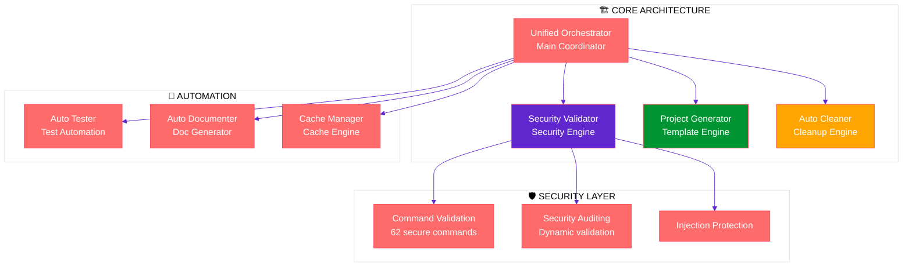
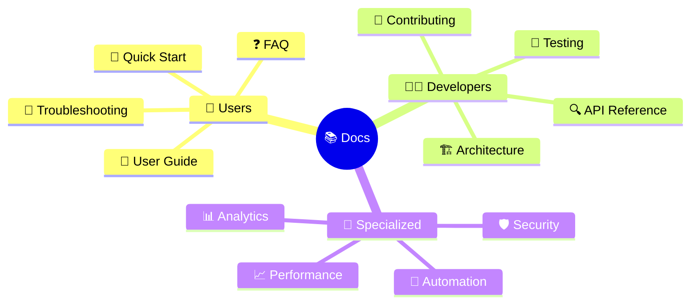

# 🏗️ **Diagrammes d'Architecture Athalia**

## 📊 **Architecture Core**



## 🔄 **Workflow de Développement**

```mermaid
gitgraph
    commit id: "Initial Setup"
    branch feature/security
    checkout feature/security
    commit id: "Security Validator"
    commit id: "Command Whitelist"
    checkout main
    merge feature/security
    branch feature/automation
    checkout feature/automation
    commit id: "Auto Cleaner"
    commit id: "Auto Tester"
    checkout main
    merge feature/automation
    commit id: "v12.0.0 Release"
```

## 📚 **Structure de Documentation**



---

*Dernière mise à jour : 21 août 2025*
