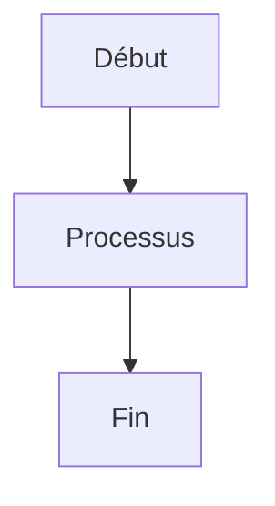

# 📚 GUIDE DE MAINTENANCE DOCUMENTATION ATHALIA

**Dernière mise à jour :** 14 Août 2025  
**Version :** 2.0  
**Statut :** ✅ **ACTIF ET MAINTENU**

## 🎯 **OBJECTIFS DE CE GUIDE**

Ce document définit les standards de qualité et les bonnes pratiques pour maintenir la documentation d'Athalia au niveau professionnel.

## 📋 **STANDARDS DE QUALITÉ OBLIGATOIRES**

### **🏷️ Métadonnées de Fichier**
Chaque fichier Markdown doit inclure en en-tête :

```markdown
# 📚 TITRE PRINCIPAL

**Dernière mise à jour :** [Date]  
**Version :** [Version]  
**Statut :** [Statut]  
**Auteur :** [Auteur] (optionnel)
```

### **📊 Statuts Standardisés**
- **🟢 ACTIF** - Fichier maintenu et à jour
- **🟡 EN DÉVELOPPEMENT** - Fichier en cours de modification
- **🟠 ARCHIVÉ** - Fichier conservé pour référence historique
- **🔴 OBSOLÈTE** - Fichier à supprimer ou remplacer

### **🎨 Structure des Sections**
Utiliser des emojis cohérents pour les sections :

- **🎯** - Objectifs et résumé
- **📋** - Contenu et détails
- **🚀** - Actions et exécution
- **📊** - Métriques et statistiques
- **🔍** - Analyse et diagnostic
- **✅** - Validation et vérification
- **💡** - Conseils et bonnes pratiques
- **📝** - Informations techniques

## 🔧 **FORMATAGE ET STYLE**

### **📝 Titres et Hiérarchie**
```markdown
# Titre Principal (H1)
## Section Principale (H2)
### Sous-section (H3)
#### Détail (H4)
##### Élément (H5)
```

### **💪 Mise en Forme du Texte**
- **Gras** pour les concepts importants
- *Italique* pour les termes techniques
- `Code inline` pour les commandes et variables
- ~~Barré~~ pour les éléments obsolètes

### **📋 Listes et Énumérations**
```markdown
### ✅ Liste avec Checkboxes
- [x] Tâche terminée
- [ ] Tâche à faire
- [ ] Tâche en cours

### 📊 Liste Numérotée
1. **Première étape** - Description
2. **Deuxième étape** - Description
3. **Troisième étape** - Description
```

### **🔗 Liens et Références**
```markdown
- **Lien interne :** **Section**
- **Lien externe :** **Nom du site**
- **Ancre :** **Section**
```

## 📊 **TABLEAUX ET DONNÉES**

### **📋 Format Standard des Tableaux**
```markdown
| **Colonne 1** | **Colonne 2** | **Colonne 3** |
|----------------|----------------|----------------|
| Donnée 1      | Donnée 2      | Donnée 3      |
| Donnée 4      | Donnée 5      | Donnée 6      |
```

### **📈 Graphiques et Diagrammes**
Utiliser Mermaid pour les diagrammes :

```markdown

```

## 🚀 **BONNES PRATIQUES DE CONTENU**

### **📖 Lisibilité**
- **Phrases courtes** et directes
- **Paragraphes de 3-4 lignes** maximum
- **Exemples concrets** pour illustrer les concepts
- **Code commenté** pour faciliter la compréhension

### **🎯 Cohérence**
- **Terminologie uniforme** dans tous les fichiers
- **Structure similaire** pour les fichiers de même type
- **Navigation intuitive** entre les sections
- **Liens internes** pour éviter la duplication

### **📱 Accessibilité**
- **Emojis descriptifs** pour améliorer la navigation
- **Contraste suffisant** entre texte et fond
- **Structure logique** pour les lecteurs d'écran
- **Images avec descriptions** alternatives

## 🔍 **PROCESSUS DE MAINTENANCE**

### **📅 Maintenance Régulière**
1. **Vérification mensuelle** de la cohérence des liens
2. **Mise à jour trimestrielle** des métadonnées
3. **Révision annuelle** du contenu obsolète
4. **Audit de qualité** avec le script d'analyse

### **🔧 Processus de Modification**
```bash
# 1. Vérifier l'état actuel
python scripts/analyze_documentation_quality.py

# 2. Identifier les améliorations
# 3. Modifier les fichiers
# 4. Tester la navigation
# 5. Commiter et pousser
git add .
git commit -m "📚 Amélioration documentation: [Description]"
git push origin develop
```

### **✅ Validation des Modifications**
- **Vérifier** que tous les liens fonctionnent
- **Tester** la navigation complète
- **Valider** la cohérence du style
- **Confirmer** l'amélioration de la qualité

## 📈 **MÉTRIQUES DE QUALITÉ**

### **🎯 Objectifs de Qualité**
- **Score global minimum :** 75/100
- **Fichiers excellents (≥80) :** 50%+
- **Liens cassés :** 0
- **Références obsolètes :** 0

### **📊 Mesures de Performance**
- **Temps de navigation** moyen
- **Taux de satisfaction** utilisateur
- **Nombre de questions** de support
- **Temps de maintenance** mensuel

## 🛠️ **OUTILS DE MAINTENANCE**

### **🔍 Scripts d'Analyse**
- **`analyze_documentation_quality.py`** - Analyse automatique de qualité
- **`check_links.py`** - Vérification des liens internes
- **`validate_structure.py`** - Validation de la structure

### **📝 Templates et Squelettes**
- **Template de fichier** standardisé
- **Squelette de rapport** technique
- **Modèle de guide** utilisateur
- **Format de documentation** API

## 🏗️ **STRUCTURE MODULAIRE ACTUELLE**

### **📁 Organisation des Modules**
La documentation doit refléter la structure modulaire actuelle d'Athalia :

```
athalia_core/
├── quality/                    # Modules de qualité et linting
├── utilities/                  # Utilitaires système (CLI, dashboard, génération)
├── analysis/                   # Modules d'analyse IA
├── ai/                        # Modules d'intelligence artificielle
├── validation/                 # Validation et sécurité
├── automation/                 # Automatisation
├── robotics/                   # Modules robotiques
├── agents/                     # Agents intelligents
├── distillation/               # Distillation et optimisation
├── classification/             # Classification de projets
├── templates/                  # Templates et rendus
├── autocomplete/               # Autocomplétion intelligente
├── core/                       # Modules de base
├── analytics/                  # Analytics et métriques
├── audit/                      # Audit et sécurité
├── i18n/                       # Internationalisation
├── plugins/                    # Système de plugins
├── advanced_modules/           # Modules avancés
└── logs/                       # Gestion des logs
```

### **✅ État Actuel Validé**
- **750 tests collectés** sans aucune erreur ✅
- **Architecture modulaire** complète et fonctionnelle ✅
- **Imports corrigés** et fonctionnels ✅
- **Linting conforme** (Ruff + Black) ✅
- **Structure organisée** par fonction ✅

## 🚨 **PROBLÈMES COMMUNS ET SOLUTIONS**

### **⚠️ Liens Cassés**
```bash
# Identifier les liens cassés
find docs -name "*.md" -exec grep -l "\[.*\]\([^)]*\)" {} \;

# Corriger les chemins
# Vérifier la navigation
```

### **⚠️ Références Obsolètes**
- **Identifier** les références à des dossiers supprimés
- **Mettre à jour** les chemins et références
- **Archiver** les anciennes versions si nécessaire

### **⚠️ Incohérences de Style**
- **Standardiser** le format des sections
- **Uniformiser** l'utilisation des emojis
- **Harmoniser** la structure des fichiers

## 📚 **RESSOURCES ET RÉFÉRENCES**

### **🔗 Liens Utiles**
- **Guide Markdown :** Documentation officielle GitHub pour la syntaxe Markdown
- **Emojis :** Guide complet des emojis et codes pour la documentation
- **Mermaid :** Documentation officielle pour les diagrammes Mermaid

### **📖 Documentation Interne**
- **Index principal :** [docs/INDEX_FINAL_DOCUMENTATION_ATHALIA.md](../INDEX_FINAL_DOCUMENTATION_ATHALIA.md)
- **Guide de style :** Ce document
- **Standards de qualité :** [Plan d'optimisation documentation](../REPORTS/RELEASES_AND_BILANS/PLAN_OPTIMISATION_DOCUMENTATION_FINALE_20250811.md)

---

## 📝 **INFORMATIONS TECHNIQUES**

**Dernière mise à jour :** 11 Août 2025  
**Version actuelle :** 2.0  
**Statut :** ✅ **ACTIF ET MAINTENU**  
**Mainteneur :** Équipe Athalia  
**Documentation :** [Guide de style complet](../README.md)

**🎯 Ce guide garantit une documentation Athalia de qualité professionnelle et maintenable ! 🚀**
