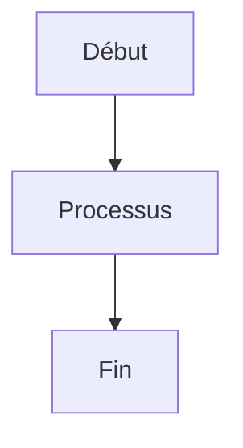

# 📚 TITRE PRINCIPAL DU FICHIER

**Dernière mise à jour :** [Date]  
**Version :** [Version]  
**Statut :** [Statut]  
**Auteur :** [Auteur] (optionnel)  
**Catégorie :** [Catégorie]

## 🎯 **RÉSUMÉ EXÉCUTIF**

Description courte et claire de l'objectif de ce document en 2-3 lignes maximum.

---

## 📋 **CONTENU PRINCIPAL**

### **🎯 Section 1 - Objectifs**
- **Objectif principal** - Description
- **Objectifs secondaires** - Description
- **Résultats attendus** - Description

### **🚀 Section 2 - Actions**
- **Action 1** - Description détaillée
- **Action 2** - Description détaillée
- **Action 3** - Description détaillée

### **📊 Section 3 - Métriques**
- **Métrique 1** - Valeur et unité
- **Métrique 2** - Valeur et unité
- **Métrique 3** - Valeur et unité

---

## 🔍 **DÉTAILS TECHNIQUES**

### **📝 Code et Exemples**
```python
# Exemple de code Python
def exemple_fonction():
    """Description de la fonction"""
    return "Résultat"
```

### **📋 Tableaux de Données**
| **Colonne 1** | **Colonne 2** | **Colonne 3** |
|----------------|----------------|----------------|
| Donnée 1      | Donnée 2      | Donnée 3      |
| Donnée 4      | Donnée 5      | Donnée 6      |

### **📈 Diagrammes (si applicable)**


---

## ❓ **FAQ - QUESTIONS FRÉQUENTES**

### **🔧 Questions Techniques**
<details>
<summary><strong>Question 1 ?</strong></summary>

**Réponse détaillée** avec explications et exemples si nécessaire.
</details>

<details>
<summary><strong>Question 2 ?</strong></summary>

**Réponse détaillée** avec explications et exemples si nécessaire.
</details>

### **🚀 Questions d'Utilisation**
<details>
<summary><strong>Comment utiliser cette fonctionnalité ?</strong></summary>

1. **Étape 1** - Description
2. **Étape 2** - Description
3. **Étape 3** - Description
</details>

---

## 🎯 **BONNES PRATIQUES**

### **✅ À Faire**
- **Bonne pratique 1** - Description et justification
- **Bonne pratique 2** - Description et justification
- **Bonne pratique 3** - Description et justification

### **❌ À Éviter**
- **Mauvaise pratique 1** - Description et alternative
- **Mauvaise pratique 2** - Description et alternative
- **Mauvaise pratique 3** - Description et alternative

---

## 🚨 **DÉPANNAGE**

### **⚠️ Problèmes Courants**

#### **Problème 1 : Description du problème**
- **Symptômes :** Description des symptômes
- **Cause :** Explication de la cause
- **Solution :** Description de la solution
- **Prévention :** Comment éviter ce problème

#### **Problème 2 : Description du problème**
- **Symptômes :** Description des symptômes
- **Cause :** Explication de la cause
- **Solution :** Description de la solution
- **Prévention :** Comment éviter ce problème

---

## 📚 **RESSOURCES ET RÉFÉRENCES**

### **🔗 Liens Utiles**
- **Documentation officielle :** [Lien](URL)
- **Guide utilisateur :** [Lien](URL)
- **Exemples pratiques :** [Lien](URL)

### **📖 Documentation Interne**
- **Fichier connexe 1 :** [Nom du fichier](chemin/vers/fichier.md)
- **Fichier connexe 2 :** [Nom du fichier](chemin/vers/fichier.md)
- **Guide principal :** [docs/INDEX_FINAL_DOCUMENTATION_ATHALIA.md](../../INDEX_FINAL_DOCUMENTATION_ATHALIA.md)

---

## 📝 **INFORMATIONS TECHNIQUES**

**Dernière mise à jour :** [Date]  
**Version actuelle :** [Version]  
**Statut :** [Statut]  
**Mainteneur :** [Mainteneur]  
**Documentation :** [Lien vers la documentation principale]

**🎯 [Message de conclusion inspirant] 🚀**

---

## 📋 **CHECKLIST DE QUALITÉ**

### **✅ Avant de Commiter**
- [ ] **Métadonnées** complètes et à jour
- [ ] **Structure** respectée (emojis, hiérarchie)
- [ ] **Liens internes** fonctionnels
- [ ] **Code et exemples** testés
- [ ] **Orthographe et grammaire** vérifiés
- [ ] **Navigation** testée

### **🔍 Validation Finale**
- [ ] **Score de qualité** ≥ 75/100
- [ ] **Cohérence** avec les autres fichiers
- [ ] **Utilité** pour l'utilisateur final
- [ ] **Maintenabilité** assurée 