# 🧭 **GLOBAL NAVIGATION** - Documentation Index

<div align="center">


[](.)
[](.)
[](.)
[](.)

**Complete navigation index for Athalia DevOps Platform documentation**

</div>

---

## 🗺️ **Documentation Map**

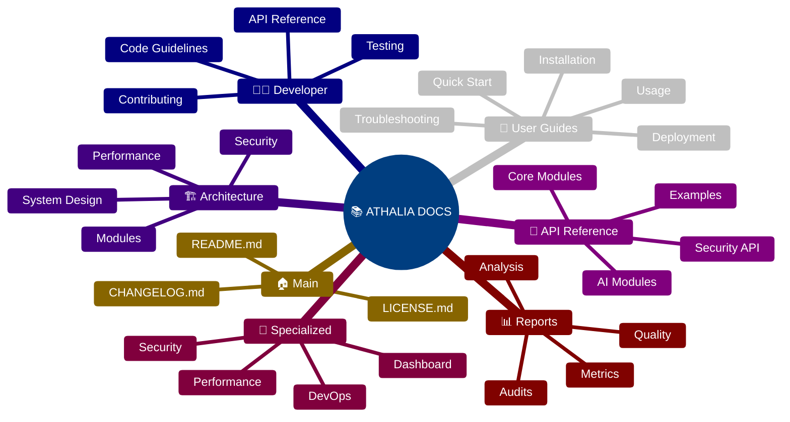

---

## 🚀 **Quick Start Navigation**

### 🎯 **For New Users**

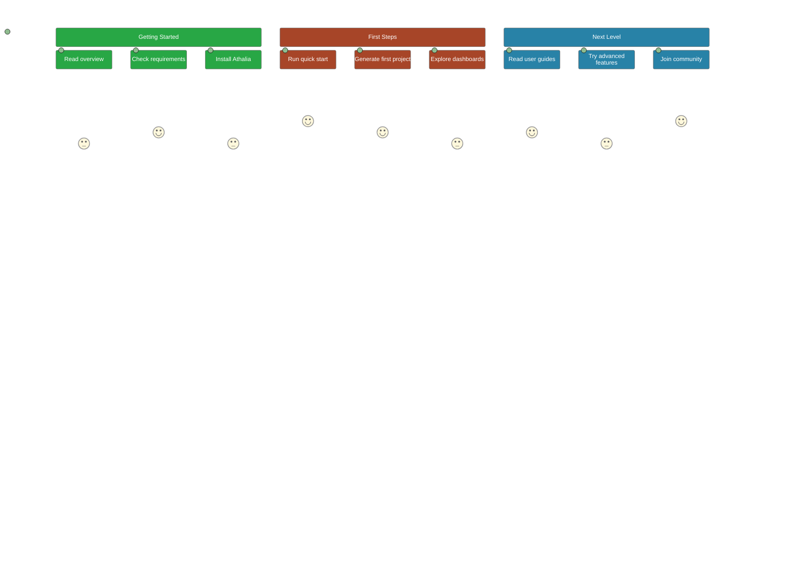

<div align="center">

**🎯 Essential Links for New Users**

| Step | Document | Time | Description |
|:----:|:---------|:----:|:------------|
| **1** | [📖 Main README](../README.md) | 3 min | Project overview & capabilities |
| **2** | [⚙️ Installation](USER_GUIDES/INSTALLATION.md) | 5 min | Complete setup guide |
| **3** | [⚡ Quick Start](USER_GUIDES/QUICK_START.md) | 10 min | First hands-on experience |
| **4** | [📚 Usage Guide](USER_GUIDES/USAGE.md) | 15 min | Complete feature tour |

</div>

### 👨‍💻 **For Developers**

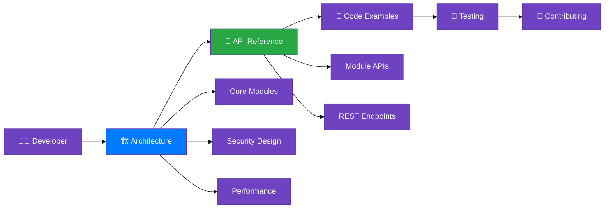

<div align="center">

**👨‍💻 Essential Links for Developers**

| Category | Document | Purpose |
|:---------|:---------|:--------|
| **🏗️ Architecture** | [System Design](ARCHITECTURE/INDEX.md) | Understand system structure |
| **🔌 API Reference** | [Module APIs](API/INDEX.md) | Complete API documentation |
| **🧪 Testing** | [Test Guidelines](DEVELOPER/TESTING.md) | Testing best practices |
| **🤝 Contributing** | [Contribution Guide](DEVELOPER/CONTRIBUTING.md) | How to contribute code |

</div>

### 🔧 **For System Administrators**

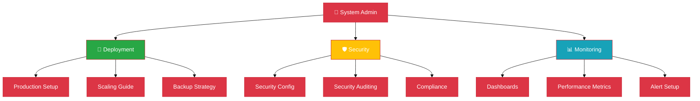

---

## 📋 **Complete Documentation Index**

### 🏠 **Main Documentation**

<div align="center">

| **Document** | **Type** | **Audience** | **Priority** | **Last Updated** |
|:-------------|:---------|:-------------|:-------------|:-----------------|
| [📖 **README.md**](../README.md) | Overview | All | 🔴 **Critical** | 2025-08-04 |
| [📚 **docs/README.md**](README.md) | Index | All | 🔴 **Critical** | 2025-08-04 |
| [📋 **CHANGELOG.md**](../CHANGELOG.md) | History | All | 🟡 **Important** | 2025-08-03 |
| [⚖️ **LICENSE.md**](../LICENSE.md) | Legal | All | 🟢 **Standard** | 2025-07-30 |

</div>

### 👤 **User Guides** (8 documents)

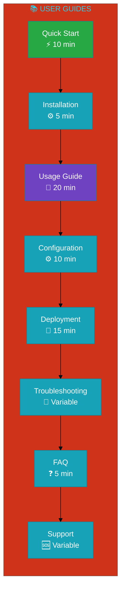

| **Guide** | **Path** | **Description** | **Difficulty** |
|:----------|:---------|:----------------|:---------------|
| [⚡ **Quick Start**](USER_GUIDES/QUICK_START.md) | `USER_GUIDES/` | Get started in 10 minutes | 🟢 **Beginner** |
| [⚙️ **Installation**](USER_GUIDES/INSTALLATION.md) | `USER_GUIDES/` | Complete setup guide | 🟢 **Beginner** |
| [📖 **Usage Guide**](USER_GUIDES/USAGE.md) | `USER_GUIDES/` | Complete feature overview | 🟡 **Intermediate** |
| [🔧 **Troubleshooting**](USER_GUIDES/TROUBLESHOOTING.md) | `USER_GUIDES/` | Problem resolution | 🟡 **Intermediate** |
| [🚀 **Deployment**](USER_GUIDES/DEPLOYMENT.md) | `USER_GUIDES/` | Production deployment | 🔴 **Advanced** |
| [⚙️ **Configuration**](USER_GUIDES/CONFIGURATION.md) | `USER_GUIDES/` | Settings & customization | 🟡 **Intermediate** |

### 👨‍💻 **Developer Documentation** (15+ documents)

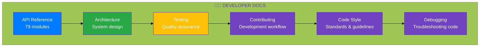

| **Category** | **Documents** | **Key Files** | **Focus** |
|:-------------|:-------------:|:--------------|:----------|
| **🔌 API Reference** | 20+ | [API Index](API/INDEX.md) | Module documentation |
| **🏗️ Architecture** | 8+ | [Architecture](ARCHITECTURE/INDEX.md) | System design |
| **🧪 Testing** | 5+ | [Testing Guide](DEVELOPER/TESTING.md) | Quality assurance |
| **🤝 Contributing** | 3+ | [Contributing](DEVELOPER/CONTRIBUTING.md) | Development process |

### 🏗️ **Architecture Documentation** (8 documents)

<div align="center">

| **Component** | **Document** | **Diagrams** | **Complexity** |
|:--------------|:-------------|:------------:|:---------------|
| **🎯 Overview** | [Architecture Index](ARCHITECTURE/INDEX.md) | 8 | 🟡 **Medium** |
| **📁 Structure** | [Project Structure](ARCHITECTURE/STRUCTURE_PROJET_EXPLICATION.md) | 3 | 🟢 **Low** |
| **🏢 Workspace** | [Workspace Org](ARCHITECTURE/ORGANISATION_WORKSPACE.md) | 2 | 🟢 **Low** |
| **🔄 Data Flow** | [Data Architecture](ARCHITECTURE/DATA_FLOW.md) | 5 | 🔴 **High** |

</div>

### 🔌 **API Reference** (20+ documents)

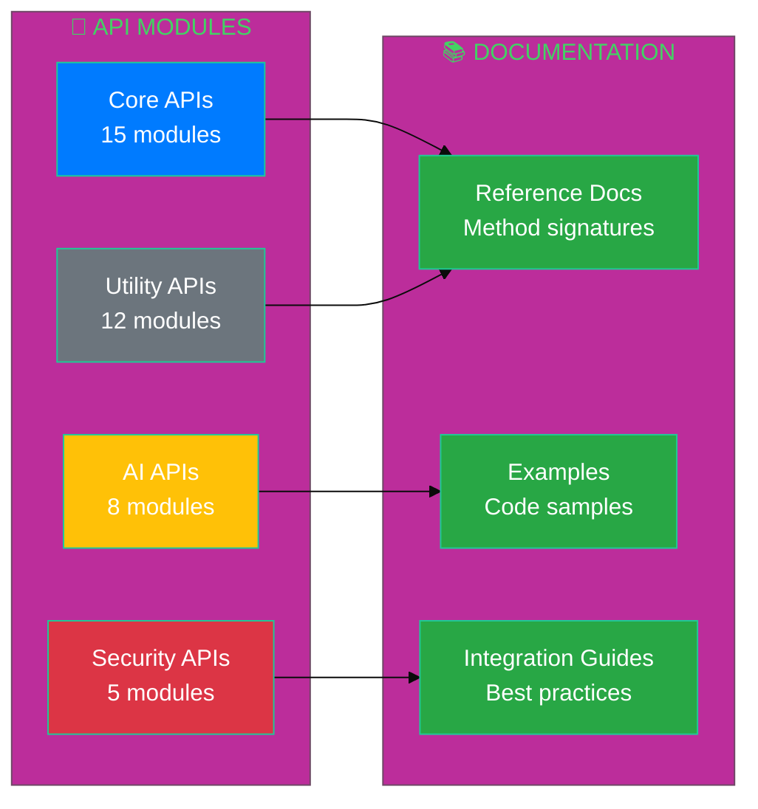

| **API Category** | **Modules** | **Key Documents** | **Examples** |
|:-----------------|:-----------:|:------------------|:-------------|
| **🧠 Core APIs** | 15 | [Core Modules](API/core_modules.md) | [Core Examples](API/EXAMPLES.md) |
| **🤖 AI APIs** | 8 | [AI Modules](API/ai_modules.md) | [AI Examples](API/AI_EXAMPLES.md) |
| **🛡️ Security APIs** | 5 | [Security API](API/SECURITY_API.md) | [Security Examples](API/SEC_EXAMPLES.md) |
| **🔧 Utility APIs** | 12 | [Utility Modules](API/utility_modules.md) | [Utility Examples](API/UTIL_EXAMPLES.md) |

### 🎯 **Specialized Documentation** (30+ documents)

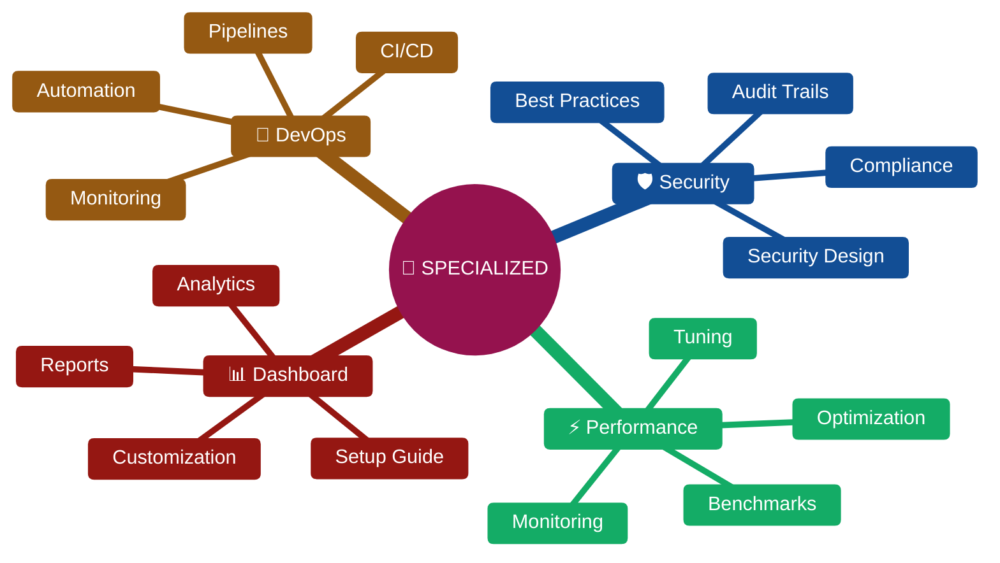

<div align="center">

| **Specialization** | **Documents** | **Key Topics** | **Audience** |
|:-------------------|:-------------:|:---------------|:-------------|
| **🛡️ Security** | 12 | Authentication, Authorization, Auditing | Security Engineers |
| **⚡ Performance** | 8 | Optimization, Monitoring, Benchmarking | DevOps Engineers |
| **📊 Dashboard** | 6 | Setup, Customization, Analytics | System Administrators |
| **🚀 DevOps** | 10 | CI/CD, Automation, Monitoring | DevOps Teams |

</div>

---

## 🔍 **Search & Discovery**

### 🎯 **Find by Use Case**

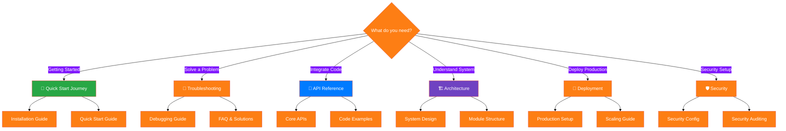

### 📚 **Find by Document Type**

<div align="center">

| **Document Type** | **Count** | **Examples** | **Best For** |
|:------------------|:---------:|:-------------|:-------------|
| **📖 Guides** | 25 | Quick Start, Installation | Learning step-by-step |
| **📋 References** | 45 | API docs, Module specs | Looking up specific info |
| **🎯 Tutorials** | 15 | Code examples, Workflows | Hands-on practice |
| **📊 Reports** | 12 | Analysis, Quality metrics | Understanding status |
| **🔧 Tools** | 8 | Scripts, Validators | Automation & validation |

</div>

### 🏷️ **Find by Topic Tags**

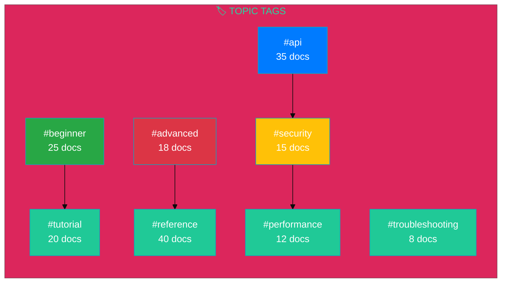

---

## 🔄 **Documentation Maintenance**

### 📊 **Quality Metrics**

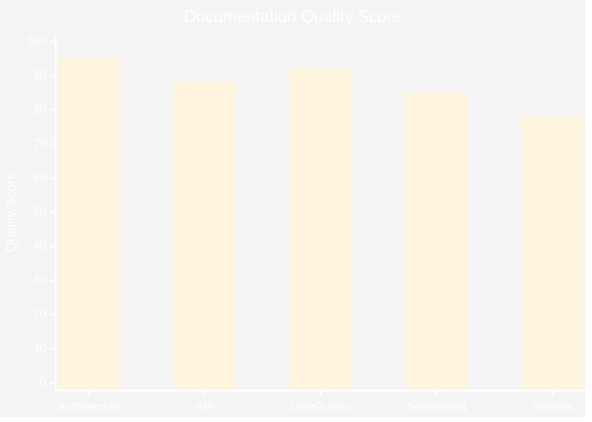

<div align="center">

**📈 Current Quality Metrics**

| **Category** | **Quality Score** | **Diagrams** | **Code Examples** | **Status** |
|:-------------|:-----------------:|:------------:|:-----------------:|:-----------|
| **🏗️ Architecture** | 95/100 | ✅ Excellent | ✅ Excellent | 🟢 **Excellent** |
| **🔌 API Reference** | 88/100 | ✅ Good | ✅ Excellent | 🟢 **Good** |
| **👤 User Guides** | 92/100 | ✅ Excellent | ✅ Good | 🟢 **Excellent** |
| **🎯 Specialized** | 85/100 | 🟡 Needs Work | ✅ Good | 🟡 **Good** |
| **📊 Reports** | 78/100 | 🟡 Needs Work | 🟡 Needs Work | 🟡 **Acceptable** |

</div>

### 🔧 **Maintenance Tools**

```python
# 🔧 Documentation maintenance scripts
scripts/
├── validate_documentation.py      # Quality validation
├── generate_index.py             # Auto-generate indices  
├── check_links.py                # Link validation
├── update_metrics.py             # Metrics calculation
└── sync_translations.py          # Multi-language sync
```

### 📅 **Update Schedule**

<div align="center">

| **Frequency** | **Tasks** | **Responsible** | **Tools** |
|:--------------|:----------|:----------------|:----------|
| **Daily** | Link validation, Basic quality checks | Automated | Scripts |
| **Weekly** | Content review, Update metrics | Team | Manual + Scripts |
| **Monthly** | Comprehensive audit, Structure review | Lead | Full validation |
| **Quarterly** | Major updates, Architecture reviews | Team | Complete overhaul |

</div>

---

## 🌐 **Multi-Language Support**

### 🗣️ **Language Coverage**

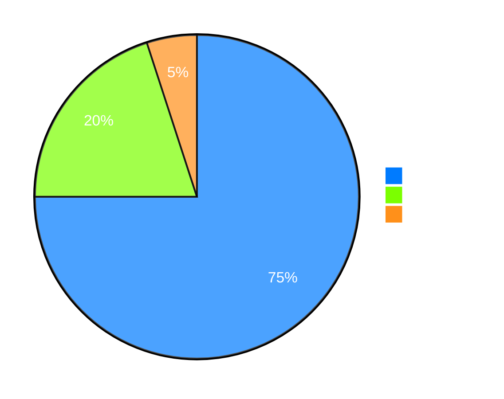

<div align="center">

| **Language** | **Documents** | **Coverage** | **Status** |
|:-------------|:-------------:|:------------:|:-----------|
| **🇺🇸 English** | 110 | 75% | ✅ **Primary** |
| **🇫🇷 French** | 30 | 20% | 🟡 **Legacy** |
| **🌐 Mixed** | 7 | 5% | 🔄 **Transitioning** |

</div>

---

## 🎯 **Recommended Learning Paths**

### 🚀 **Path 1: Complete Beginner (2 hours)**

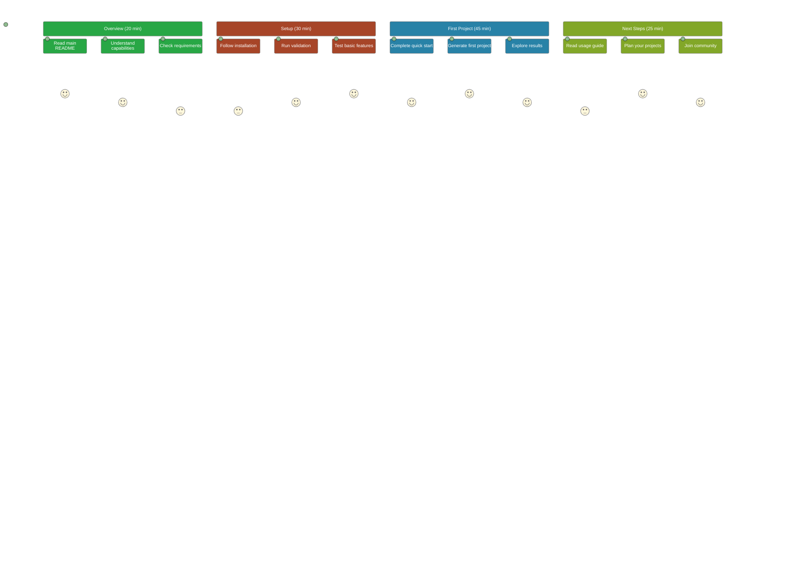

### 👨‍💻 **Path 2: Developer Integration (4 hours)**

```mermaid
%%{init: {'theme':'base', 'themeVariables': { 'primaryColor': '#6f42c1', 'primaryTextColor': '#fff', 'primaryBorderColor': '#5a32a3'}}}%%
timeline
    title Developer Integration Path
    section Hour 1 : Architecture
                   : System Design
                   : Module Structure
                   : Data Flow
    section Hour 2 : Core APIs
                   : Module References
                   : Code Examples
                   : Integration Patterns
    section Hour 3 : Advanced Features
                   : Security APIs
                   : Performance Optimization
                   : Plugin Development
    section Hour 4 : Testing & Deployment
                   : Test Framework
                   : CI/CD Integration
                   : Production Deployment
```

### 🔧 **Path 3: System Administrator (3 hours)**

```mermaid
%%{init: {'theme':'base', 'themeVariables': { 'primaryColor': '#dc3545', 'primaryTextColor': '#fff', 'primaryBorderColor': '#c82333'}}}%%
gantt
    title System Administrator Path
    dateFormat HH:mm
    axisFormat %H:%M
    
    section Setup
    Installation & Config    :active, setup, 00:00, 01:00
    
    section Security
    Security Configuration   :security, after setup, 01:00
    
    section Deployment
    Production Deployment    :deploy, after security, 01:00
    
    section Monitoring
    Dashboard & Monitoring   :monitor, after deploy, 00:30
    
    section Maintenance
    Backup & Maintenance     :maint, after monitor, 00:30
```

---

<div align="center">

**🧭 Global Navigation Complete**

*Your complete guide to Athalia DevOps Platform documentation*

[](USER_GUIDES/QUICK_START.md)
[](API/INDEX.md)
[](ARCHITECTURE/INDEX.md)

**147 Documents** | **6 Categories** | **Enterprise Ready** | **Always Updated**

</div>