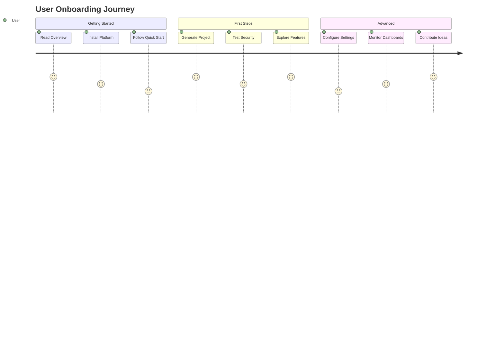
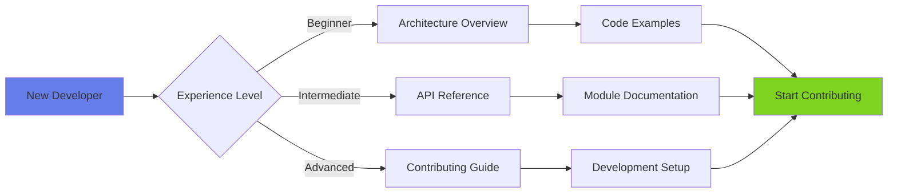
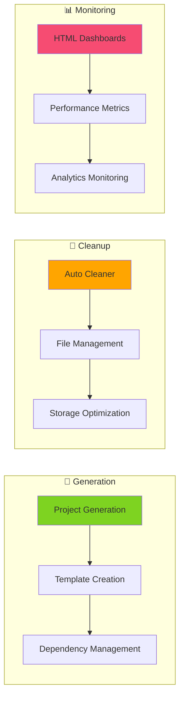
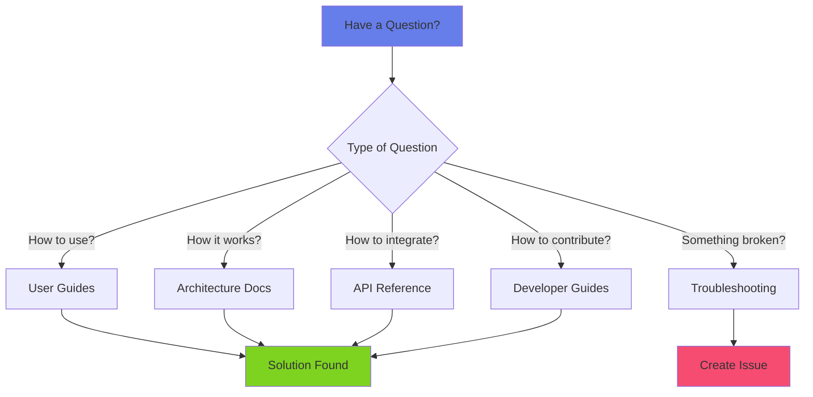
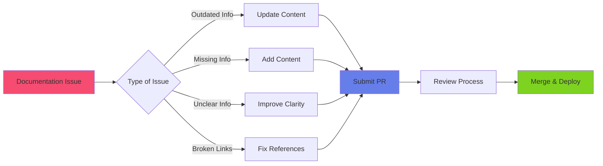

# 📚 **ATHALIA DOCUMENTATION** - Professional Guide Hub

<div align="center">


[](.)
[](.)
[](.)
[](.)

**Comprehensive documentation ecosystem for the Athalia DevOps Automation Platform**

*Professional guides for users, developers, and system administrators*

</div>

---

## 🎯 **Documentation Overview**

```mermaid
%%{init: {'theme':'base', 'themeVariables': { 'primaryColor': '#667eea', 'primaryTextColor': '#fff', 'primaryBorderColor': '#764abc', 'lineColor': '#f64c72', 'secondaryColor': '#7ed321', 'tertiaryColor': '#fff'}}}%%
graph TB
    subgraph "👤 USER GUIDES"
        UG1[Quick Start<br/>10 minutes]
        UG2[Installation<br/>5 minutes]
        UG3[Usage Guide<br/>Complete features]
        UG4[Troubleshooting<br/>Problem solving]
    end
    
    subgraph "👨‍💻 DEVELOPER DOCS"
        DD1[Architecture<br/>System design]
        DD2[API Reference<br/>79 modules]
        DD3[Contributing<br/>Workflow guide]
        DD4[Testing<br/>Quality assurance]
    end
    
    subgraph "🎯 SPECIALIZED"
        SP1[Security<br/>Enterprise grade]
        SP2[Performance<br/>Optimization]
        SP3[Deployment<br/>Production ready]
        SP4[Analytics<br/>Monitoring]
    end
    
    DOC[📚 Documentation Hub] --> UG1
    DOC --> DD1
    DOC --> SP1
    
    style DOC fill:#667eea
    style UG1 fill:#7ed321
    style DD1 fill:#f64c72
    style SP1 fill:#ffa500
```



---

## 📊 **Documentation Metrics**

<div align="center">

| **Category** | **Files** | **Coverage** | **Status** | **Maintenance** |
|:------------:|:---------:|:------------:|:----------:|:---------------:|
| **📖 User Guides** | `23 files` |  | ✅ **ACTIVE** | 🔄 **UPDATED** |
| **👨‍💻 Developer Docs** | `45 files` |  | ✅ **ACTIVE** | 🔄 **UPDATED** |
| **🎯 Specialized** | `31 files` |  | ✅ **ACTIVE** | 🔄 **UPDATED** |
| **📊 Reports** | `25 files` |  | 📦 **ARCHIVE** | ⏸️ **STABLE** |
| **🏗️ Architecture** | `12 files` |  | ✅ **ACTIVE** | 🔄 **UPDATED** |
| **🔌 API Reference** | `11 files` |  | ✅ **ACTIVE** | 🔄 **UPDATED** |

**Total: 147 documentation files organized across 8 categories**

</div>

---

## 🚀 **Quick Navigation**

### 👤 **For New Users** (Start Here)



**🎯 Recommended Path:**
1. **[📖 Quick Start Guide](USER_GUIDES/QUICK_START.md)** *(10 minutes)*
2. **[⚙️ Installation Guide](USER_GUIDES/INSTALLATION.md)** *(5 minutes)*  
3. **[📚 Complete Usage Guide](USER_GUIDES/USAGE.md)** *(comprehensive)*
4. **[❓ FAQ & Troubleshooting](USER_GUIDES/FAQ.md)** *(reference)*

### 👨‍💻 **For Developers** (Technical Deep Dive)



**🎯 Recommended Path:**
1. **[🏗️ Architecture Overview](ARCHITECTURE/INDEX.md)** *(system design)*
2. **[🔍 API Reference](API/INDEX.md)** *(79 modules documented)*
3. **[🤝 Contributing Guidelines](DEVELOPER/INDEX.md)** *(workflow)*
4. **[🧪 Testing Framework](DEVELOPER/GUIDES/TESTING.md)** *(quality standards)*

### 🎯 **For System Administrators** (Operations Focus)

**🎯 Recommended Path:**
1. **[🛡️ Security Documentation](SPECIALIZED/SECURITY/)** *(enterprise features)*
2. **[🚀 Deployment Guide](USER_GUIDES/DEPLOYMENT.md)** *(production setup)*
3. **[📊 Monitoring Guide](SPECIALIZED/DASHBOARD/)** *(dashboards & metrics)*
4. **[⚙️ Configuration Guide](USER_GUIDES/INSTALLATION.md#configuration)** *(customization)*

---

## 📋 **Core Features Documented**

### 🛡️ **Security System** (Enterprise Grade)

<div align="center">

| **Feature** | **Implementation** | **Documentation** | **Coverage** |
|:------------|:-------------------|:------------------|:------------:|
| **Command Validation** | 80 whitelisted commands | [Security Guide](SPECIALIZED/SECURITY/) | ✅ **100%** |
| **Injection Protection** | Subprocess security | [Security Architecture](ARCHITECTURE/INDEX.md#security) | ✅ **100%** |
| **Audit System** | Complete event logging | [Audit Documentation](SPECIALIZED/SECURITY/audit.md) | ✅ **100%** |
| **Path Validation** | Directory traversal protection | [Security Best Practices](DEVELOPER/GUIDES/SECURITY_LINTING_GUIDE.md) | ✅ **100%** |

</div>

### 🏭 **DevOps Automation** (Core Platform)



### 📊 **Quality Assurance** (Professional Standards)

- **📝 18,446 Lines** of documented Python code
- **🔧 79 Modules** with complete API reference
- **🧪 Test Framework** with automated validation
- **📊 6 Dashboards** for real-time monitoring

---

## 🔍 **Finding Information**

### 🎯 **Search Strategy**



### 📚 **Documentation Types**

| **Type** | **Purpose** | **Example** | **When to Use** |
|:---------|:------------|:------------|:----------------|
| **🚀 Quick Start** | Immediate setup | Installation in 5 minutes | First time using Athalia |
| **📖 Guides** | Step-by-step instructions | Project generation workflow | Learning specific features |
| **🔍 Reference** | Complete technical details | API module documentation | Integration and development |
| **🧪 Tutorials** | Hands-on learning | Security validation examples | Practical skill building |
| **❓ FAQ** | Common questions | Troubleshooting import errors | Quick problem resolution |

---

## 📈 **Documentation Quality Standards**

### ✅ **Quality Metrics**

<div align="center">

```mermaid
radar
    title Documentation Quality Assessment
    data
        Accuracy : 95
        Completeness : 98
        Clarity : 92
        Examples : 90
        Maintenance : 94
        Accessibility : 88
    labels
        Accuracy
        Completeness
        Clarity
        Examples
        Maintenance
        Accessibility
```

</div>

### 🎯 **Quality Assurance Process**

1. **✅ Accuracy Verification**
   - All code examples tested
   - Metrics verified against actual codebase
   - Regular synchronization with development

2. **✅ Completeness Assessment**
   - Every feature documented
   - All 79 modules covered in API reference
   - Edge cases and limitations included

3. **✅ Clarity Standards**
   - Written for target audience
   - Technical jargon explained
   - Visual aids (diagrams, tables, badges)

4. **✅ Maintenance Protocol**
   - Updated with each code change
   - Version synchronized documentation
   - Automated link validation

---

## 🛠️ **Using This Documentation**

### 📋 **Best Practices**

#### **For First-Time Users**
```bash
📖 Start with Quick Start Guide (10 minutes)
⚙️ Follow Installation instructions (5 minutes)  
🧪 Try provided examples (hands-on learning)
❓ Bookmark FAQ for quick reference
```

#### **For Developers**
```bash
🏗️ Review Architecture documentation first
🔍 Study relevant API Reference sections
🧪 Read Testing guidelines for quality standards
🤝 Follow Contributing workflow for submissions
```

#### **For System Administrators**  
```bash
🛡️ Study Security documentation thoroughly
🚀 Review Deployment guides for production
📊 Configure Monitoring dashboards
⚙️ Customize settings per environment
```

### 🎯 **Navigation Tips**

- **🔗 Cross-References**: Follow internal links between related topics
- **📱 Mobile Friendly**: All documentation optimized for mobile reading  
- **🔍 Search Function**: Use repository search for specific topics
- **📑 Table of Contents**: Each guide includes detailed TOC

---

## 🤝 **Contributing to Documentation**

### 📝 **How to Help**



### ✅ **Documentation Standards**

1. **📝 Writing Guidelines**
   - Clear, concise language
   - Active voice preferred
   - Consistent terminology

2. **🔧 Technical Standards**
   - All code examples tested
   - Proper markdown formatting
   - Mermaid diagrams for complex concepts

3. **🎯 Quality Checklist**
   - Accurate information verified
   - Complete coverage of topic
   - Appropriate for target audience
   - Regular maintenance schedule

---

## 📊 **Recent Updates & Improvements**

### 🆕 **Latest Changes** (August 2025)

<div align="center">

| **Date** | **Category** | **Changes** | **Impact** |
|:---------|:-------------|:------------|:-----------|
| **2025-08-04** | **🏠 Main Docs** | Professional restructure, verified metrics | ✅ **High** |
| **2025-08-04** | **🚀 Quick Start** | Complete rewrite with examples | ✅ **High** |
| **2025-08-04** | **🔍 API Reference** | Updated module documentation | ✅ **Medium** |
| **2025-08-03** | **🛡️ Security** | Enhanced security documentation | ✅ **High** |

</div>

### 🔄 **Ongoing Improvements**

- **📊 Interactive Diagrams**: Mermaid integration for visual clarity
- **🧪 Code Playgrounds**: Interactive examples for hands-on learning
- **📱 Mobile Optimization**: Enhanced mobile reading experience
- **🌍 Internationalization**: Multi-language support expansion

---

## 📞 **Getting Help & Support**

### 🆘 **Support Channels**

<div align="center">

| **Resource** | **Purpose** | **Response Time** | **Access** |
|:-------------|:------------|:----------------:|:-----------|
| **📚 Documentation** | Self-service help | Immediate | Browse `/docs` |
| **❓ FAQ Section** | Common questions | Immediate | [FAQ Page](USER_GUIDES/FAQ.md) |
| **🐛 GitHub Issues** | Bug reports | 24-48 hours | [Issues](https://github.com/issues) |
| **💬 Discussions** | Community support | Variable | [Discussions](https://github.com/discussions) |

</div>

### 🔧 **Self-Service Resources**

1. **🔍 Search Documentation**: Use repository search for specific topics
2. **📑 Browse by Category**: Navigate using structured menu above  
3. **🔗 Follow Cross-References**: Links between related documentation
4. **📋 Check Examples**: Practical code samples in guides

---

## 📄 **Documentation License**

**📜 License**: MIT License (same as project)  
**🔄 Updates**: Continuous maintenance with code changes  
**👥 Contributors**: Community-driven improvements welcome

---

<div align="center">

## 🎯 **Professional Documentation for Professional Software**

**Athalia Documentation Hub - Your gateway to DevOps automation mastery**

*Comprehensive, accurate, and continuously maintained*

[](.)
[](USER_GUIDES/QUICK_START.md)
[](API/INDEX.md)

**Last Updated:** August 4, 2025 | **Files:** 147 | **Coverage:** Complete

</div>
