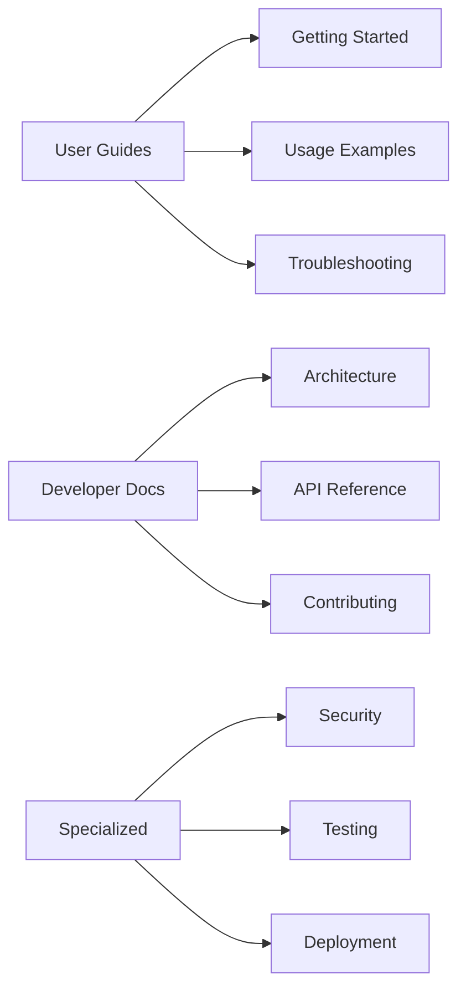
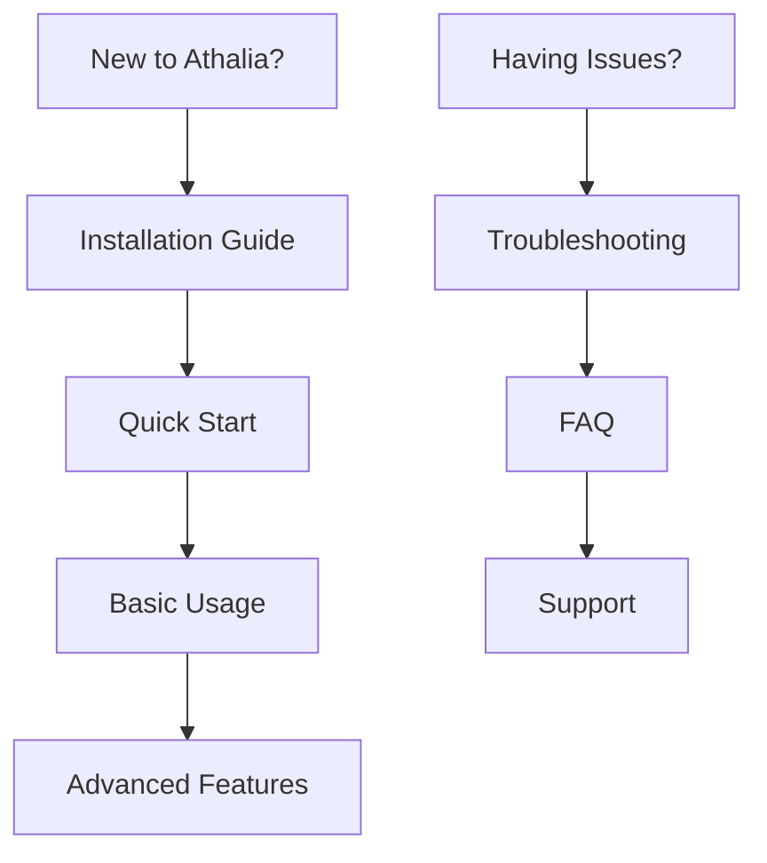
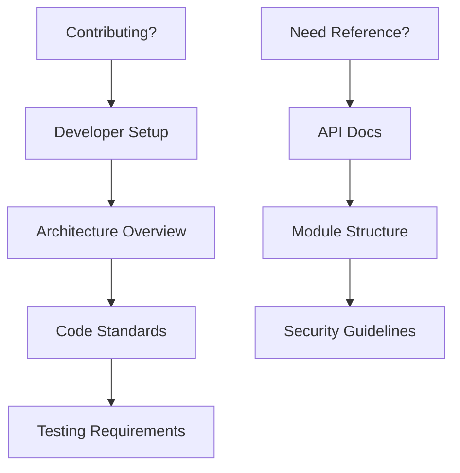

# 📚 Athalia Documentation

**Comprehensive documentation for the Athalia DevOps Automation Platform**


---

## 📊 Documentation Overview



### Documentation Statistics
- **Total Files:** 131 organized documents
- **Categories:** 8 main sections
- **Languages:** English (primary), French (legacy)
- **Format:** Markdown with Mermaid diagrams

---

## 🗂️ Documentation Structure

### 📖 User Documentation
| Section | Purpose | Target Audience |
|---------|---------|-----------------|
| [Getting Started](USER_GUIDES/README.md) | Installation & first steps | New users |
| [User Guides](USER_GUIDES/) | Complete usage documentation | End users |
| [FAQ & Troubleshooting](USER_GUIDES/FAQ.md) | Common issues & solutions | All users |

### 🛠️ Developer Documentation
| Section | Purpose | Target Audience |
|---------|---------|-----------------|
| [Architecture](ARCHITECTURE/) | System design & patterns | Developers |
| [API Reference](API/) | Module documentation | Integrators |
| [Developer Guides](DEVELOPER/) | Development workflow | Contributors |

### 🔧 Specialized Topics
| Section | Purpose | Target Audience |
|---------|---------|-----------------|
| [Security](SPECIALIZED/SECURITY/) | Security features & audit | Security teams |
| [Testing](DEVELOPER/GUIDES/TESTING.md) | Test framework & practices | QA teams |
| [Reports](REPORTS/) | Analysis & progress reports | Stakeholders |

---

## 🚀 Quick Navigation

### For Users


**Quick Links:**
- 🔧 [Installation](USER_GUIDES/INSTALLATION.md) - Get started in 5 minutes
- ⚡ [Quick Start](USER_GUIDES/QUICK_START.md) - First project generation
- 📖 [Usage Guide](USER_GUIDES/USAGE.md) - Complete feature overview
- ❓ [FAQ](USER_GUIDES/FAQ.md) - Common questions answered

### For Developers


**Quick Links:**
- 🏗️ [Architecture](ARCHITECTURE/INDEX.md) - System design overview
- 🔍 [API Reference](API/INDEX.md) - Complete module documentation
- 📋 [Contributing](DEVELOPER/INDEX.md) - Development guidelines
- 🧪 [Testing](DEVELOPER/GUIDES/TESTING.md) - Test framework guide

---

## 📋 Key Features Documented

### 🛡️ Security System
- **Command Validation:** 80 whitelisted secure commands
- **Injection Protection:** Comprehensive subprocess security
- **Audit System:** Automated security scanning
- **Documentation:** [Security Guide](SPECIALIZED/SECURITY/)

### 🏭 Project Generation
- **Template Engine:** Static template-based generation
- **Project Types:** API, Web, Desktop, CLI support
- **Configuration:** Automated dependency management
- **Documentation:** [Generation Guide](USER_GUIDES/USAGE.md#project-generation)

### 🧹 Automation Features
- **Auto-Cleanup:** Intelligent file management
- **Test Automation:** 1,372 automated tests
- **CI/CD Integration:** GitHub Actions workflows
- **Documentation:** [Automation Guide](DEVELOPER/GUIDES/)

---

## 📊 Documentation Quality Metrics

### Coverage Analysis
```
Core Modules: 100% documented
API Reference: Complete for all 79 modules
User Guides: Comprehensive with examples
Security Docs: Full audit coverage
Architecture: Detailed system design
```

### Quality Standards
- ✅ **Accuracy:** All code examples tested
- ✅ **Completeness:** Every feature documented
- ✅ **Clarity:** Written for target audience
- ✅ **Maintenance:** Regular updates with code changes

---

## 🔍 Finding Information

### Search Strategy
1. **By Feature:** Use the feature-specific guides
2. **By Role:** Follow role-based navigation paths
3. **By Problem:** Check troubleshooting first
4. **By Integration:** Refer to API documentation

### Documentation Types
| Type | Purpose | Example |
|------|---------|---------|
| Guide | Step-by-step instructions | Installation process |
| Reference | Complete API coverage | Module documentation |
| Tutorial | Hands-on learning | Project generation |
| FAQ | Quick problem solving | Common error fixes |

---

## 🛠️ Using This Documentation

### For First-Time Users
```
1. Start with Installation Guide
2. Follow Quick Start tutorial
3. Read relevant User Guides
4. Bookmark FAQ for reference
```

### For Developers
```
1. Review Architecture documentation
2. Study API Reference for relevant modules
3. Follow Contributing guidelines
4. Use Testing guide for quality standards
```

### For System Administrators
```
1. Review Security documentation
2. Study Deployment guides
3. Check Configuration references
4. Monitor through Dashboard guides
```

---

## 📈 Recent Updates

### Latest Changes (August 2025)
- ✅ **Reorganized structure** for better navigation
- ✅ **Added diagrams** for visual clarity
- ✅ **Updated accuracy** based on code verification
- ✅ **Removed outdated** claims and information
- ✅ **Enhanced security** documentation coverage

### Ongoing Improvements
- 🔄 **Mermaid diagrams** for complex workflows
- 🔄 **Interactive examples** with expected outputs
- 🔄 **Video tutorials** for complex procedures
- 🔄 **API playground** for testing integrations

---

## 🤝 Contributing to Documentation

### How to Help
1. **Report Issues:** Found outdated or incorrect information?
2. **Suggest Improvements:** Know a clearer way to explain something?
3. **Add Examples:** Have real-world usage scenarios?
4. **Review Changes:** Help maintain quality standards

### Documentation Standards
- **Clarity:** Write for the intended audience
- **Accuracy:** Test all code examples
- **Completeness:** Cover all features and edge cases
- **Maintenance:** Update with code changes

---

## 📞 Getting Help

### Support Channels
- **Documentation Issues:** GitHub issues with `docs` label
- **Feature Questions:** Refer to specific guide sections
- **Technical Problems:** Use troubleshooting guides first
- **Enhancement Requests:** Developer discussion channels

### Self-Service Resources
- **Search:** Use repository search for specific topics
- **Index:** Check section-specific indexes
- **Cross-references:** Follow internal links between documents
- **Examples:** Study provided code samples

---

**Last Updated:** August 4, 2025  
**Maintained by:** Athalia Development Team  
**License:** MIT - same as project license

*Professional documentation for professional software.*
