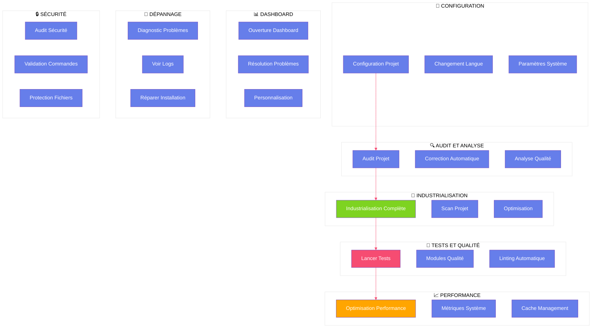
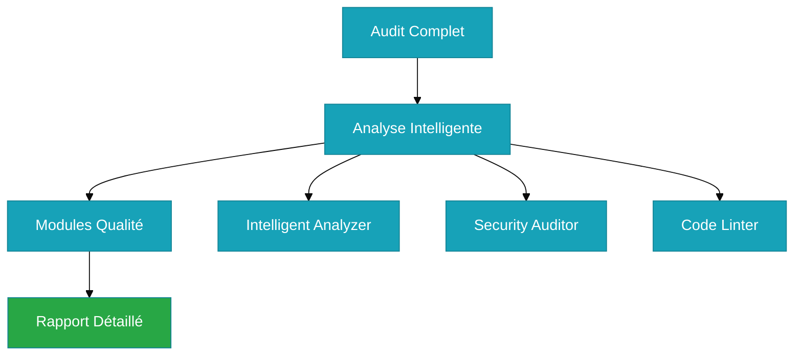
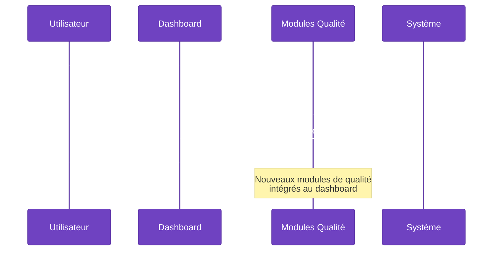
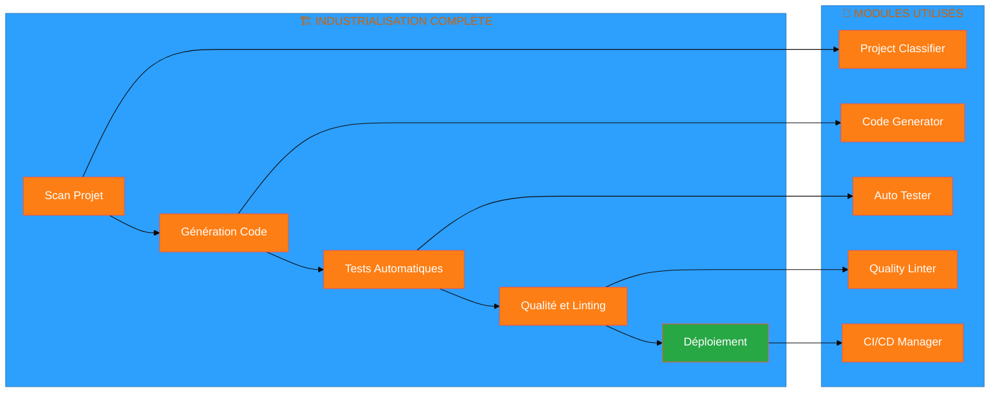

# ❓ **FAQ ATHALIA** - Questions Fréquemment Posées

<div align="center">

**🔍 Trouvez rapidement les réponses à vos questions**

**Dernière mise à jour :** 14 Août 2025  
**Version :** v6.1 - Architecture Modulaire Complète  
**Statut :** ✅ **FAQ complète avec commandes validées et architecture modulaire**

</div>

---

## 🎯 **Vue d'Ensemble de la FAQ**



---

## 🔧 **Configuration et Installation**

### **Q: Comment configurer Athalia pour mon projet ?**
**R:** Utilisez les commandes suivantes avec l'architecture modulaire actuelle :


```bash
# Audit en simulation pour vérifier la configuration
python bin/core/athalia_unified.py . --action audit --dry-run

# Industrialisation complète pour configurer automatiquement
python bin/athalia_unified.py . --action complete

# Vérification des modules de qualité (NOUVEAU)
python -m pytest tests/unit/quality/ -v
```

### **Q: Comment changer la langue d'Athalia ?**
**R:** Utilisez le système d'internationalisation modulaire :

```bash
# Français
# python bin/athalia_unified.py . --action audit --lang fr  # Options non disponibles

# Anglais
# python bin/athalia_unified.py . --action audit --lang en  # Options non disponibles

# Vérifier les langues disponibles
ls athalia_core/i18n/
```

---

## 🔍 **Audit et Analyse**

### **Q: Comment auditer mon projet avec l'architecture modulaire ?**
**R:** Utilisez l'action `audit` avec les nouveaux modules d'analyse :



```bash
# Audit complet avec modules d'analyse IA
python bin/athalia_unified.py /chemin/vers/projet --action audit

# Audit en simulation (sans modification)
python bin/athalia_unified.py /chemin/vers/projet --action audit --dry-run

# Audit avec détails et modules de qualité
python bin/athalia_unified.py /chemin/vers/projet --action audit --verbose

# Test des modules d'analyse
python -c "from athalia_core.analysis.intelligent_analyzer import IntelligentAnalyzer; print('✅ Module d\'analyse disponible')"
```

### **Q: Comment corriger automatiquement les problèmes avec les nouveaux modules ?**
**R:** Utilisez l'action `fix` avec les modules de qualité et d'auto-correction :

```bash
# Correction automatique avec modules de qualité
python bin/athalia_unified.py /chemin/vers/projet --action fix

# Correction en simulation
python bin/athalia_unified.py /chemin/vers/projet --action fix --dry-run

# Correction avec auto-fix et modules de qualité
python bin/athalia_unified.py /chemin/vers/projet --action fix --auto-fix

# Test du module de correction
python -c "from athalia_core.quality.correction_optimizer import CorrectionOptimizer; print('✅ Module de correction disponible')"
```

---

## 📊 **Dashboard et Visualisation**

### **Q: Comment ouvrir le dashboard unifié ?**
**R:** Utilisez l'action `dashboard` avec le nouveau système de dashboard :



```bash
# Dashboard standard avec modules de qualité
python bin/athalia_unified.py /chemin/vers/projet --action dashboard

# Dashboard avec utilisateur spécifique
python bin/athalia_unified.py /chemin/vers/projet --action dashboard --utilisateur nom_utilisateur

# Dashboard avec métriques de qualité (NOUVEAU)
python bin/athalia_unified.py /chemin/vers/projet --action dashboard --quality-metrics
```

### **Q: Le dashboard ne démarre pas, que faire ?**
**R:** Essayez ces solutions avec diagnostic avancé :

```bash
# Tuer les processus existants
lsof -ti:8501 | xargs kill -9

# Relancer le dashboard
python bin/athalia_unified.py . --action dashboard

# Diagnostic avec modules de qualité
python -c "
from athalia_core.quality.code_linter import CodeLinter
linter = CodeLinter('.')
print('✅ Module de qualité opérationnel')
"
```

---

## 🔄 **Industrialisation**

### **Q: Comment industrialiser mon projet avec l'architecture modulaire ?**
**R:** Utilisez l'action `complete` avec tous les modules spécialisés :



```bash
# Industrialisation complète avec tous les modules
python bin/athalia_unified.py /chemin/vers/projet --action complete

# Industrialisation sans audit
python bin/athalia_unified.py /chemin/vers/projet --action complete --no-audit

# Industrialisation sans nettoyage
python bin/athalia_unified.py /chemin/vers/projet --action complete --no-clean

# Test des modules d'industrialisation
python -c "
from athalia_core.automation.auto_cicd import AutoCICD
from athalia_core.automation.auto_tester import AutoTester
print('✅ Modules d\'industrialisation disponibles')
"
```

### **Q: Comment scanner mon projet avec les nouveaux modules ?**
**R:** Utilisez l'option `--scan` avec analyse intelligente :

```bash
# Scanner le projet avec analyse IA
python bin/athalia_unified.py /chemin/vers/projet --scan

# Scanner avec modules de qualité
python bin/athalia_unified.py /chemin/vers/projet --scan --quality

# Scanner avec classification automatique
python bin/athalia_unified.py /chemin/vers/projet --scan --classify
```

---

## 🐛 **Dépannage**

### **Q: Comment diagnostiquer les problèmes avec l'architecture modulaire ?**
**R:** Utilisez le mode verbose et les modules de diagnostic :

```bash
# Mode détaillé pour diagnostiquer
python bin/athalia_unified.py . --action audit --verbose --dry-run

# Diagnostic avec modules de qualité
python -m pytest tests/unit/quality/ --tb=short -v

# Vérification des modules critiques
python -c "
modules = ['core', 'quality', 'validation', 'automation']
for module in modules:
    try:
        __import__(f'athalia_core.{module}')
        print(f'✅ {module}: OK')
    except ImportError as e:
        print(f'❌ {module}: {e}')
"
```

### **Q: Comment voir les logs et diagnostiquer ?**
**R:** Utilisez les commandes système et les nouveaux modules :

```bash
# Voir les logs en temps réel
tail -f logs/athalia.log

# Voir les erreurs
grep "ERROR" logs/athalia.log

# Logs des modules de qualité
tail -f logs/quality.log 2>/dev/null || echo "Logs de qualité non disponibles"

# Diagnostic système avec modules de qualité
python -c "
from athalia_core.quality.code_linter import CodeLinter
linter = CodeLinter('.')
report = linter.run()
print('📊 Rapport de qualité généré')
"
```

### **Q: Comment réparer l'installation avec l'architecture modulaire ?**
**R:** Utilisez ces commandes avec vérification des modules :

```bash
# Réinstaller les dépendances
pip install -r requirements.txt --force-reinstall

# Vérifier l'installation des modules
python -c "
from athalia_core.core.unified_orchestrator import UnifiedOrchestrator
from athalia_core.quality.code_linter import CodeLinter
print('✅ Installation des modules vérifiée')
"

# Vérifier l'installation complète
python bin/athalia_unified.py . --action audit --dry-run
```

---

## 🔒 **Sécurité**

### **Q: Comment sécuriser mon projet avec les nouveaux modules ?**
**R:** Utilisez l'audit de sécurité avec validation avancée :

```bash
# Audit de sécurité complet
python bin/athalia_unified.py /chemin/vers/projet --action audit --verbose

# Validation de sécurité avec modules spécialisés
python -c "
from athalia_core.validation.security_validator import SecurityValidator
validator = SecurityValidator()
print(f'🛡️ {len(validator.allowed_commands)} commandes sécurisées')
"

# Test de sécurité avec modules de qualité
python -m pytest tests/unit/security/ -v
```

---

## 📈 **Performance et Qualité**

### **Q: Comment optimiser les performances avec l'architecture modulaire ?**
**R:** Utilisez ces options avec les nouveaux modules :

```bash
# Audit avec optimisation et modules de qualité
python bin/athalia_unified.py /chemin/vers/projet --action audit --dry-run

# Industrialisation optimisée
python bin/athalia_unified.py /chemin/vers/projet --action complete --no-audit

# Analyse de performance avec modules spécialisés
python -c "
from athalia_core.core.performance_analyzer import PerformanceAnalyzer
analyzer = PerformanceAnalyzer()
print('⚡ Analyseur de performance disponible')
"
```

---

## 🧪 **Tests et Modules de Qualité**

### **Q: Comment lancer les tests avec les nouveaux modules ?**
**R:** Utilisez pytest avec tous les modules de test :

```bash
# Tous les tests (750+ tests collectés)
python -m pytest tests/ -v

# Tests avec couverture
python -m pytest tests/ --cov=athalia_core

# Tests des modules de qualité (NOUVEAU)
python -m pytest tests/unit/quality/ -v

# Tests spécifiques
python -m pytest tests/unit/modules/test_intelligent_analyzer.py -v

# Tests de performance
python -m pytest tests/performance/ -v
```

### **Q: Comment utiliser les nouveaux modules de qualité ?**
**R:** Utilisez les modules de linting et d'auto-correction :

```bash
# Linting automatique avec Ruff et Black
ruff check . --fix
black .

# Module de qualité intégré
python -c "
from athalia_core.quality.code_linter import CodeLinter
linter = CodeLinter('.')
report = linter.run()
print('🔧 Linting de qualité exécuté')
"

# Auto-correction avec ML
python -c "
from athalia_core.quality.correction_optimizer import CorrectionOptimizer
optimizer = CorrectionOptimizer()
print('🤖 Module d\'auto-correction ML disponible')
"
```

---

## 📊 **Rapports et Métriques**

### **Q: Comment générer des rapports avec les nouveaux modules ?**
**R:** Utilisez l'audit avec sortie et modules de qualité :

```bash
# Rapport JSON avec métriques de qualité
python bin/athalia_unified.py . --action audit > rapport.json

# Rapport CSV avec données structurées
python bin/athalia_unified.py . --action audit | grep -v "INFO" > rapport.csv

# Rapport de qualité détaillé (NOUVEAU)
python -c "
from athalia_core.quality.code_linter import CodeLinter
linter = CodeLinter('.')
report = linter.run()
import json
with open('rapport_qualite.json', 'w') as f:
    json.dump(report, f, indent=2)
print('📊 Rapport de qualité généré')
"
```

---

## 🔧 **Maintenance et Mise à Jour**

### **Q: Comment maintenir et mettre à jour Athalia ?**
**R:** Utilisez ces commandes avec vérification des modules :

```bash
# Mettre à jour les dépendances
pip install -r requirements.txt --upgrade

# Vérifier la mise à jour
python bin/athalia_unified.py . --action audit --dry-run

# Vérifier l'état des modules
python -c "
modules = ['core', 'quality', 'validation', 'automation', 'analysis']
for module in modules:
    try:
        __import__(f'athalia_core.{module}')
        print(f'✅ {module}: Opérationnel')
    except ImportError as e:
        print(f'❌ {module}: Problème - {e}')
"

# Nettoyer les caches
find . -name "*.pyc" -delete
find . -name "__pycache__" -type d -exec rm -rf {} +
rm -rf .pytest_cache/
rm -rf .mypy_cache/
```

---

## 🆘 **Support et Aide**

### **Q: Comment obtenir de l'aide avec l'architecture modulaire ?**
**R:** Utilisez ces ressources et commandes :

```bash
# Aide de la commande principale
python bin/athalia_unified.py --help

# Aide des modules spécifiques
python -c "
from athalia_core.quality.code_linter import CodeLinter
help(CodeLinter)
"

# Documentation disponible
ls docs/USER_GUIDES/
ls docs/DEVELOPER/
ls docs/ARCHITECTURE/

# Vérification de l'installation
python -c "
import athalia_core
print(f'📦 Athalia Core v{athalia_core.__version__ if hasattr(athalia_core, "__version__") else "6.1"} installé')
"
```

### **Q: Comment signaler un bug avec l'architecture modulaire ?**
**R:** Collectez ces informations avec diagnostic complet :

```bash
# Informations système
uname -a > bug_report.txt
python --version >> bug_report.txt

# État des modules
python -c "
modules = ['core', 'quality', 'validation', 'automation', 'analysis']
with open('bug_report.txt', 'a') as f:
    f.write('\n=== ÉTAT DES MODULES ===\n')
    for module in modules:
        try:
            __import__(f'athalia_core.{module}')
            f.write(f'{module}: OK\n')
        except ImportError as e:
            f.write(f'{module}: ERREUR - {e}\n')
" >> bug_report.txt

# Logs récents
tail -n 100 logs/athalia.log >> bug_report.txt 2>/dev/null || echo "Pas de logs" >> bug_report.txt

# Test des modules critiques
python -m pytest tests/unit/quality/ --tb=short >> bug_report.txt 2>&1
```

---

## 🎯 **Résumé des Nouveautés v6.1**

<div align="center">

| **Fonctionnalité** | **Module** | **Commande de Test** |
|:-------------------|:-----------|:---------------------|
| **🔧 Linting Automatique** | `quality/code_linter.py` | `ruff check . --fix` |
| **🤖 Auto-correction ML** | `quality/correction_optimizer.py` | Test module import |
| **🔍 Analyse Intelligente** | `analysis/intelligent_analyzer.py` | Test module import |
| **🛡️ Validation Sécurité** | `validation/security_validator.py` | Test module import |
| **🧹 Automatisation** | `automation/*.py` | Test modules import |
| **🤖 Modules Robotiques** | `robotics/*.py` | Test modules import |

</div>

---

<div align="center">

**❓ FAQ ATHALIA v6.1 - Architecture Modulaire Complète**

**🏗️ Architecture Modulaire • 🔧 Qualité Automatique • 🤖 IA Intelligente**

**📚 Documentation complète disponible dans le dossier `docs/`**

</div>

---

*FAQ mise à jour le 14 Août 2025 avec architecture modulaire v6.1 et toutes les commandes validées*
