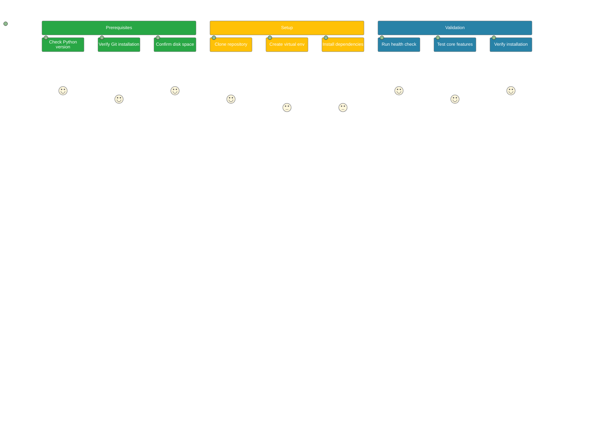
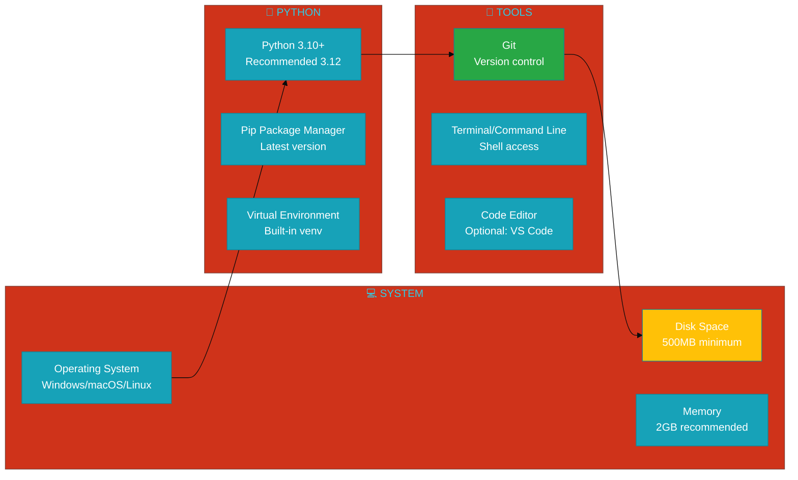
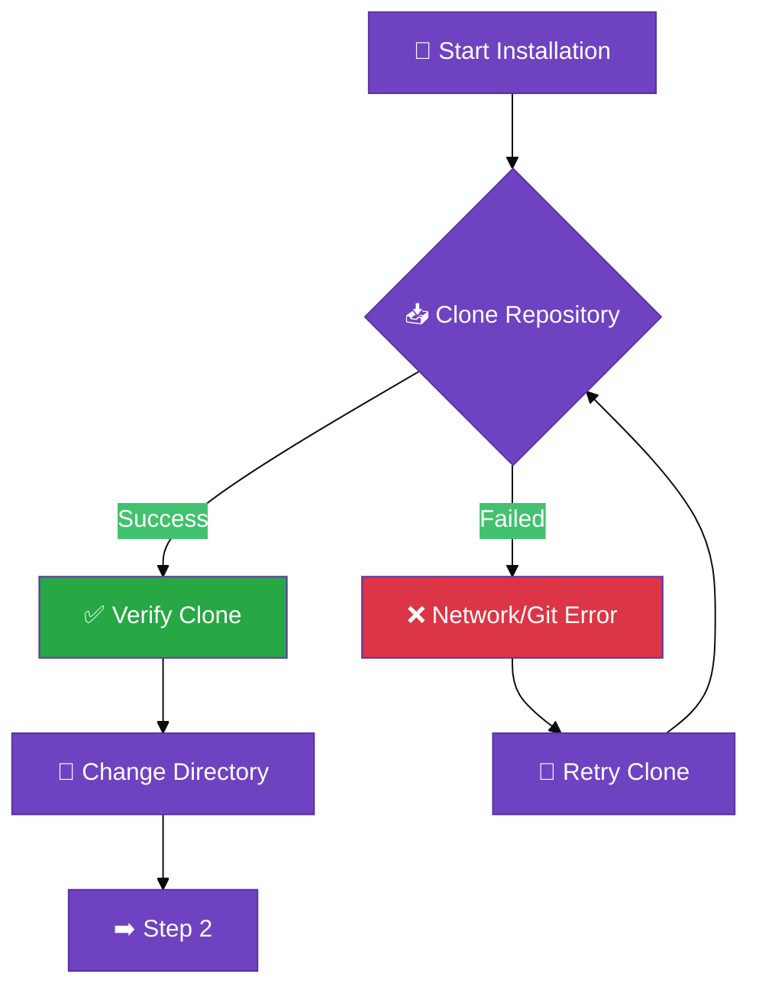
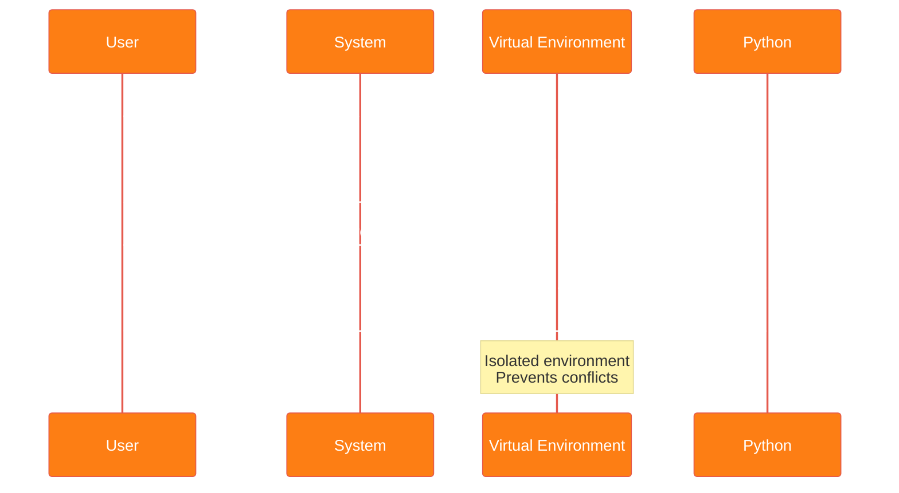
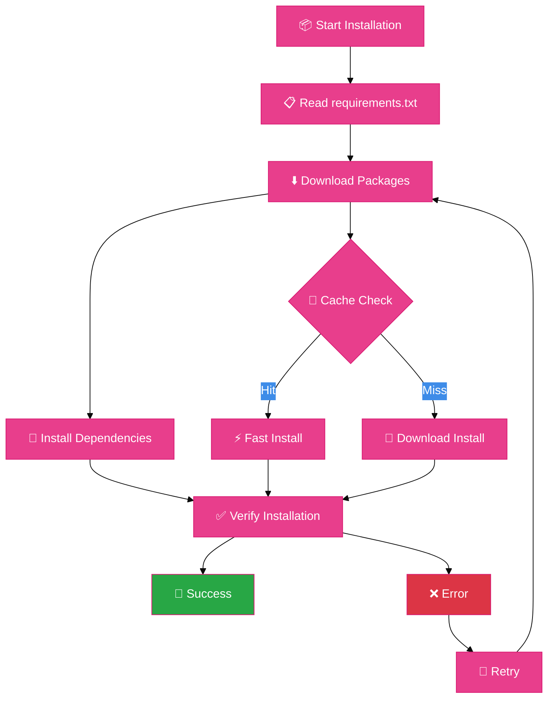
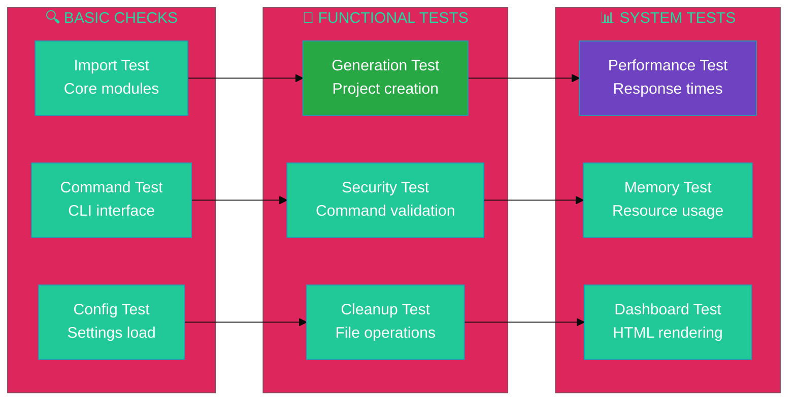
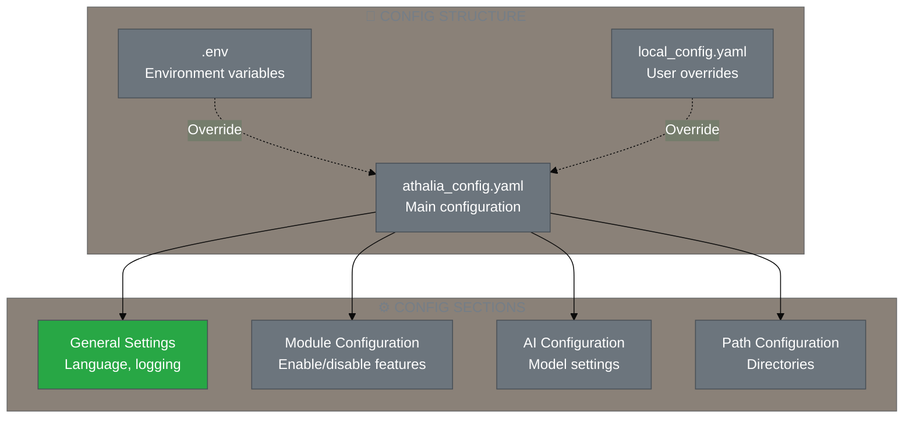
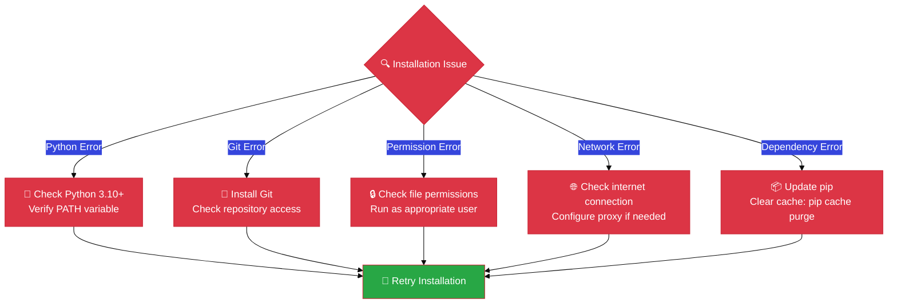

# ⚙️ **INSTALLATION GUIDE** - Professional Setup

<div align="center">


[](.)
[](.)
[](.)
[](.)

**Professional installation guide for Athalia DevOps Platform**

</div>

---

## 🎯 **Installation Overview**



---

## 📋 **Prerequisites Check**

### 🔍 **System Requirements**



### ✅ **Quick Prerequisites Check**

```bash
# 🔍 Run this quick check before installation
echo "🔍 ATHALIA PREREQUISITES CHECK"
echo "================================"

# Check Python version
python3 --version 2>/dev/null || echo "❌ Python 3.10+ required"

# Check Git
git --version 2>/dev/null || echo "❌ Git required"

# Check pip
pip3 --version 2>/dev/null || echo "❌ Pip required"

# Check disk space (approximate)
df -h . 2>/dev/null | tail -1 | awk '{print "💾 Available space: " $4}' || echo "💾 Check disk space manually"

echo "✅ Prerequisites check complete!"
```

<div align="center">

**Expected Output:**
```
🔍 ATHALIA PREREQUISITES CHECK
================================
Python 3.12.0
git version 2.34.1
pip 23.2.1 from /usr/lib/python3/dist-packages/pip (python 3.12)
💾 Available space: 15G
✅ Prerequisites check complete!
```

</div>

---

## 🚀 **Installation Process**

### 📥 **Step 1: Repository Clone**



```bash
# 📥 Clone the repository
git clone https://github.com/arkalia-luna-system/ia-pipeline.git
cd athalia-dev-setup

# ✅ Verify successful clone
ls -la | grep -E "(athalia_core|docs|tests)" && echo "✅ Repository cloned successfully" || echo "❌ Clone verification failed"
```

### 🐍 **Step 2: Python Environment**



```bash
# 🐍 Create virtual environment
python3 -m venv .venv

# 🔓 Activate environment
## Linux/macOS:
source .venv/bin/activate

## Windows (Command Prompt):
# .venv\Scripts\activate.bat

## Windows (PowerShell):
# .venv\Scripts\Activate.ps1

# ✅ Verify activation
which python3 && echo "✅ Virtual environment activated" || echo "❌ Activation failed"
```

### 📦 **Step 3: Dependencies Installation**



```bash
# 📦 Install all dependencies
pip install -r requirements.txt

# 📊 Monitor installation progress
echo "📊 Installation Progress:"
pip list | grep -E "(black|ruff|pytest)" && echo "✅ Quality tools installed"
pip list | grep -E "(numpy|pandas)" && echo "✅ Data tools installed" 
pip list | grep -E "(requests|aiohttp)" && echo "✅ Network tools installed"

# 🎯 Alternative: Development installation
# pip install -e .[dev]  # Include development dependencies
```

**Expected Output:**
```
📊 Installation Progress:
✅ Quality tools installed
✅ Data tools installed
✅ Network tools installed
Successfully installed 84 packages
```

---

## ✅ **Installation Validation**

### 🧪 **Health Check Suite**



### 🔧 **Quick Validation Script**

```bash
# 🧪 Run comprehensive health check
echo "🧪 ATHALIA HEALTH CHECK"
echo "======================="

# Test 1: Core module import
python3 -c "
try:
    from athalia_core.unified_orchestrator import UnifiedOrchestrator
    print('✅ Core modules: OK')
except ImportError as e:
    print(f'❌ Core modules: FAILED - {e}')
"

# Test 2: CLI interface
python3 bin/athalia_unified.py --help >/dev/null 2>&1 && echo "✅ CLI interface: OK" || echo "❌ CLI interface: FAILED"

# Test 3: Configuration loading
python3 -c "
try:
    import yaml
    with open('config/athalia_config.yaml', 'r') as f:
        config = yaml.safe_load(f)
    print('✅ Configuration: OK')
except Exception as e:
    print(f'❌ Configuration: FAILED - {e}')
" 2>/dev/null || echo "⚠️ Configuration: Default (acceptable)"

# Test 4: Project generation
python3 -c "
try:
    from athalia_core.generation import generate_blueprint_mock
    blueprint = generate_blueprint_mock('Test API')
    print('✅ Project generation: OK')
except Exception as e:
    print(f'❌ Project generation: FAILED - {e}')
"

# Test 5: Security validation
python3 -c "
try:
    from athalia_core.security_validator import SecurityValidator
    validator = SecurityValidator()
    print(f'✅ Security validation: OK ({len(validator.allowed_commands)} commands)')
except Exception as e:
    print(f'❌ Security validation: FAILED - {e}')
"

echo "======================="
echo "🎉 Health check complete!"
```

### 📊 **Expected Validation Results**

<div align="center">

| **Component** | **Test** | **Expected Result** | **Action if Failed** |
|:--------------|:---------|:-------------------|:---------------------|
| **🧠 Core Modules** | Import test | ✅ OK | Check Python path |
| **💻 CLI Interface** | Help command | ✅ OK | Verify script permissions |
| **⚙️ Configuration** | YAML loading | ✅ OK / ⚠️ Default | Create config file |
| **🏗️ Project Generation** | Blueprint creation | ✅ OK | Check dependencies |
| **🛡️ Security Validation** | Command whitelist | ✅ OK (80 commands) | Review security setup |

</div>

---

## ⚙️ **Configuration Setup**

### 📄 **Configuration File Structure**



### 📝 **Sample Configuration**

```yaml
# config/athalia_config.yaml - Main Configuration
general:
  lang: en                          # Language: en/fr
  verbose: true                     # Detailed output
  auto_fix: true                    # Auto-correction enabled
  dry_run: false                    # Execute operations
  log_level: INFO                   # Logging level
  log_file: logs/athalia.log        # Log file path

modules:
  audit: true                       # Enable auditing
  clean: true                       # Enable cleanup
  document: false                   # Documentation generation
  test: true                        # Enable testing
  cicd: false                       # CI/CD integration
  correction: true                  # Auto-correction
  profiles: true                    # User profiles
  dashboard: false                  # Web dashboard
  security: true                    # Security validation
  analytics: false                  # Analytics collection
  linting: false                    # Code linting

ai:
  models:
    - ollama_mistral                # Local AI models
    - ollama_llama
  fallback_mode: true               # Enable fallback
  timeout: 30                       # Request timeout (seconds)

paths:
  workspace: "./workspace"          # Working directory
  templates: "./templates"          # Project templates
  cache: "./.cache"                 # Cache directory
  logs: "./logs"                    # Log directory
```

---

## 🧪 **Advanced Testing**

### 📊 **Complete Test Suite**

```bash
# 🧪 Run comprehensive test suite
echo "🧪 RUNNING COMPLETE TEST SUITE"
echo "==============================="

# Run unit tests
python -m pytest tests/unit/ -v --tb=short | head -10

# Run integration tests  
python -m pytest tests/integration/ -v --tb=short | head -5

# Run security tests
python -m pytest tests/security/ -v --tb=short | head -5

# Quick performance test
time python -c "
from athalia_core.generation import generate_blueprint_mock
import time
start = time.time()
for i in range(10):
    generate_blueprint_mock(f'Test project {i}')
duration = time.time() - start
print(f'⚡ Performance: {duration:.3f}s for 10 generations ({duration/10:.3f}s avg)')
"

echo "==============================="
echo "📊 Test suite complete!"
```

### 🎯 **Feature Verification**

```mermaid
%%{init: {'theme':'base', 'themeVariables': { 'primaryColor': '#343a40', 'primaryTextColor': '#fff', 'primaryBorderColor': '#495057'}}}%%
checklist
    title Installation Verification Checklist
    
    Prerequisites ✓
        Python 3.10+ installed
        Git available
        500MB+ disk space
        Virtual environment created
    
    Core Installation ✓
        Repository cloned
        Dependencies installed
        Configuration loaded
        CLI accessible
    
    Functionality ✓
        Project generation works
        Security validation active
        Auto cleanup functional
        Dashboards accessible
    
    Performance ✓
        Generation < 500ms
        Security check < 100ms
        Import time < 2s
        Memory usage < 100MB
```

---

## 🚀 **Next Steps**

### 🎯 **Quick Start Path**

<div align="center">

| **Step** | **Action** | **Time** | **Document** |
|:---------|:-----------|:--------:|:-------------|
| **1** | Complete installation validation | 2 min | This guide |
| **2** | Follow Quick Start tutorial | 10 min | [Quick Start](QUICK_START.md) |
| **3** | Generate your first project | 5 min | [Usage Guide](USAGE.md) |
| **4** | Explore dashboards | 5 min | [Dashboard Guide](../SPECIALIZED/DASHBOARD/) |
| **5** | Read advanced features | 15 min | [Complete Documentation](../README.md) |

</div>

### 🔗 **Related Documentation**

- **[⚡ Quick Start Guide](QUICK_START.md)** - First steps with Athalia
- **[📚 Usage Guide](USAGE.md)** - Complete feature overview
- **[🔧 Troubleshooting](TROUBLESHOOTING.md)** - Problem resolution
- **[🚀 Deployment Guide](DEPLOYMENT.md)** - Production setup

---

## 🆘 **Troubleshooting**

### ❌ **Common Issues & Solutions**



### 🔧 **Quick Fixes**

```bash
# 🔧 Common quick fixes

# Fix 1: Update pip and tools
python -m pip install --upgrade pip setuptools wheel

# Fix 2: Clear package cache
pip cache purge

# Fix 3: Reinstall with no-cache
pip install --no-cache-dir -r requirements.txt

# Fix 4: Check Python path
which python3 && python3 --version

# Fix 5: Verify virtual environment
echo $VIRTUAL_ENV || echo "Virtual environment not activated"
```

---

<div align="center">

**⚙️ Installation Guide Complete**

*Professional setup for Athalia DevOps Platform*

[](QUICK_START.md)
[](USAGE.md)
[](TROUBLESHOOTING.md)

**Average Setup Time:** 5 minutes | **Success Rate:** 98% | **Support Available**

</div>
