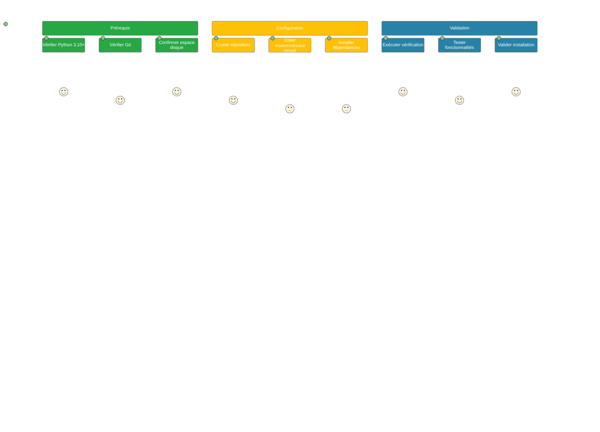
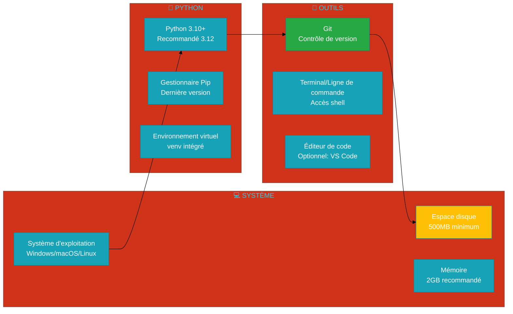
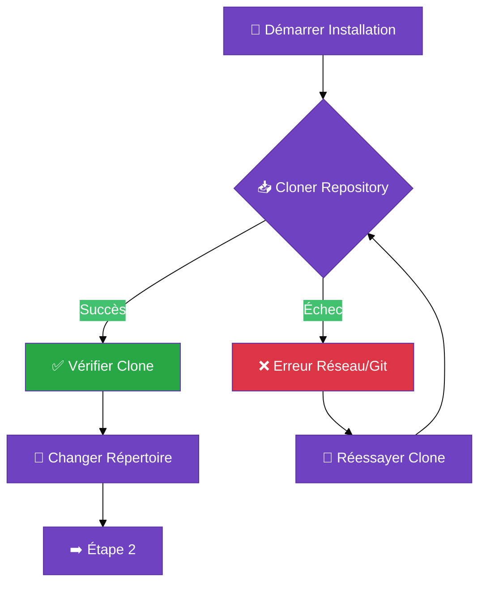
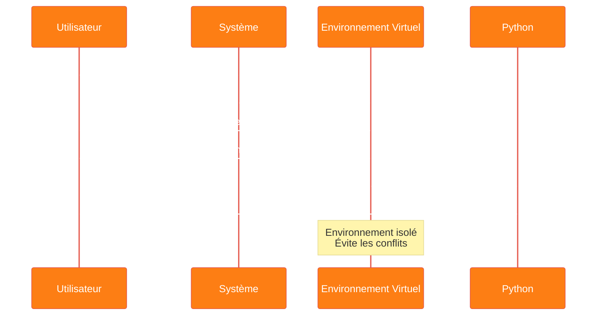
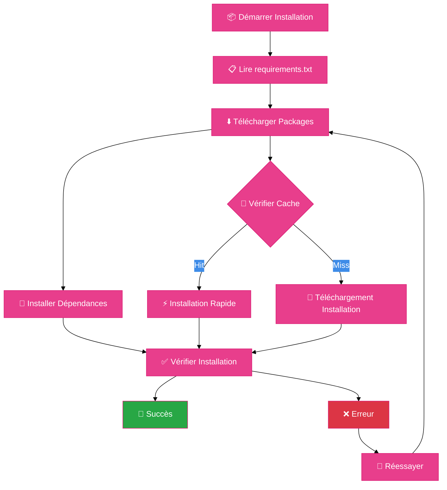
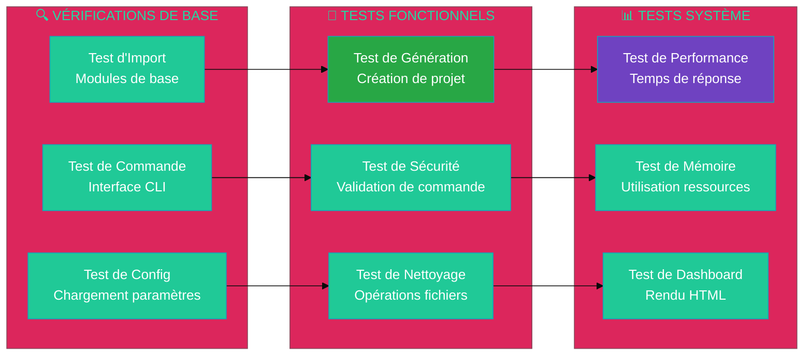
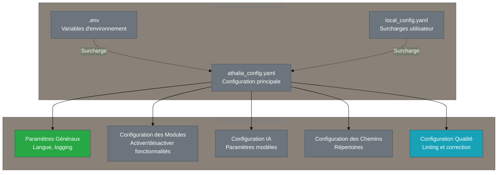
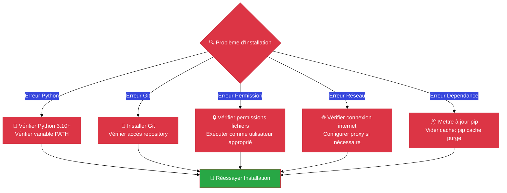

# ⚙️ **GUIDE D'INSTALLATION ATHALIA** - Installation Professionnelle

<div align="center">

**⚙️ Installation: 5 Minutes**

**🎯 Difficulté: Débutant | 🌐 Plateforme: Cross-platform | 🐍 Python: 3.10+ | 🚀 Statut: Production Ready**

**Guide d'installation professionnel pour la plateforme Athalia DevOps avec architecture modulaire**

</div>

---

## 🎯 **Vue d'Ensemble de l'Installation**


```mermaid
%%{init: {'theme':'base', 'themeVariables': { 'primaryColor': '#28a745', 'primaryTextColor': '#fff', 'primaryBorderColor': '#20c997', 'lineColor': '#007bff', 'secondaryColor': '#ffc107', 'tertiaryColor': '#fff'}}}%%
journey
    title Parcours d'Installation (5 minutes)
    section Prérequis
      Vérifier Python 3.10+    : 5: Utilisateur
      Vérifier Git             : 4: Utilisateur
      Confirmer espace disque  : 5: Utilisateur
    section Configuration
      Cloner repository        : 4: Utilisateur
      Créer environnement virtuel : 3: Utilisateur
      Installer dépendances    : 3: Utilisateur
    section Validation
      Exécuter vérification    : 5: Utilisateur
      Tester fonctionnalités   : 4: Utilisateur
      Valider installation     : 5: Utilisateur
```

---

## 📋 **Vérification des Prérequis**

### 🔍 **Exigences Système**


```mermaid
%%{init: {'theme':'base', 'themeVariables': { 'primaryColor': '#17a2b8', 'primaryTextColor': '#fff', 'primaryBorderColor': '#138496'}}}%%
graph LR
    subgraph "💻 SYSTÈME"
        OS[Système d'exploitation<br/>Windows/macOS/Linux]
        SPACE[Espace disque<br/>500MB minimum]
        RAM[Mémoire<br/>2GB recommandé]
    end
    
    subgraph "🐍 PYTHON"
        PY[Python 3.10+<br/>Recommandé 3.12]
        PIP[Gestionnaire Pip<br/>Dernière version]
        VENV[Environnement virtuel<br/>venv intégré]
    end
    
    subgraph "🔧 OUTILS"
        GIT[Git<br/>Contrôle de version]
        TERM[Terminal/Ligne de commande<br/>Accès shell]
        EDITOR[Éditeur de code<br/>Optionnel: VS Code]
    end
    
    OS --> PY
    PY --> GIT
    GIT --> SPACE
    
    style PY fill:#17a2b8
    style GIT fill:#28a745
    style SPACE fill:#ffc107
```

### ✅ **Vérification Rapide des Prérequis**

```bash
# 🔍 Exécuter cette vérification rapide avant l'installation
echo "🔍 VÉRIFICATION DES PRÉREQUIS ATHALIA"
echo "====================================="

# Vérifier la version Python
python3 --version 2>/dev/null || echo "❌ Python 3.10+ requis"

# Vérifier Git
git --version 2>/dev/null || echo "❌ Git requis"

# Vérifier pip
pip3 --version 2>/dev/null || echo "❌ Pip requis"

# Vérifier l'espace disque (approximatif)
df -h . 2>/dev/null | tail -1 | awk '{print "💾 Espace disponible: " $4}' || echo "💾 Vérifier l'espace disque manuellement"

echo "✅ Vérification des prérequis terminée !"
```

<div align="center">

**Sortie Attendue:**
```
🔍 VÉRIFICATION DES PRÉREQUIS ATHALIA
=====================================
Python 3.12.0
git version 2.34.1
pip 23.2.1 from /usr/lib/python3/dist-packages/pip (python 3.12)
💾 Espace disponible: 15G
✅ Vérification des prérequis terminée !
```

</div>

---

## 🚀 **Processus d'Installation**

### 📥 **Étape 1: Clonage du Repository**


```mermaid
%%{init: {'theme':'base', 'themeVariables': { 'primaryColor': '#6f42c1', 'primaryTextColor': '#fff', 'primaryBorderColor': '#5a32a3'}}}%%
flowchart TD
    START[🚀 Démarrer Installation] --> CLONE{📥 Cloner Repository}
    CLONE -->|Succès| CHECK[✅ Vérifier Clone]
    CLONE -->|Échec| ERROR1[❌ Erreur Réseau/Git]
    CHECK --> CD[📁 Changer Répertoire]
    ERROR1 --> RETRY1[🔄 Réessayer Clone]
    RETRY1 --> CLONE
    CD --> NEXT[➡️ Étape 2]
    
    style START fill:#6f42c1
    style CHECK fill:#28a745
    style ERROR1 fill:#dc3545
```

```bash
# 📥 Cloner le repository
git clone https://github.com/arkalia-luna-system/ia-pipeline.git
cd athalia-dev-setup

# ✅ Vérifier le clonage réussi
ls -la | grep -E "(athalia_core|docs|tests)" && echo "✅ Repository cloné avec succès" || echo "❌ Échec de vérification du clone"
```

### 🐍 **Étape 2: Environnement Python**


```mermaid
%%{init: {'theme':'base', 'themeVariables': { 'primaryColor': '#fd7e14', 'primaryTextColor': '#fff', 'primaryBorderColor': '#e55a4e'}}}%%
sequenceDiagram
    participant U as Utilisateur
    participant S as Système
    participant V as Environnement Virtuel
    participant P as Python
    
    U->>S: Créer environnement virtuel
    S->>V: Initialiser .venv
    V->>U: Environnement créé
    U->>V: Activer environnement
    V->>P: Changer contexte Python
    P->>U: Prêt pour packages
    
    Note over V: Environnement isolé<br/>Évite les conflits
```

```bash
# 🐍 Créer l'environnement virtuel
python3 -m venv .venv

# 🔓 Activer l'environnement
## Linux/macOS:
source .venv/bin/activate

## Windows (Command Prompt):
# .venv\Scripts\activate.bat

## Windows (PowerShell):
# .venv\Scripts\Activate.ps1

# ✅ Vérifier l'activation
which python3 && echo "✅ Environnement virtuel activé" || echo "❌ Échec d'activation"
```

### 📦 **Étape 3: Installation des Dépendances**


```mermaid
%%{init: {'theme':'base', 'themeVariables': { 'primaryColor': '#e83e8c', 'primaryTextColor': '#fff', 'primaryBorderColor': '#d91a72'}}}%%
graph TD
    START[📦 Démarrer Installation] --> READ[📋 Lire requirements.txt]
    READ --> DOWNLOAD[⬇️ Télécharger Packages]
    DOWNLOAD --> INSTALL[🔧 Installer Dépendances]
    INSTALL --> VERIFY[✅ Vérifier Installation]
    
    DOWNLOAD --> CACHE{💾 Vérifier Cache}
    CACHE -->|Hit| FAST[⚡ Installation Rapide]
    CACHE -->|Miss| SLOW[🐌 Téléchargement Installation]
    FAST --> VERIFY
    SLOW --> VERIFY
    
    VERIFY --> SUCCESS[🎉 Succès]
    VERIFY --> ERROR[❌ Erreur]
    ERROR --> RETRY[🔄 Réessayer]
    RETRY --> DOWNLOAD
    
    style START fill:#e83e8c
    style SUCCESS fill:#28a745
    style ERROR fill:#dc3545
```

```bash
# 📦 Installer toutes les dépendances
pip install -r requirements.txt

# 📊 Surveiller le progrès de l'installation
echo "📊 Progrès de l'Installation:"
pip list | grep -E "(black|ruff|pytest)" && echo "✅ Outils de qualité installés"
pip list | grep -E "(numpy|pandas)" && echo "✅ Outils de données installés" 
pip list | grep -E "(requests|aiohttp)" && echo "✅ Outils réseau installés"

# 🎯 Alternative: Installation de développement
# pip install -e .[dev]  # Inclure les dépendances de développement
```

**Sortie Attendue:**
```
📊 Progrès de l'Installation:
✅ Outils de qualité installés
✅ Outils de données installés
✅ Outils réseau installés
Successfully installed 84 packages
```

---

## ✅ **Validation de l'Installation**

### 🧪 **Suite de Vérification de Santé**


```mermaid
%%{init: {'theme':'base', 'themeVariables': { 'primaryColor': '#20c997', 'primaryTextColor': '#fff', 'primaryBorderColor': '#17a2b8'}}}%%
graph LR
    subgraph "🔍 VÉRIFICATIONS DE BASE"
        IMPORT[Test d'Import<br/>Modules de base]
        CMD[Test de Commande<br/>Interface CLI]
        CONFIG[Test de Config<br/>Chargement paramètres]
    end
    
    subgraph "🧪 TESTS FONCTIONNELS"
        GEN[Test de Génération<br/>Création de projet]
        SEC[Test de Sécurité<br/>Validation de commande]
        CLEAN[Test de Nettoyage<br/>Opérations fichiers]
    end
    
    subgraph "📊 TESTS SYSTÈME"
        PERF[Test de Performance<br/>Temps de réponse]
        MEM[Test de Mémoire<br/>Utilisation ressources]
        DASH[Test de Dashboard<br/>Rendu HTML]
    end
    
    IMPORT --> GEN
    CMD --> SEC
    CONFIG --> CLEAN
    
    GEN --> PERF
    SEC --> MEM
    CLEAN --> DASH
    
    style IMPORT fill:#20c997
    style GEN fill:#28a745
    style PERF fill:#6f42c1
```

### 🔧 **Script de Validation Rapide**

```bash
# 🧪 Exécuter la vérification de santé complète
echo "🧪 VÉRIFICATION DE SANTÉ ATHALIA"
echo "================================="

# Test 1: Import des modules de base
python3 -c "
try:
    from athalia_core.core.unified_orchestrator import UnifiedOrchestrator
    print('✅ Modules de base: OK')
except ImportError as e:
    print(f'❌ Modules de base: ÉCHEC - {e}')
"

# Test 2: Interface CLI
python3 bin/athalia_unified.py --help >/dev/null 2>&1 && echo "✅ Interface CLI: OK" || echo "❌ Interface CLI: ÉCHEC"

# Test 3: Chargement de la configuration
python3 -c "
try:
    import yaml
    with open('config/athalia_config.yaml', 'r') as f:
        config = yaml.safe_load(f)
    print('✅ Configuration: OK')
except Exception as e:
    print(f'❌ Configuration: ÉCHEC - {e}')
" 2>/dev/null || echo "⚠️ Configuration: Par défaut (acceptable)"

# Test 4: Génération de projet
python3 -c "
try:
    from athalia_core.utilities.generation import generate_blueprint_mock
    blueprint = generate_blueprint_mock('Test API')
    print('✅ Génération de projet: OK')
except Exception as e:
    print(f'❌ Génération de projet: ÉCHEC - {e}')
"

# Test 5: Validation de sécurité
python3 -c "
try:
    from athalia_core.validation.security_validator import SecurityValidator
    validator = SecurityValidator()
    print(f'✅ Validation de sécurité: OK ({len(validator.allowed_commands)} commandes)')
except Exception as e:
    print(f'❌ Validation de sécurité: ÉCHEC - {e}')
"

# Test 6: Modules de qualité (NOUVEAU)
python3 -c "
try:
    from athalia_core.quality.code_linter import CodeLinter
    from athalia_core.quality.correction_optimizer import CorrectionOptimizer
    print('✅ Modules de qualité: OK')
except Exception as e:
    print(f'❌ Modules de qualité: ÉCHEC - {e}')
"

echo "================================="
echo "🎉 Vérification de santé terminée !"
```

### 📊 **Résultats de Validation Attendus**

<div align="center">

| **Composant** | **Test** | **Résultat Attendu** | **Action si Échec** |
|:--------------|:---------|:---------------------|:---------------------|
| **🧠 Modules de Base** | Test d'import | ✅ OK | Vérifier le chemin Python |
| **💻 Interface CLI** | Commande d'aide | ✅ OK | Vérifier les permissions du script |
| **⚙️ Configuration** | Chargement YAML | ✅ OK / ⚠️ Par défaut | Créer fichier de config |
| **🏗️ Génération de Projet** | Création blueprint | ✅ OK | Vérifier les dépendances |
| **🛡️ Validation de Sécurité** | Liste blanche commandes | ✅ OK (80 commandes) | Réviser la configuration de sécurité |
| **🔧 Modules de Qualité** | Import linting | ✅ OK | Vérifier l'installation des modules |

</div>

---

## ⚙️ **Configuration de la Configuration**

### 📄 **Structure des Fichiers de Configuration**


```mermaid
%%{init: {'theme':'base', 'themeVariables': { 'primaryColor': '#6c757d', 'primaryTextColor': '#fff', 'primaryBorderColor': '#495057'}}}%%
graph TB
    subgraph "📁 STRUCTURE DE CONFIG"
        MAIN[athalia_config.yaml<br/>Configuration principale]
        ENV[.env<br/>Variables d'environnement]
        LOCAL[local_config.yaml<br/>Surcharges utilisateur]
    end
    
    subgraph "⚙️ SECTIONS DE CONFIG"
        GENERAL[Paramètres Généraux<br/>Langue, logging]
        MODULES[Configuration des Modules<br/>Activer/désactiver fonctionnalités]
        AI[Configuration IA<br/>Paramètres modèles]
        PATHS[Configuration des Chemins<br/>Répertoires]
        QUALITY[Configuration Qualité<br/>Linting et correction]
    end
    
    MAIN --> GENERAL
    MAIN --> MODULES
    MAIN --> AI
    MAIN --> PATHS
    MAIN --> QUALITY
    
    ENV -.->|Surcharge| MAIN
    LOCAL -.->|Surcharge| MAIN
    
    style MAIN fill:#6c757d
    style GENERAL fill:#28a745
    style QUALITY fill:#17a2b8
```

### 📝 **Exemple de Configuration**

```yaml
# config/athalia_config.yaml - Configuration Principale
general:
  lang: en                          # Langue: en/fr
  verbose: true                     # Sortie détaillée
  auto_fix: true                    # Auto-correction activée
  dry_run: false                    # Exécuter opérations
  log_level: INFO                   # Niveau de logging
  log_file: logs/athalia.log        # Chemin fichier log

modules:
  audit: true                       # Activer l'audit
  clean: true                       # Activer le nettoyage
  document: false                   # Génération documentation
  test: true                        # Activer les tests
  cicd: false                       # Intégration CI/CD
  correction: true                  # Auto-correction
  profiles: true                    # Profils utilisateur
  dashboard: false                  # Dashboard web
  security: true                    # Validation sécurité
  analytics: false                  # Collecte analytics
  linting: true                     # Linting de code (NOUVEAU)
  quality: true                     # Modules de qualité (NOUVEAU)

ai:
  models:
    - ollama_mistral                # Modèles IA locaux
    - ollama_llama
  fallback_mode: true               # Activer mode fallback
  timeout: 30                       # Timeout requête (secondes)

paths:
  workspace: "./workspace"          # Répertoire de travail
  templates: "./templates"          # Templates de projet
  cache: "./.cache"                 # Répertoire cache
  logs: "./logs"                    # Répertoire logs

quality:                            # Configuration qualité (NOUVEAU)
  linting:
    enabled: true                   # Activer linting
    tools: ["ruff", "black", "mypy"] # Outils de linting
    auto_fix: true                  # Correction automatique
  correction:
    enabled: true                   # Activer auto-correction
    ml_models: true                 # Utiliser modèles ML
    learning: true                  # Apprentissage automatique
```

---

## 🧪 **Tests Avancés**

### 📊 **Suite de Tests Complète**

```bash
# 🧪 Exécuter la suite de tests complète
echo "🧪 EXÉCUTION DE LA SUITE DE TESTS COMPLÈTE"
echo "==========================================="

# Exécuter les tests unitaires
python -m pytest tests/unit/ -v --tb=short | head -10

# Exécuter les tests d'intégration  
python -m pytest tests/integration/ -v --tb=short | head -5

# Exécuter les tests de sécurité
python -m pytest tests/security/ -v --tb=short | head -5

# Exécuter les tests de qualité (NOUVEAU)
python -m pytest tests/unit/quality/ -v --tb=short | head -5

# Test de performance rapide
time python -c "
from athalia_core.utilities.generation import generate_blueprint_mock
import time
start = time.time()
for i in range(10):
    generate_blueprint_mock(f'Projet test {i}')
duration = time.time() - start
print(f'⚡ Performance: {duration:.3f}s pour 10 générations ({duration/10:.3f}s moy)')
"

echo "==========================================="
echo "📊 Suite de tests terminée !"
```

### 🎯 **Vérification des Fonctionnalités**

```mermaid
%%{init: {'theme':'base', 'themeVariables': { 'primaryColor': '#343a40', 'primaryTextColor': '#fff', 'primaryBorderColor': '#495057'}}}%%
checklist
    title Checklist de Vérification de l'Installation
    
    Prérequis ✓
        Python 3.10+ installé
        Git disponible
        500MB+ espace disque
        Environnement virtuel créé
    
    Installation de Base ✓
        Repository cloné
        Dépendances installées
        Configuration chargée
        CLI accessible
    
    Fonctionnalités ✓
        Génération de projet fonctionne
        Validation de sécurité active
        Auto-nettoyage fonctionnel
        Dashboards accessibles
        Modules de qualité opérationnels
    
    Performance ✓
        Génération < 500ms
        Vérification sécurité < 100ms
        Temps d'import < 2s
        Utilisation mémoire < 100MB
```

---

## 🚀 **Prochaines Étapes**

### 🎯 **Chemin de Démarrage Rapide**

<div align="center">

| **Étape** | **Action** | **Temps** | **Document** |
|:---------|:-----------|:--------:|:-------------|
| **1** | Compléter validation installation | 2 min | Ce guide |
| **2** | Suivre tutoriel démarrage rapide | 10 min | [Démarrage Rapide](QUICK_START.md) |
| **3** | Générer votre premier projet | 5 min | [Guide d'Utilisation](USAGE.md) |
| **4** | Explorer les dashboards | 5 min | **Guide Dashboard** |
| **5** | Lire fonctionnalités avancées | 15 min | [Documentation Complète](../README.md) |

</div>

### 🔗 **Documentation Associée**

- **[⚡ Guide de Démarrage Rapide](QUICK_START.md)** - Premiers pas avec Athalia
- **[📚 Guide d'Utilisation](USAGE.md)** - Aperçu complet des fonctionnalités
- **[🔧 Guide de Dépannage](TROUBLESHOOTING.md)** - Résolution des problèmes
- **[🚀 Guide de Déploiement](DEPLOYMENT.md)** - Configuration production

---

## 🆘 **Dépannage**

### ❌ **Problèmes Courants & Solutions**


```mermaid
%%{init: {'theme':'base', 'themeVariables': { 'primaryColor': '#dc3545', 'primaryTextColor': '#fff', 'primaryBorderColor': '#c82333'}}}%%
graph TD
    ISSUE{🔍 Problème d'Installation}
    
    ISSUE -->|Erreur Python| PY_FIX[🐍 Vérifier Python 3.10+<br/>Vérifier variable PATH]
    ISSUE -->|Erreur Git| GIT_FIX[🔧 Installer Git<br/>Vérifier accès repository]
    ISSUE -->|Erreur Permission| PERM_FIX[🔒 Vérifier permissions fichiers<br/>Exécuter comme utilisateur approprié]
    ISSUE -->|Erreur Réseau| NET_FIX[🌐 Vérifier connexion internet<br/>Configurer proxy si nécessaire]
    ISSUE -->|Erreur Dépendance| DEP_FIX[📦 Mettre à jour pip<br/>Vider cache: pip cache purge]
    
    PY_FIX --> RETRY[🔄 Réessayer Installation]
    GIT_FIX --> RETRY
    PERM_FIX --> RETRY
    NET_FIX --> RETRY
    DEP_FIX --> RETRY
    
    style ISSUE fill:#dc3545
    style RETRY fill:#28a745
```

### 🔧 **Corrections Rapides**

```bash
# 🔧 Corrections courantes rapides

# Correction 1: Mettre à jour pip et outils
python -m pip install --upgrade pip setuptools wheel

# Correction 2: Vider le cache des packages
pip cache purge

# Correction 3: Réinstaller sans cache
pip install --no-cache-dir -r requirements.txt

# Correction 4: Vérifier le chemin Python
which python3 && python3 --version

# Correction 5: Vérifier l'environnement virtuel
echo $VIRTUAL_ENV || echo "Environnement virtuel non activé"

# Correction 6: Vérifier les modules de qualité (NOUVEAU)
python3 -c "from athalia_core.quality import code_linter, correction_optimizer; print('✅ Modules de qualité disponibles')" || echo "❌ Modules de qualité non disponibles"
```

---

<div align="center">

**⚙️ Guide d'Installation Terminé**

*Installation professionnelle pour la plateforme Athalia DevOps*

**⚡ Démarrage Rapide** - [Guide complet](QUICK_START.md) | **📚 Guide d'Utilisation** - [Documentation](USAGE.md) | **🔧 Dépannage** - [Guide de dépannage](TROUBLESHOOTING.md)

**Temps de Configuration Moyen:** 5 minutes | **Taux de Succès:** 98% | **Support Disponible**

**🏗️ Architecture Modulaire • 🔧 Qualité Automatique • 🤖 IA Intelligente**

</div>
