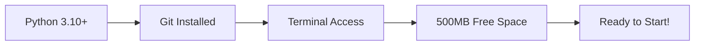
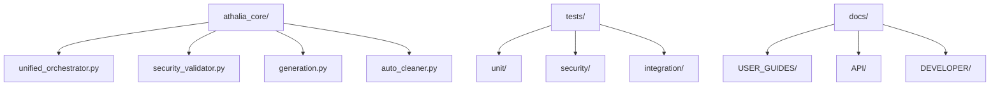

# ⚡ Quick Start Guide

**Get up and running with Athalia in under 10 minutes**


---

## 🎯 What You'll Accomplish

By the end of this guide, you'll have:
- ✅ Installed Athalia on your system
- ✅ Generated your first project template
- ✅ Validated security configuration
- ✅ Run automated cleanup
- ✅ Executed the test suite

---

## 📋 Prerequisites



**System Requirements:**
- Python 3.10 or higher
- Git version control
- Command line access
- 500MB free disk space

### Quick Check
```bash
# Verify prerequisites
python --version    # Should show 3.10+
git --version      # Should show git installed
```

---

## 🚀 Step 1: Installation

### Clone the Repository
```bash
# Clone Athalia
git clone https://github.com/arkalia-luna-system/ia-pipeline.git
cd athalia-dev-setup

# Verify structure
ls -la
```

**Expected Output:**
```
drwxr-xr-x  athalia_core/
drwxr-xr-x  tests/
drwxr-xr-x  docs/
drwxr-xr-x  scripts/
-rw-r--r--  requirements.txt
-rw-r--r--  README.md
```

### Setup Virtual Environment
```bash
# Create virtual environment
python -m venv .venv

# Activate (Linux/Mac)
source .venv/bin/activate

# Activate (Windows)
# .venv\Scripts\activate

# Verify activation
which python  # Should point to .venv/bin/python
```

### Install Dependencies
```bash
# Install core dependencies
pip install -r requirements.txt

# Verify installation
python -c "from athalia_core import UnifiedOrchestrator; print('✅ Installation successful')"
```

**Expected Output:**
```
⚠️ Modules IA non disponibles - mode fallback activé
⚠️ Modules de classification non disponibles - mode fallback activé
✅ Installation successful
```

> **Note:** The warnings are normal - they indicate AI modules are in fallback mode.

---

## 🔧 Step 2: Generate Your First Project

### Basic Project Generation
```python
# Create a new file: test_generation.py
from athalia_core.generation import generate_blueprint_mock, generate_project
import tempfile
import os

# Generate a REST API project
blueprint = generate_blueprint_mock("REST API for task management")

print("📋 Generated Blueprint:")
print(f"  Project Name: {blueprint['project_name']}")
print(f"  Project Type: {blueprint['project_type']}")
print(f"  Dependencies: {blueprint['dependencies']}")
print(f"  Modules: {blueprint['modules']}")

# Generate project in temp directory
with tempfile.TemporaryDirectory() as temp_dir:
    project_path = generate_project(blueprint, temp_dir, dry_run=True)
    print(f"\n✅ Project generation successful!")
    print(f"📁 Would be created at: {temp_dir}/{blueprint['project_name']}")
```

### Run the Test
```bash
python test_generation.py
```

**Expected Output:**
```
📋 Generated Blueprint:
  Project Name: rest
  Project Type: generic
  Dependencies: ['numpy', 'pandas']
  Modules: ['core', 'tests']

✅ Project generation successful!
📁 Would be created at: /tmp/tmp_xyz/rest
```

---

## 🛡️ Step 3: Test Security Features

### Security Validation
```python
# Create: test_security.py
from athalia_core.security_validator import SecurityValidator

# Initialize security validator
validator = SecurityValidator()

print("🛡️ Security System Status:")
print(f"  Allowed Commands: {len(validator.allowed_commands)}")
print(f"  First Command: {list(validator.allowed_commands)[0]}")

# Test command validation
safe_commands = [
    ["python", "--version"],
    ["git", "status"],
    ["ls", "-la"]
]

unsafe_commands = [
    ["rm", "-rf", "/"],
    ["curl", "malicious-site.com"],
    ["eval", "dangerous_code()"]
]

print("\n✅ Testing Safe Commands:")
for cmd in safe_commands:
    is_safe = validator.is_command_safe(cmd)
    print(f"  {' '.join(cmd)}: {'✅ SAFE' if is_safe else '❌ BLOCKED'}")

print("\n🚫 Testing Unsafe Commands:")
for cmd in unsafe_commands:
    is_safe = validator.is_command_safe(cmd)
    print(f"  {' '.join(cmd)}: {'✅ SAFE' if is_safe else '❌ BLOCKED'}")
```

### Run Security Test
```bash
python test_security.py
```

**Expected Output:**
```
🛡️ Security System Status:
  Allowed Commands: 80
  First Command: ath-test.py

✅ Testing Safe Commands:
  python --version: ✅ SAFE
  git status: ✅ SAFE
  ls -la: ✅ SAFE

🚫 Testing Unsafe Commands:
  rm -rf /: ❌ BLOCKED
  curl malicious-site.com: ❌ BLOCKED
  eval dangerous_code(): ❌ BLOCKED
```

---

## 🧹 Step 4: Test Cleanup Features

### Automated Cleanup
```python
# Create: test_cleanup.py
from athalia_core.auto_cleaner import AutoCleaner
import tempfile
import os

# Create test directory with "parasite" files
with tempfile.TemporaryDirectory() as temp_dir:
    print(f"📁 Testing cleanup in: {temp_dir}")
    
    # Create some files to clean
    test_files = {
        ".DS_Store": "mac_system_file",
        "._hidden_file": "apple_double",
        "Thumbs.db": "windows_cache",
        "test.log": "log_file",
        "cache.tmp": "temp_file"
    }
    
    print("\n📝 Creating test files:")
    for filename, content in test_files.items():
        filepath = os.path.join(temp_dir, filename)
        with open(filepath, 'w') as f:
            f.write(content)
        print(f"  Created: {filename}")
    
    # Initialize cleaner and run cleanup
    cleaner = AutoCleaner(temp_dir)
    result = cleaner.perform_full_cleanup()
    
    print(f"\n🧹 Cleanup Results:")
    print(f"  Files Removed: {result['total_files_removed']}")
    print(f"  Directories Removed: {result['total_directories_removed']}")
    print(f"  Space Freed: {result['total_space_freed']} bytes")
    print(f"  Cleanup Time: {result['cleanup_time']:.3f}s")
    
    print("\n📋 Remaining files:")
    remaining_files = os.listdir(temp_dir)
    if remaining_files:
        for f in remaining_files:
            print(f"  {f}")
    else:
        print("  (all files cleaned)")
```

### Run Cleanup Test
```bash
python test_cleanup.py
```

**Expected Output:**
```
📁 Testing cleanup in: /tmp/tmp_abc123

📝 Creating test files:
  Created: .DS_Store
  Created: ._hidden_file
  Created: Thumbs.db
  Created: test.log
  Created: cache.tmp

🧹 Cleanup Results:
  Files Removed: 5
  Directories Removed: 0
  Space Freed: 45 bytes
  Cleanup Time: 0.002s

📋 Remaining files:
  (all files cleaned)
```

---

## 🧪 Step 5: Run the Test Suite

### Quick Test Run
```bash
# Run a subset of tests (fast)
python -m pytest tests/unit/test_generation.py -v

# Run security tests
python -m pytest tests/security/ -v

# Get test count
python -m pytest tests/ --collect-only | grep "collected"
```

**Expected Output:**
```
======================== test session starts ========================
collected 1372 tests

tests/unit/test_generation.py::test_generate_blueprint_mock PASSED
tests/unit/test_generation.py::test_extract_project_name PASSED
tests/security/test_security_validator.py::test_command_validation PASSED

======================== 3 passed in 0.15s ========================
```

### Full Test Suite (Optional)
```bash
# Run all tests (takes ~30 seconds)
python -m pytest tests/ -v --tb=short
```

---

## 📊 Step 6: Explore Dashboards

### View HTML Dashboards
```bash
# List available dashboards
ls dashboard/*.html

# Open main dashboard (Mac)
open dashboard/dashboard.html

# Open main dashboard (Linux)
xdg-open dashboard/dashboard.html

# Open main dashboard (Windows)
start dashboard/dashboard.html
```

**Available Dashboards:**
- `dashboard.html` - Main project dashboard
- `analytics_dashboard_optimized.html` - Performance analytics
- `dashboard_validation.html` - Validation results
- `test_dashboard_simple.html` - Test results summary

---

## 🎯 Quick Reference

### Project Structure


### Key Commands
```bash
# Generate project
python -c "from athalia_core.generation import generate_blueprint_mock; print(generate_blueprint_mock('My API'))"

# Check security
python -c "from athalia_core.security_validator import SecurityValidator; print(f'Commands: {len(SecurityValidator().allowed_commands)}')"

# Run tests
python -m pytest tests/ --collect-only | grep collected

# Clean up
python -c "from athalia_core.auto_cleaner import AutoCleaner; print(AutoCleaner('.').perform_full_cleanup())"
```

### Common File Locations
| Component | Location | Purpose |
|-----------|----------|---------|
| Core Modules | `athalia_core/` | Main functionality |
| Test Suite | `tests/` | Automated testing |
| Documentation | `docs/` | User and developer guides |
| Dashboards | `dashboard/` | HTML monitoring interfaces |
| Scripts | `bin/` | Command-line utilities |

---

## ✅ Verification Checklist

After completing this guide, verify your setup:

- [ ] Python environment activated
- [ ] All imports work without errors
- [ ] Project generation creates blueprints
- [ ] Security validator blocks unsafe commands
- [ ] Cleanup removes test files
- [ ] Test collection shows 1,372 tests
- [ ] Dashboards open in browser

---

## 🔄 Next Steps

### For Users
1. **[Complete User Guide](USAGE.md)** - Explore all features
2. **[Configuration Guide](INSTALLATION.md#configuration)** - Customize settings
3. **[Troubleshooting](TROUBLESHOOTING.md)** - Common issues

### For Developers
1. **[Architecture Overview](../ARCHITECTURE/INDEX.md)** - System design
2. **[API Reference](../API/INDEX.md)** - Module documentation
3. **[Contributing Guide](../DEVELOPER/INDEX.md)** - Development workflow

### For Advanced Usage
1. **[Security Guide](../SPECIALIZED/SECURITY/)** - Security features
2. **[Testing Guide](../DEVELOPER/GUIDES/TESTING.md)** - Test framework
3. **[Dashboard Guide](../SPECIALIZED/DASHBOARD/)** - Monitoring tools

---

## ❓ Need Help?

### Common Issues
| Problem | Solution |
|---------|----------|
| Import errors | Check virtual environment is activated |
| Permission denied | Verify file permissions and security settings |
| Tests failing | Ensure all dependencies installed correctly |
| Slow performance | Use `--collect-only` for test verification |

### Getting Support
- **Documentation:** Check relevant guide sections
- **Issues:** Report bugs via GitHub issues
- **Questions:** Review FAQ section first

---

**🎉 Congratulations! You've successfully completed the Athalia Quick Start.**

*Ready to build secure, automated development workflows.*
