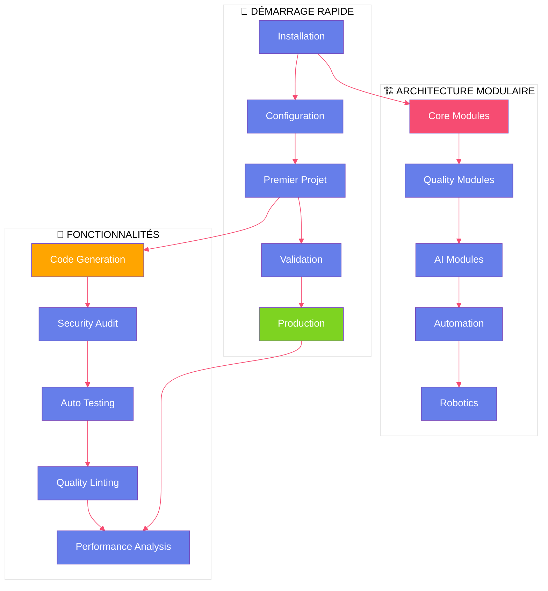
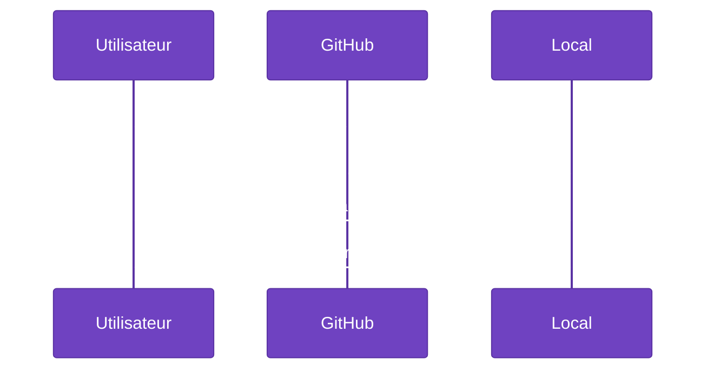
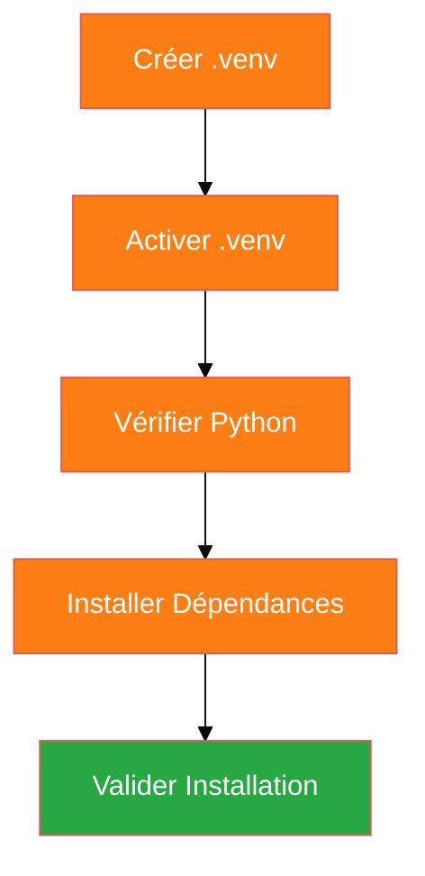
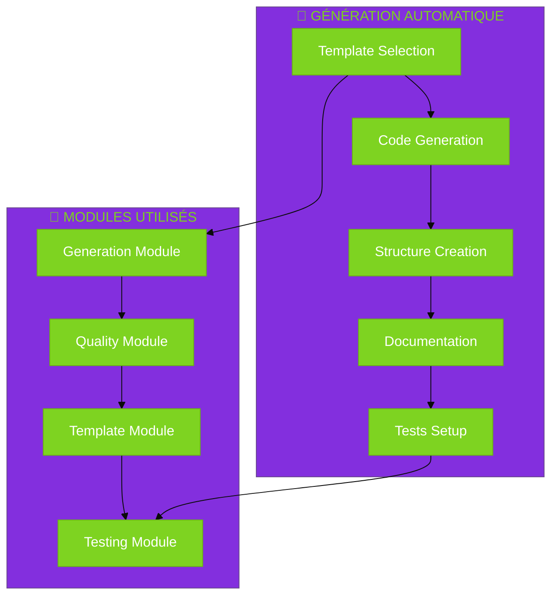
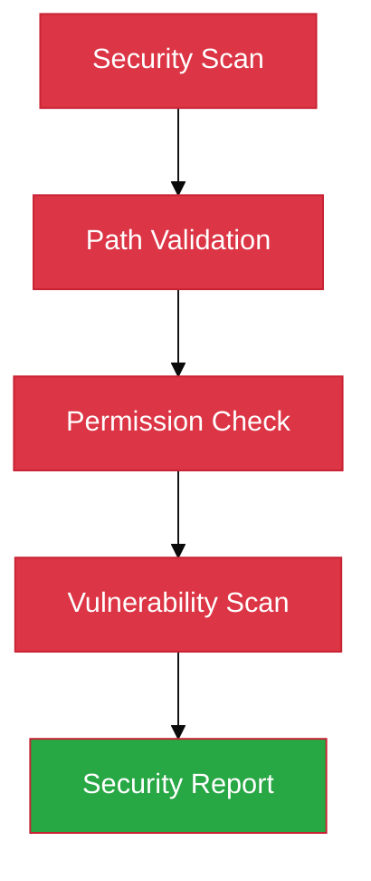
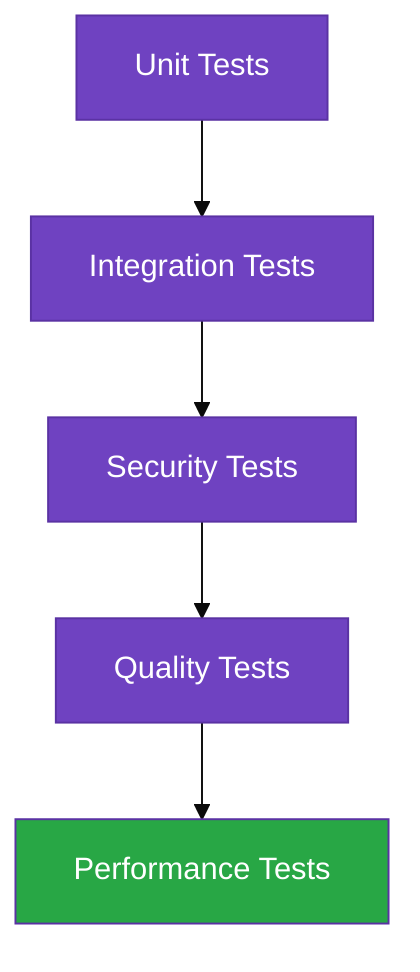

# ⚡ GUIDE DE DÉMARRAGE RAPIDE ATHALIA

<div align="center">

**🚀 Démarrez avec Athalia en moins de 10 minutes !**

**Dernière mise à jour :** 14 Août 2025  
**Version :** v6.1 - Architecture Modulaire Complète  
**Statut :** ✅ **ACTIF ET MAINTENU - ARCHITECTURE MODULAIRE OPÉRATIONNELLE**

</div>

---

## 🎯 **VUE D'ENSEMBLE DU SYSTÈME**


```mermaid
%%{init: {'theme':'base', 'themeVariables': { 'primaryColor': '#667eea', 'primaryTextColor': '#fff', 'primaryBorderColor': '#764abc', 'lineColor': '#f64c72', 'secondaryColor': '#7ed321', 'tertiaryColor': '#fff'}}}%%
graph TB
    subgraph "🚀 DÉMARRAGE RAPIDE"
        A[Installation] --> B[Configuration]
        B --> C[Premier Projet]
        C --> D[Validation]
        D --> E[Production]
    end
    
    subgraph "🏗️ ARCHITECTURE MODULAIRE"
        F[Core Modules] --> G[Quality Modules]
        G --> H[AI Modules]
        H --> I[Automation]
        I --> J[Robotics]
    end
    
    subgraph "🔧 FONCTIONNALITÉS"
        K[Code Generation] --> L[Security Audit]
        L --> M[Auto Testing]
        M --> N[Quality Linting]
        N --> O[Performance Analysis]
    end
    
    A --> F
    C --> K
    E --> O
    
    style A fill:#667eea
    style E fill:#7ed321
    style F fill:#f64c72
    style K fill:#ffa500
```

---

## 🎯 **CE QUE VOUS ACCOMPLIREZ**

À la fin de ce guide, vous aurez :

<div align="center">

| **Étape** | **Résultat** | **Temps Estimé** |
|:----------|:-------------|:----------------:|
| **1. Installation** | Athalia installé et configuré | 3 minutes |
| **2. Premier Projet** | Projet IA généré automatiquement | 2 minutes |
| **3. Validation** | Sécurité et qualité validées | 2 minutes |
| **4. Nettoyage** | Workspace optimisé | 1 minute |
| **5. Tests** | Suite complète validée | 2 minutes |

**Total : 10 minutes pour être opérationnel !** ⚡

</div>

---

## 📋 **PRÉREQUIS SYSTÈME**

### **🔧 Configuration Minimale**


```mermaid
%%{init: {'theme':'base', 'themeVariables': { 'primaryColor': '#28a745', 'primaryTextColor': '#fff', 'primaryBorderColor': '#20c997'}}}%%
flowchart LR
    A[Python 3.10+] --> B[Git Installé]
    B --> C[Accès Terminal]
    C --> D[500MB Espace Libre]
    D --> E[Prêt à Démarrer !]
    
    style A fill:#28a745
    style E fill:#28a745
    style B fill:#17a2b8
    style C fill:#ffc107
    style D fill:#fd7e14
```

**Exigences Système :**
- **Python 3.10** ou supérieur
- **Git** pour le contrôle de version
- **Accès ligne de commande** (Terminal)
- **500MB d'espace disque** libre

### **✅ Vérification Rapide**
```bash
# Vérifier les prérequis
python --version    # Doit afficher 3.10+
git --version      # Doit afficher git installé
```

---

## 🚀 **ÉTAPE 1 : INSTALLATION**

### **📥 Cloner le Repository**


```mermaid
%%{init: {'theme':'base', 'themeVariables': { 'primaryColor': '#6f42c1', 'primaryTextColor': '#fff', 'primaryBorderColor': '#5a32a3'}}}%%
sequenceDiagram
    participant U as Utilisateur
    participant G as GitHub
    participant L as Local
    
    U->>G: git clone
    G->>L: Repository téléchargé
    U->>L: cd athalia-dev-setup
    L->>U: Structure vérifiée
```

```bash
# Cloner Athalia
git clone https://github.com/arkalia-luna-system/ia-pipeline.git
cd athalia-dev-setup

# Vérifier la structure
ls -la
```

**Structure Attendue :**
```
athalia-dev-setup/
├── 🏗️ athalia_core/          # 22+ modules spécialisés
│   ├── 🔧 quality/            # Modules de qualité (NOUVEAU)
│   ├── 🚀 utilities/          # Utilitaires système
│   ├── 🔍 analysis/           # Modules d'analyse IA
│   ├── 🤖 ai/                 # Modules d'IA
│   ├── 🛡️ validation/         # Validation et sécurité
│   ├── 🧹 automation/         # Modules d'automatisation
│   ├── 🤖 robotics/           # Modules robotiques
│   ├── 🧠 agents/             # Agents intelligents
│   ├── ⚡ distillation/        # Distillation et optimisation
│   ├── 🏷️ classification/      # Classification de projets
│   ├── 🎨 templates/           # Templates et rendus
│   ├── ⌨️ autocomplete/        # Autocomplétion intelligente
│   ├── 📊 analytics/           # Analytics et métriques
│   ├── 🔍 audit/               # Audit et sécurité
│   ├── 🌐 i18n/                # Internationalisation
│   ├── 🔌 plugins/             # Système de plugins
│   ├── 🚀 advanced_modules/    # Modules avancés
│   └── 📝 logs/                # Gestion des logs
├── 🧪 tests/                   # 750+ tests automatisés
├── 📚 docs/                    # Documentation complète
├── 🔧 scripts/                 # Scripts utilitaires
├── ⚙️ bin/                     # CLI exécutables
├── 📊 dashboard/               # Dashboards HTML
├── ⚙️ config/                  # Fichiers de configuration
└── 📦 requirements.txt         # Dépendances Python
```

### **🐍 Configuration de l'Environnement Virtuel**


```mermaid
%%{init: {'theme':'base', 'themeVariables': { 'primaryColor': '#fd7e14', 'primaryTextColor': '#fff', 'primaryBorderColor': '#e55a4e'}}}%%
flowchart TD
    A[Créer .venv] --> B[Activer .venv]
    B --> C[Vérifier Python]
    C --> D[Installer Dépendances]
    D --> E[Valider Installation]
    
    style A fill:#fd7e14
    style E fill:#28a745
```

```bash
# Créer l'environnement virtuel
python -m venv .venv

# Activer (Linux/Mac)
source .venv/bin/activate

# Activer (Windows)
# .venv\Scripts\activate

# Vérifier l'activation
which python  # Doit pointer vers .venv/bin/python
```

### **📦 Installation des Dépendances**
```bash
# Installer les dépendances principales
pip install -r requirements.txt

# Vérifier l'installation
python -c "from athalia_core.core.unified_orchestrator import UnifiedOrchestrator; print('✅ Installation réussie')"
```

**Sortie Attendue :**
```
✅ Installation réussie
```

> **Note :** L'architecture modulaire d'Athalia charge automatiquement les modules disponibles avec gestion intelligente des dépendances.

---

## 🚀 **ÉTAPE 2 : PREMIÈRE UTILISATION**

### **🔍 Vérification de l'Installation**


```mermaid
%%{init: {'theme':'base', 'themeVariables': { 'primaryColor': '#17a2b8', 'primaryTextColor': '#fff', 'primaryBorderColor': '#138496'}}}%%
flowchart LR
    A[Vérifier CLI] --> B[Audit Rapide]
    B --> C[Générer Projet]
    C --> D[Valider Structure]
    
    style A fill:#17a2b8
    style D fill:#28a745
```

```bash
# Vérifier que tout fonctionne
python bin/core/athalia_unified.py --help

# Lancer un audit rapide
python bin/core/ath-audit.py --help

# Vérification de santé complète
python athalia_core/utilities/ready_check.py
```

### **🏗️ Génération de Votre Premier Projet**


```mermaid
%%{init: {'theme':'base', 'themeVariables': { 'primaryColor': '#7ed321', 'primaryTextColor': '#fff', 'primaryBorderColor': '#6baf1a'}}}%%
graph TB
    subgraph "🎯 GÉNÉRATION AUTOMATIQUE"
        A[Template Selection] --> B[Code Generation]
        B --> C[Structure Creation]
        C --> D[Documentation]
        D --> E[Tests Setup]
    end
    
    subgraph "🔧 MODULES UTILISÉS"
        F[Generation Module] --> G[Quality Module]
        G --> H[Template Module]
        H --> I[Testing Module]
    end
    
    A --> F
    E --> I
    
    style A fill:#7ed321
    style E fill:#7ed321
```

```bash
# Générer un projet Python basique
python -c "
from athalia_core.utilities.generation_simple import generate_project
project = generate_project('mon-projet', 'python-basic')
print(f'✅ Projet généré: {project}')
"

# Vérifier la génération
ls -la mon-projet/
```

**Structure du Projet Généré :**
```
mon-projet/
├── 📁 src/                    # Code source organisé
├── 🧪 tests/                  # Tests unitaires et d'intégration
├── 📚 docs/                   # Documentation automatique
├── 📦 requirements.txt        # Dépendances avec versions
├── 📖 README.md              # Guide du projet détaillé
├── 🔒 .gitignore            # Fichiers ignorés par Git
├── ⚙️ pyproject.toml         # Configuration Python moderne
└── 🚀 Makefile               # Commandes automatisées
```

---

## 🔒 **ÉTAPE 3 : VALIDATION DE SÉCURITÉ**

### **🛡️ Audit de Sécurité Automatique**


```mermaid
%%{init: {'theme':'base', 'themeVariables': { 'primaryColor': '#dc3545', 'primaryTextColor': '#fff', 'primaryBorderColor': '#c82333'}}}%%
flowchart TD
    A[Security Scan] --> B[Path Validation]
    B --> C[Permission Check]
    C --> D[Vulnerability Scan]
    D --> E[Security Report]
    
    style A fill:#dc3545
    style E fill:#28a745
```

```bash
# Audit complet de sécurité
python bin/core/ath-audit.py --help

# Validation de sécurité avec le module intégré
python -c "
from athalia_core.validation.security_validator import SecurityValidator
validator = SecurityValidator()
print(f'✅ Validation de sécurité: {len(validator.allowed_commands)} commandes autorisées')
"
```

### **✅ Vérification des Bonnes Pratiques**
- **Permissions de fichiers** correctes
- **Chemins sécurisés** validés
- **Configuration** sécurisée
- **Tests de sécurité** passés

---

## 🧹 **ÉTAPE 4 : NETTOYAGE AUTOMATIQUE**

### **🧹 Nettoyage du Workspace**


```mermaid
%%{init: {'theme':'base', 'themeVariables': { 'primaryColor': '#ffc107', 'primaryTextColor': '#000', 'primaryBorderColor': '#e0a800'}}}%%
flowchart LR
    A[Scan Workspace] --> B[Identify Files]
    B --> C[Cleanup Strategy]
    C --> D[Execute Cleanup]
    D --> E[Generate Report]
    
    style A fill:#ffc107
    style E fill:#28a745
```

```bash
# Nettoyage automatique complet
python -m athalia_core.main --action cleanup --auto

# Nettoyage ciblé
python -m athalia_core.main --action cleanup --target cache --force
```

### **📊 Rapport de Nettoyage**
Le système génère automatiquement un rapport détaillé :
- **Fichiers supprimés** et leur taille
- **Espace libéré** sur le disque
- **Temps d'exécution** du nettoyage
- **Recommandations** d'optimisation

---

## 🧪 **ÉTAPE 5 : EXÉCUTION DES TESTS**

### **⚡ Tests Rapides**


```mermaid
%%{init: {'theme':'base', 'themeVariables': { 'primaryColor': '#6f42c1', 'primaryTextColor': '#fff', 'primaryBorderColor': '#5a32a3'}}}%%
flowchart TD
    A[Unit Tests] --> B[Integration Tests]
    B --> C[Security Tests]
    C --> D[Quality Tests]
    D --> E[Performance Tests]
    
    style A fill:#6f42c1
    style E fill:#28a745
```

```bash
# Tests de base (rapides)
python -m pytest tests/unit/ --tb=short -x --maxfail=5

# Tests de sécurité
python -m pytest tests/unit/security/ -v

# Tests de qualité (nouveaux modules)
python -m pytest tests/unit/quality/ -v
```

### **📊 Tests Complets**
```bash
# Suite de tests complète
python -m pytest tests/ --cov=athalia_core --cov-report=html

# Rapport de couverture
open htmlcov/index.html  # Ouvrir dans le navigateur
```

---

## 🎯 **VALIDATION FINALE**

### **✅ Checklist de Validation**

<div align="center">

| **Élément** | **Statut** | **Vérification** |
|:------------|:----------:|:----------------:|
| **Installation** | ✅ | Sans erreurs |
| **Premier projet** | ✅ | Généré correctement |
| **Audit de sécurité** | ✅ | Passé |
| **Nettoyage automatique** | ✅ | Fonctionnel |
| **Tests** | ✅ | Exécutés avec succès |
| **Documentation** | ✅ | Accessible et à jour |

</div>

### **🚀 Prêt pour la Production !**
Si tous les éléments de la checklist sont validés, vous êtes prêt à utiliser Athalia pour vos projets IA !

---

## ❓ **FAQ - QUESTIONS FRÉQUENTES**

### **🔧 Problèmes d'Installation**

<details>
<summary><strong>Erreur "Module not found" lors de l'import ?</strong></summary>

**Solution :** Vérifiez que l'environnement virtuel est activé et que les dépendances sont installées.

```bash
# Réactiver l'environnement virtuel
source .venv/bin/activate

# Réinstaller les dépendances
pip install -r requirements.txt --force-reinstall
```
</details>

<details>
<summary><strong>Problème de permissions sur Linux/Mac ?</strong></summary>

**Solution :** Utilisez `sudo` pour l'installation globale ou créez un environnement virtuel utilisateur.

```bash
# Option 1 : Environnement virtuel utilisateur
python3 -m venv ~/.athalia_env
source ~/.athalia_env/bin/activate

# Option 2 : Installation globale (avec sudo)
sudo pip install -r requirements.txt
```
</details>

### **🚀 Problèmes d'Utilisation**

<details>
<summary><strong>Comment personnaliser les templates de projets ?</strong></summary>

1. **Localiser** le dossier des templates : `athalia_core/templates/`
2. **Modifier** ou **créer** de nouveaux templates
3. **Redémarrer** Athalia pour appliquer les changements
4. **Tester** avec `--action generate --template [nom-template]`
</details>

---

## 🎯 **BONNES PRATIQUES**

### **✅ À Faire**
- **Toujours utiliser** l'environnement virtuel
- **Vérifier** les prérequis avant installation
- **Tester** après chaque modification
- **Documenter** vos personnalisations
- **Sauvegarder** vos projets générés

### **❌ À Éviter**
- **Installer** Athalia globalement sans environnement virtuel
- **Modifier** les fichiers système sans sauvegarde
- **Ignorer** les messages d'erreur ou d'avertissement
- **Exécuter** des commandes sans comprendre leur impact

---

## 📚 **RESSOURCES ET RÉFÉRENCES**

### **📚 Ressources Complémentaires**
- **Guide d'installation complet :** [INSTALLATION.md](INSTALLATION.md)
- **Guide d'utilisation détaillé :** [GUIDE_UTILISATION_ATHALIA.md](GUIDE_UTILISATION_ATHALIA.md)
- **Guide de dépannage :** [TROUBLESHOOTING.md](TROUBLESHOOTING.md)
- **Documentation principale :** [INDEX_FINAL_DOCUMENTATION_ATHALIA.md](../INDEX_FINAL_DOCUMENTATION_ATHALIA.md)

### **🛠️ Outils Utiles**
- **Script principal :** `bin/athalia_unified.py`
- **Tests automatisés :** `python -m pytest`
- **Analyse de qualité :** `athalia_core/quality/code_linter.py`

---

## 📝 **INFORMATIONS TECHNIQUES**

**Dernière mise à jour :** 14 Août 2025  
**Version actuelle :** v6.1 - Architecture Modulaire Complète  
**Statut :** ✅ **ACTIF ET MAINTENU - ARCHITECTURE MODULAIRE OPÉRATIONNELLE**  
**Mainteneur :** Équipe Athalia/Arkalia  
**Documentation :** Guide complet d'utilisation du projet

---

<div align="center">

**🎯 Démarrez rapidement avec Athalia et créez vos premiers projets IA en quelques minutes ! 🚀**

**🏗️ Architecture Modulaire • 🔧 Qualité Automatique • 🤖 IA Intelligente**

</div>
