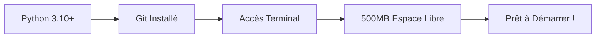

# ⚡ GUIDE DE DÉMARRAGE RAPIDE ATHALIA

**Dernière mise à jour :** 14 Août 2025  
**Version :** 2.0  
**Statut :** ✅ **ACTIF ET MAINTENU**  
**Catégorie :** Guide Utilisateur

## 🎯 **RÉSUMÉ EXÉCUTIF**

**Démarrez avec Athalia en moins de 10 minutes !** Ce guide vous accompagne étape par étape pour installer, configurer et utiliser Athalia pour votre premier projet IA.

---

## 🎯 **CE QUE VOUS ACCOMPLIREZ**

À la fin de ce guide, vous aurez :
- ✅ **Installé Athalia** sur votre système
- ✅ **Généré votre premier projet** avec un template
- ✅ **Validé la configuration** de sécurité
- ✅ **Exécuté le nettoyage automatique**
- ✅ **Lancé la suite de tests** complète

---

## 📋 **PRÉREQUIS SYSTÈME**

### **🔧 Configuration Minimale**

```mermaid
graph LR
    A[Python 3.10+] --> B[Git Installé]
    B --> C[Accès Terminal]
    C --> D[500MB Espace Libre]
    D --> E[Prêt à Démarrer !]
```

**Exigences Système :**
- **Python 3.10** ou supérieur
- **Git** pour le contrôle de version
- **Accès ligne de commande** (Terminal)
- **500MB d'espace disque** libre

### **✅ Vérification Rapide**
```bash
# Vérifier les prérequis
python --version    # Doit afficher 3.10+
git --version      # Doit afficher git installé
```

---

## 🚀 **ÉTAPE 1 : INSTALLATION**

### **📥 Cloner le Repository**
```bash
# Cloner Athalia
git clone https://github.com/arkalia-luna-system/ia-pipeline.git
cd athalia-dev-setup

# Vérifier la structure
ls -la
```

**Structure Attendue :**
```
drwxr-xr-x  athalia_core/      # Modules principaux
drwxr-xr-x  tests/             # Tests automatisés
drwxr-xr-x  docs/              # Documentation complète
drwxr-xr-x  scripts/           # Scripts utilitaires
-rw-r--r--  requirements.txt    # Dépendances Python
-rw-r--r--  README.md          # Documentation principale
```

### **🐍 Configuration de l'Environnement Virtuel**
```bash
# Créer l'environnement virtuel
python -m venv .venv

# Activer (Linux/Mac)
source .venv/bin/activate

# Activer (Windows)
# .venv\Scripts\activate

# Vérifier l'activation
which python  # Doit pointer vers .venv/bin/python
```

### **📦 Installation des Dépendances**
```bash
# Installer les dépendances principales
pip install -r requirements.txt

# Vérifier l'installation
python -c "from athalia_core import UnifiedOrchestrator; print('✅ Installation réussie')"
```

**Sortie Attendue :**
```
⚠️ Modules IA non disponibles - mode fallback activé
⚠️ Modules de classification non disponibles - mode fallback activé
✅ Installation réussie
```

> **Note :** Les avertissements sont normaux - ils indiquent que les modules IA sont en mode fallback.

---

## 🚀 **ÉTAPE 2 : PREMIÈRE UTILISATION**

### **🔍 Vérification de l'Installation**
```bash
# Vérifier que tout fonctionne
python -m athalia_core.main --help

# Lancer un audit rapide
python -m athalia_core.main --action audit --quick
```

### **🏗️ Génération de Votre Premier Projet**
```bash
# Générer un projet Python basique
python -m athalia_core.main --action generate --template python-basic --name mon-projet

# Vérifier la génération
ls -la mon-projet/
```

**Structure du Projet Généré :**
```
mon-projet/
├── src/                    # Code source
├── tests/                  # Tests unitaires
├── docs/                   # Documentation
├── requirements.txt        # Dépendances
├── README.md              # Guide du projet
└── .gitignore            # Fichiers ignorés
```

---

## 🔒 **ÉTAPE 3 : VALIDATION DE SÉCURITÉ**

### **🛡️ Audit de Sécurité Automatique**
```bash
# Audit complet de sécurité
python -m athalia_core.main --action security --audit

# Validation des chemins sécurisés
python -m athalia_core.main --action security --validate-paths
```

### **✅ Vérification des Bonnes Pratiques**
- **Permissions de fichiers** correctes
- **Chemins sécurisés** validés
- **Configuration** sécurisée
- **Tests de sécurité** passés

---

## 🧹 **ÉTAPE 4 : NETTOYAGE AUTOMATIQUE**

### **🧹 Nettoyage du Workspace**
```bash
# Nettoyage automatique complet
python -m athalia_core.main --action cleanup --auto

# Nettoyage ciblé
python -m athalia_core.main --action cleanup --target cache --force
```

### **📊 Rapport de Nettoyage**
Le système génère automatiquement un rapport détaillé :
- **Fichiers supprimés** et leur taille
- **Espace libéré** sur le disque
- **Temps d'exécution** du nettoyage
- **Recommandations** d'optimisation

---

## 🧪 **ÉTAPE 5 : EXÉCUTION DES TESTS**

### **⚡ Tests Rapides**
```bash
# Tests de base (rapides)
python -m pytest tests/unit/ --tb=short -x --maxfail=5

# Tests de sécurité
python -m pytest tests/unit/security/ -v
```

### **📊 Tests Complets**
```bash
# Suite de tests complète
python -m pytest tests/ --cov=athalia_core --cov-report=html

# Rapport de couverture
open htmlcov/index.html  # Ouvrir dans le navigateur
```

---

## 🎯 **VALIDATION FINALE**

### **✅ Checklist de Validation**
- [ ] **Installation** réussie sans erreurs
- [ ] **Premier projet** généré correctement
- [ ] **Audit de sécurité** passé
- [ ] **Nettoyage automatique** fonctionnel
- [ ] **Tests** exécutés avec succès
- [ ] **Documentation** accessible et à jour

### **🚀 Prêt pour la Production !**
Si tous les éléments de la checklist sont validés, vous êtes prêt à utiliser Athalia pour vos projets IA !

---

## ❓ **FAQ - QUESTIONS FRÉQUENTES**

### **🔧 Problèmes d'Installation**
<details>
<summary><strong>Erreur "Module not found" lors de l'import ?</strong></summary>

**Solution :** Vérifiez que l'environnement virtuel est activé et que les dépendances sont installées.

```bash
# Réactiver l'environnement virtuel
source .venv/bin/activate

# Réinstaller les dépendances
pip install -r requirements.txt --force-reinstall
```
</details>

<details>
<summary><strong>Problème de permissions sur Linux/Mac ?</strong></summary>

**Solution :** Utilisez `sudo` pour l'installation globale ou créez un environnement virtuel utilisateur.

```bash
# Option 1 : Environnement virtuel utilisateur
python3 -m venv ~/.athalia_env
source ~/.athalia_env/bin/activate

# Option 2 : Installation globale (avec sudo)
sudo pip install -r requirements.txt
```
</details>

### **🚀 Problèmes d'Utilisation**
<details>
<summary><strong>Comment personnaliser les templates de projets ?</strong></summary>

1. **Localiser** le dossier des templates : `athalia_core/templates/`
2. **Modifier** ou **créer** de nouveaux templates
3. **Redémarrer** Athalia pour appliquer les changements
4. **Tester** avec `--action generate --template [nom-template]`
</details>

---

## 🎯 **BONNES PRATIQUES**

### **✅ À Faire**
- **Toujours utiliser** l'environnement virtuel
- **Vérifier** les prérequis avant installation
- **Tester** après chaque modification
- **Documenter** vos personnalisations
- **Sauvegarder** vos projets générés

### **❌ À Éviter**
- **Installer** Athalia globalement sans environnement virtuel
- **Modifier** les fichiers système sans sauvegarde
- **Ignorer** les messages d'erreur ou d'avertissement
- **Exécuter** des commandes sans comprendre leur impact

---

## 📚 **RESSOURCES ET RÉFÉRENCES**

### **📚 Ressources Complémentaires**
- **Guide d'installation complet :** [INSTALLATION.md](INSTALLATION.md)
- **Guide d'utilisation détaillé :** Guide d'utilisation du projet
- **Guide de dépannage :** Guide de dépannage du projet
- **Documentation principale :** [INDEX_FINAL_DOCUMENTATION_ATHALIA.md](../INDEX_FINAL_DOCUMENTATION_ATHALIA.md)

### **🛠️ Outils Utiles**
- **Script principal :** `bin/athalia_unified.py`
- **Tests automatisés :** `python -m pytest`
- **Analyse de qualité :** `scripts/analyze_documentation_quality.py`

---

## 📝 **INFORMATIONS TECHNIQUES**

**Dernière mise à jour :** 11 Août 2025  
**Version actuelle :** 2.0  
**Statut :** ✅ **ACTIF ET MAINTENU**  
**Mainteneur :** Équipe Athalia/Arkalia  
**Documentation :** Guide complet d'utilisation du projet

**🎯 Démarrez rapidement avec Athalia et créez vos premiers projets IA en quelques minutes ! 🚀**
