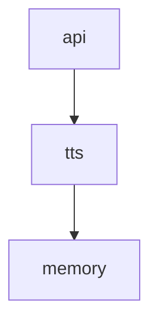
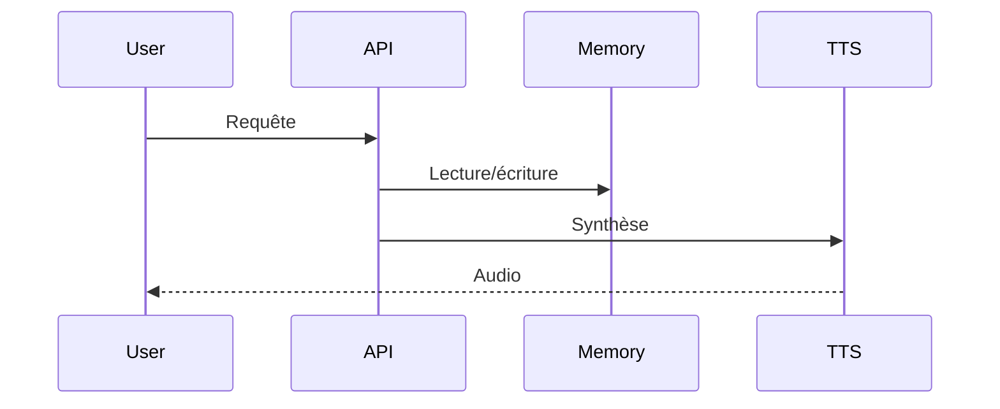

# Documentation technique

## Description
Test YAML final

## Modules
- api
- tts
- memory

## Dépendances
- flask
- tts
- memorylib

## Structure
- src/
- tests/
- api/
- prompts/
- README.md
- requirements.txt

## Endpoints/API

### api
- Endpoint : /api/api
- Méthode : POST
- Payload : {"data": "test", "user_id": 1, "mode": "fast"}
- Réponse : {"result": "ok", "details": {"info": "détail"}}

### tts
- Endpoint : /api/tts
- Méthode : POST
- Payload : {"text": "Bonjour", "lang": "fr"}
- Réponse : {"audio": "base64..."}

### memory
- Endpoint : /api/memory
- Méthode : POST
- Payload : {"key": "foo", "value": "bar"}
- Réponse : {"status": "ok"}

---

## Dépendances (Mermaid)

## Séquence principale (Mermaid)
