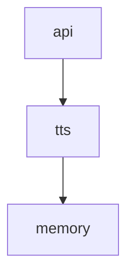
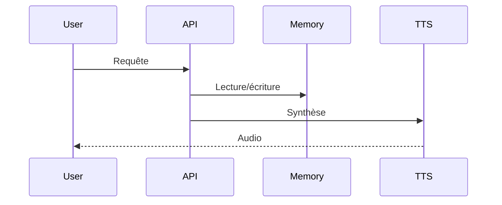

# Documentation technique

## Description
bebe qui pleure

## Modules
- api
- tts
- memory

## Dépendances
- flask
- tts
- memorylib

## Structure
- src/
- tests/
- api/
- prompts/
- README.md
- requirements.txt

## Endpoints/API
### api
- Endpoint : /api/api
- Méthode : POST
- Payload : {'data': ...}
- Réponse : {'result': ...}
### tts
- Endpoint : /api/tts
- Méthode : POST
- Payload : {'data': ...}
- Réponse : {'result': ...}
### memory
- Endpoint : /api/memory
- Méthode : POST
- Payload : {'data': ...}
- Réponse : {'result': ...}

## Dépendances (Mermaid)

## Séquence principale (Mermaid)
