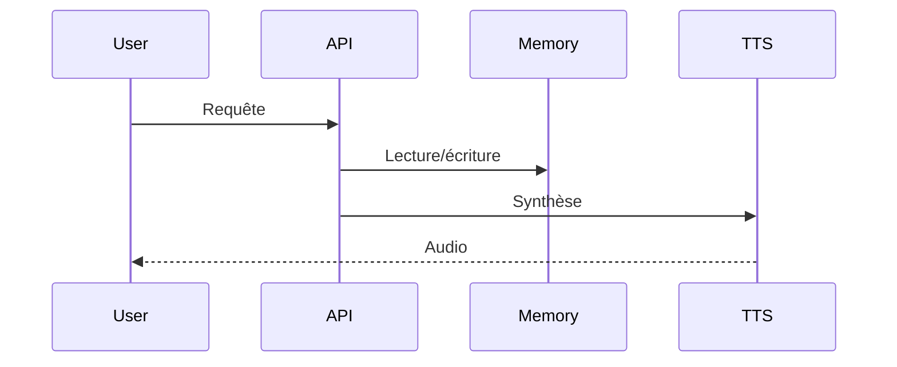

# Documentation technique

## Description
Projet IA volumineux pour test de scalabilité

## Modules
- module_1
- module_2
- module_3
- module_4
- module_5
- module_6
- module_7
- module_8
- module_9
- module_10
- module_11
- module_12
- module_13
- module_14
- module_15
- module_16
- module_17
- module_18
- module_19
- module_20
- module_21
- module_22
- module_23
- module_24
- module_25
- module_26
- module_27
- module_28
- module_29
- module_30
- module_31
- module_32
- module_33
- module_34
- module_35
- module_36
- module_37
- module_38
- module_39
- module_40
- module_41
- module_42
- module_43
- module_44
- module_45
- module_46
- module_47
- module_48
- module_49
- module_50
- module_51
- module_52
- module_53
- module_54
- module_55
- module_56
- module_57
- module_58
- module_59
- module_60
- module_61
- module_62
- module_63
- module_64
- module_65
- module_66
- module_67
- module_68
- module_69
- module_70
- module_71
- module_72
- module_73
- module_74
- module_75
- module_76
- module_77
- module_78
- module_79
- module_80
- module_81
- module_82
- module_83
- module_84
- module_85
- module_86
- module_87
- module_88
- module_89
- module_90
- module_91
- module_92
- module_93
- module_94
- module_95
- module_96
- module_97
- module_98
- module_99
- module_100
- module_101
- module_102
- module_103
- module_104
- module_105
- module_106
- module_107
- module_108
- module_109
- module_110
- module_111
- module_112
- module_113
- module_114
- module_115
- module_116
- module_117
- module_118
- module_119
- module_120

## Dépendances
- flask
- tts
- memorylib

## Structure
- module_1/
- module_2/
- module_3/
- module_4/
- module_5/
- module_6/
- module_7/
- module_8/
- module_9/
- module_10/
- module_11/
- module_12/
- module_13/
- module_14/
- module_15/
- module_16/
- module_17/
- module_18/
- module_19/
- module_20/
- module_21/
- module_22/
- module_23/
- module_24/
- module_25/
- module_26/
- module_27/
- module_28/
- module_29/
- module_30/
- module_31/
- module_32/
- module_33/
- module_34/
- module_35/
- module_36/
- module_37/
- module_38/
- module_39/
- module_40/
- module_41/
- module_42/
- module_43/
- module_44/
- module_45/
- module_46/
- module_47/
- module_48/
- module_49/
- module_50/
- module_51/
- module_52/
- module_53/
- module_54/
- module_55/
- module_56/
- module_57/
- module_58/
- module_59/
- module_60/
- module_61/
- module_62/
- module_63/
- module_64/
- module_65/
- module_66/
- module_67/
- module_68/
- module_69/
- module_70/
- module_71/
- module_72/
- module_73/
- module_74/
- module_75/
- module_76/
- module_77/
- module_78/
- module_79/
- module_80/
- module_81/
- module_82/
- module_83/
- module_84/
- module_85/
- module_86/
- module_87/
- module_88/
- module_89/
- module_90/
- module_91/
- module_92/
- module_93/
- module_94/
- module_95/
- module_96/
- module_97/
- module_98/
- module_99/
- module_100/
- module_101/
- module_102/
- module_103/
- module_104/
- module_105/
- module_106/
- module_107/
- module_108/
- module_109/
- module_110/
- module_111/
- module_112/
- module_113/
- module_114/
- module_115/
- module_116/
- module_117/
- module_118/
- module_119/
- module_120/
- src/
- tests/
- README.md
- requirements.txt

## Endpoints/API
### module_1
- Endpoint : /api/module_1
- Méthode : POST
- Payload : {'data': ...}
- Réponse : {'result': ...}
### module_2
- Endpoint : /api/module_2
- Méthode : POST
- Payload : {'data': ...}
- Réponse : {'result': ...}
### module_3
- Endpoint : /api/module_3
- Méthode : POST
- Payload : {'data': ...}
- Réponse : {'result': ...}
### module_4
- Endpoint : /api/module_4
- Méthode : POST
- Payload : {'data': ...}
- Réponse : {'result': ...}
### module_5
- Endpoint : /api/module_5
- Méthode : POST
- Payload : {'data': ...}
- Réponse : {'result': ...}
### module_6
- Endpoint : /api/module_6
- Méthode : POST
- Payload : {'data': ...}
- Réponse : {'result': ...}
### module_7
- Endpoint : /api/module_7
- Méthode : POST
- Payload : {'data': ...}
- Réponse : {'result': ...}
### module_8
- Endpoint : /api/module_8
- Méthode : POST
- Payload : {'data': ...}
- Réponse : {'result': ...}
### module_9
- Endpoint : /api/module_9
- Méthode : POST
- Payload : {'data': ...}
- Réponse : {'result': ...}
### module_10
- Endpoint : /api/module_10
- Méthode : POST
- Payload : {'data': ...}
- Réponse : {'result': ...}
### module_11
- Endpoint : /api/module_11
- Méthode : POST
- Payload : {'data': ...}
- Réponse : {'result': ...}
### module_12
- Endpoint : /api/module_12
- Méthode : POST
- Payload : {'data': ...}
- Réponse : {'result': ...}
### module_13
- Endpoint : /api/module_13
- Méthode : POST
- Payload : {'data': ...}
- Réponse : {'result': ...}
### module_14
- Endpoint : /api/module_14
- Méthode : POST
- Payload : {'data': ...}
- Réponse : {'result': ...}
### module_15
- Endpoint : /api/module_15
- Méthode : POST
- Payload : {'data': ...}
- Réponse : {'result': ...}
### module_16
- Endpoint : /api/module_16
- Méthode : POST
- Payload : {'data': ...}
- Réponse : {'result': ...}
### module_17
- Endpoint : /api/module_17
- Méthode : POST
- Payload : {'data': ...}
- Réponse : {'result': ...}
### module_18
- Endpoint : /api/module_18
- Méthode : POST
- Payload : {'data': ...}
- Réponse : {'result': ...}
### module_19
- Endpoint : /api/module_19
- Méthode : POST
- Payload : {'data': ...}
- Réponse : {'result': ...}
### module_20
- Endpoint : /api/module_20
- Méthode : POST
- Payload : {'data': ...}
- Réponse : {'result': ...}
### module_21
- Endpoint : /api/module_21
- Méthode : POST
- Payload : {'data': ...}
- Réponse : {'result': ...}
### module_22
- Endpoint : /api/module_22
- Méthode : POST
- Payload : {'data': ...}
- Réponse : {'result': ...}
### module_23
- Endpoint : /api/module_23
- Méthode : POST
- Payload : {'data': ...}
- Réponse : {'result': ...}
### module_24
- Endpoint : /api/module_24
- Méthode : POST
- Payload : {'data': ...}
- Réponse : {'result': ...}
### module_25
- Endpoint : /api/module_25
- Méthode : POST
- Payload : {'data': ...}
- Réponse : {'result': ...}
### module_26
- Endpoint : /api/module_26
- Méthode : POST
- Payload : {'data': ...}
- Réponse : {'result': ...}
### module_27
- Endpoint : /api/module_27
- Méthode : POST
- Payload : {'data': ...}
- Réponse : {'result': ...}
### module_28
- Endpoint : /api/module_28
- Méthode : POST
- Payload : {'data': ...}
- Réponse : {'result': ...}
### module_29
- Endpoint : /api/module_29
- Méthode : POST
- Payload : {'data': ...}
- Réponse : {'result': ...}
### module_30
- Endpoint : /api/module_30
- Méthode : POST
- Payload : {'data': ...}
- Réponse : {'result': ...}
### module_31
- Endpoint : /api/module_31
- Méthode : POST
- Payload : {'data': ...}
- Réponse : {'result': ...}
### module_32
- Endpoint : /api/module_32
- Méthode : POST
- Payload : {'data': ...}
- Réponse : {'result': ...}
### module_33
- Endpoint : /api/module_33
- Méthode : POST
- Payload : {'data': ...}
- Réponse : {'result': ...}
### module_34
- Endpoint : /api/module_34
- Méthode : POST
- Payload : {'data': ...}
- Réponse : {'result': ...}
### module_35
- Endpoint : /api/module_35
- Méthode : POST
- Payload : {'data': ...}
- Réponse : {'result': ...}
### module_36
- Endpoint : /api/module_36
- Méthode : POST
- Payload : {'data': ...}
- Réponse : {'result': ...}
### module_37
- Endpoint : /api/module_37
- Méthode : POST
- Payload : {'data': ...}
- Réponse : {'result': ...}
### module_38
- Endpoint : /api/module_38
- Méthode : POST
- Payload : {'data': ...}
- Réponse : {'result': ...}
### module_39
- Endpoint : /api/module_39
- Méthode : POST
- Payload : {'data': ...}
- Réponse : {'result': ...}
### module_40
- Endpoint : /api/module_40
- Méthode : POST
- Payload : {'data': ...}
- Réponse : {'result': ...}
### module_41
- Endpoint : /api/module_41
- Méthode : POST
- Payload : {'data': ...}
- Réponse : {'result': ...}
### module_42
- Endpoint : /api/module_42
- Méthode : POST
- Payload : {'data': ...}
- Réponse : {'result': ...}
### module_43
- Endpoint : /api/module_43
- Méthode : POST
- Payload : {'data': ...}
- Réponse : {'result': ...}
### module_44
- Endpoint : /api/module_44
- Méthode : POST
- Payload : {'data': ...}
- Réponse : {'result': ...}
### module_45
- Endpoint : /api/module_45
- Méthode : POST
- Payload : {'data': ...}
- Réponse : {'result': ...}
### module_46
- Endpoint : /api/module_46
- Méthode : POST
- Payload : {'data': ...}
- Réponse : {'result': ...}
### module_47
- Endpoint : /api/module_47
- Méthode : POST
- Payload : {'data': ...}
- Réponse : {'result': ...}
### module_48
- Endpoint : /api/module_48
- Méthode : POST
- Payload : {'data': ...}
- Réponse : {'result': ...}
### module_49
- Endpoint : /api/module_49
- Méthode : POST
- Payload : {'data': ...}
- Réponse : {'result': ...}
### module_50
- Endpoint : /api/module_50
- Méthode : POST
- Payload : {'data': ...}
- Réponse : {'result': ...}
### module_51
- Endpoint : /api/module_51
- Méthode : POST
- Payload : {'data': ...}
- Réponse : {'result': ...}
### module_52
- Endpoint : /api/module_52
- Méthode : POST
- Payload : {'data': ...}
- Réponse : {'result': ...}
### module_53
- Endpoint : /api/module_53
- Méthode : POST
- Payload : {'data': ...}
- Réponse : {'result': ...}
### module_54
- Endpoint : /api/module_54
- Méthode : POST
- Payload : {'data': ...}
- Réponse : {'result': ...}
### module_55
- Endpoint : /api/module_55
- Méthode : POST
- Payload : {'data': ...}
- Réponse : {'result': ...}
### module_56
- Endpoint : /api/module_56
- Méthode : POST
- Payload : {'data': ...}
- Réponse : {'result': ...}
### module_57
- Endpoint : /api/module_57
- Méthode : POST
- Payload : {'data': ...}
- Réponse : {'result': ...}
### module_58
- Endpoint : /api/module_58
- Méthode : POST
- Payload : {'data': ...}
- Réponse : {'result': ...}
### module_59
- Endpoint : /api/module_59
- Méthode : POST
- Payload : {'data': ...}
- Réponse : {'result': ...}
### module_60
- Endpoint : /api/module_60
- Méthode : POST
- Payload : {'data': ...}
- Réponse : {'result': ...}
### module_61
- Endpoint : /api/module_61
- Méthode : POST
- Payload : {'data': ...}
- Réponse : {'result': ...}
### module_62
- Endpoint : /api/module_62
- Méthode : POST
- Payload : {'data': ...}
- Réponse : {'result': ...}
### module_63
- Endpoint : /api/module_63
- Méthode : POST
- Payload : {'data': ...}
- Réponse : {'result': ...}
### module_64
- Endpoint : /api/module_64
- Méthode : POST
- Payload : {'data': ...}
- Réponse : {'result': ...}
### module_65
- Endpoint : /api/module_65
- Méthode : POST
- Payload : {'data': ...}
- Réponse : {'result': ...}
### module_66
- Endpoint : /api/module_66
- Méthode : POST
- Payload : {'data': ...}
- Réponse : {'result': ...}
### module_67
- Endpoint : /api/module_67
- Méthode : POST
- Payload : {'data': ...}
- Réponse : {'result': ...}
### module_68
- Endpoint : /api/module_68
- Méthode : POST
- Payload : {'data': ...}
- Réponse : {'result': ...}
### module_69
- Endpoint : /api/module_69
- Méthode : POST
- Payload : {'data': ...}
- Réponse : {'result': ...}
### module_70
- Endpoint : /api/module_70
- Méthode : POST
- Payload : {'data': ...}
- Réponse : {'result': ...}
### module_71
- Endpoint : /api/module_71
- Méthode : POST
- Payload : {'data': ...}
- Réponse : {'result': ...}
### module_72
- Endpoint : /api/module_72
- Méthode : POST
- Payload : {'data': ...}
- Réponse : {'result': ...}
### module_73
- Endpoint : /api/module_73
- Méthode : POST
- Payload : {'data': ...}
- Réponse : {'result': ...}
### module_74
- Endpoint : /api/module_74
- Méthode : POST
- Payload : {'data': ...}
- Réponse : {'result': ...}
### module_75
- Endpoint : /api/module_75
- Méthode : POST
- Payload : {'data': ...}
- Réponse : {'result': ...}
### module_76
- Endpoint : /api/module_76
- Méthode : POST
- Payload : {'data': ...}
- Réponse : {'result': ...}
### module_77
- Endpoint : /api/module_77
- Méthode : POST
- Payload : {'data': ...}
- Réponse : {'result': ...}
### module_78
- Endpoint : /api/module_78
- Méthode : POST
- Payload : {'data': ...}
- Réponse : {'result': ...}
### module_79
- Endpoint : /api/module_79
- Méthode : POST
- Payload : {'data': ...}
- Réponse : {'result': ...}
### module_80
- Endpoint : /api/module_80
- Méthode : POST
- Payload : {'data': ...}
- Réponse : {'result': ...}
### module_81
- Endpoint : /api/module_81
- Méthode : POST
- Payload : {'data': ...}
- Réponse : {'result': ...}
### module_82
- Endpoint : /api/module_82
- Méthode : POST
- Payload : {'data': ...}
- Réponse : {'result': ...}
### module_83
- Endpoint : /api/module_83
- Méthode : POST
- Payload : {'data': ...}
- Réponse : {'result': ...}
### module_84
- Endpoint : /api/module_84
- Méthode : POST
- Payload : {'data': ...}
- Réponse : {'result': ...}
### module_85
- Endpoint : /api/module_85
- Méthode : POST
- Payload : {'data': ...}
- Réponse : {'result': ...}
### module_86
- Endpoint : /api/module_86
- Méthode : POST
- Payload : {'data': ...}
- Réponse : {'result': ...}
### module_87
- Endpoint : /api/module_87
- Méthode : POST
- Payload : {'data': ...}
- Réponse : {'result': ...}
### module_88
- Endpoint : /api/module_88
- Méthode : POST
- Payload : {'data': ...}
- Réponse : {'result': ...}
### module_89
- Endpoint : /api/module_89
- Méthode : POST
- Payload : {'data': ...}
- Réponse : {'result': ...}
### module_90
- Endpoint : /api/module_90
- Méthode : POST
- Payload : {'data': ...}
- Réponse : {'result': ...}
### module_91
- Endpoint : /api/module_91
- Méthode : POST
- Payload : {'data': ...}
- Réponse : {'result': ...}
### module_92
- Endpoint : /api/module_92
- Méthode : POST
- Payload : {'data': ...}
- Réponse : {'result': ...}
### module_93
- Endpoint : /api/module_93
- Méthode : POST
- Payload : {'data': ...}
- Réponse : {'result': ...}
### module_94
- Endpoint : /api/module_94
- Méthode : POST
- Payload : {'data': ...}
- Réponse : {'result': ...}
### module_95
- Endpoint : /api/module_95
- Méthode : POST
- Payload : {'data': ...}
- Réponse : {'result': ...}
### module_96
- Endpoint : /api/module_96
- Méthode : POST
- Payload : {'data': ...}
- Réponse : {'result': ...}
### module_97
- Endpoint : /api/module_97
- Méthode : POST
- Payload : {'data': ...}
- Réponse : {'result': ...}
### module_98
- Endpoint : /api/module_98
- Méthode : POST
- Payload : {'data': ...}
- Réponse : {'result': ...}
### module_99
- Endpoint : /api/module_99
- Méthode : POST
- Payload : {'data': ...}
- Réponse : {'result': ...}
### module_100
- Endpoint : /api/module_100
- Méthode : POST
- Payload : {'data': ...}
- Réponse : {'result': ...}
### module_101
- Endpoint : /api/module_101
- Méthode : POST
- Payload : {'data': ...}
- Réponse : {'result': ...}
### module_102
- Endpoint : /api/module_102
- Méthode : POST
- Payload : {'data': ...}
- Réponse : {'result': ...}
### module_103
- Endpoint : /api/module_103
- Méthode : POST
- Payload : {'data': ...}
- Réponse : {'result': ...}
### module_104
- Endpoint : /api/module_104
- Méthode : POST
- Payload : {'data': ...}
- Réponse : {'result': ...}
### module_105
- Endpoint : /api/module_105
- Méthode : POST
- Payload : {'data': ...}
- Réponse : {'result': ...}
### module_106
- Endpoint : /api/module_106
- Méthode : POST
- Payload : {'data': ...}
- Réponse : {'result': ...}
### module_107
- Endpoint : /api/module_107
- Méthode : POST
- Payload : {'data': ...}
- Réponse : {'result': ...}
### module_108
- Endpoint : /api/module_108
- Méthode : POST
- Payload : {'data': ...}
- Réponse : {'result': ...}
### module_109
- Endpoint : /api/module_109
- Méthode : POST
- Payload : {'data': ...}
- Réponse : {'result': ...}
### module_110
- Endpoint : /api/module_110
- Méthode : POST
- Payload : {'data': ...}
- Réponse : {'result': ...}
### module_111
- Endpoint : /api/module_111
- Méthode : POST
- Payload : {'data': ...}
- Réponse : {'result': ...}
### module_112
- Endpoint : /api/module_112
- Méthode : POST
- Payload : {'data': ...}
- Réponse : {'result': ...}
### module_113
- Endpoint : /api/module_113
- Méthode : POST
- Payload : {'data': ...}
- Réponse : {'result': ...}
### module_114
- Endpoint : /api/module_114
- Méthode : POST
- Payload : {'data': ...}
- Réponse : {'result': ...}
### module_115
- Endpoint : /api/module_115
- Méthode : POST
- Payload : {'data': ...}
- Réponse : {'result': ...}
### module_116
- Endpoint : /api/module_116
- Méthode : POST
- Payload : {'data': ...}
- Réponse : {'result': ...}
### module_117
- Endpoint : /api/module_117
- Méthode : POST
- Payload : {'data': ...}
- Réponse : {'result': ...}
### module_118
- Endpoint : /api/module_118
- Méthode : POST
- Payload : {'data': ...}
- Réponse : {'result': ...}
### module_119
- Endpoint : /api/module_119
- Méthode : POST
- Payload : {'data': ...}
- Réponse : {'result': ...}
### module_120
- Endpoint : /api/module_120
- Méthode : POST
- Payload : {'data': ...}
- Réponse : {'result': ...}

## Dépendances (Mermaid)

```mermaid
graph TD
    module_1 --> module_2
    module_2 --> module_3
    module_3 --> module_4
    module_4 --> module_5
    module_5 --> module_6
    module_6 --> module_7
    module_7 --> module_8
    module_8 --> module_9
    module_9 --> module_10
    module_10 --> module_11
    module_11 --> module_12
    module_12 --> module_13
    module_13 --> module_14
    module_14 --> module_15
    module_15 --> module_16
    module_16 --> module_17
    module_17 --> module_18
    module_18 --> module_19
    module_19 --> module_20
    module_20 --> module_21
    module_21 --> module_22
    module_22 --> module_23
    module_23 --> module_24
    module_24 --> module_25
    module_25 --> module_26
    module_26 --> module_27
    module_27 --> module_28
    module_28 --> module_29
    module_29 --> module_30
    module_30 --> module_31
    module_31 --> module_32
    module_32 --> module_33
    module_33 --> module_34
    module_34 --> module_35
    module_35 --> module_36
    module_36 --> module_37
    module_37 --> module_38
    module_38 --> module_39
    module_39 --> module_40
    module_40 --> module_41
    module_41 --> module_42
    module_42 --> module_43
    module_43 --> module_44
    module_44 --> module_45
    module_45 --> module_46
    module_46 --> module_47
    module_47 --> module_48
    module_48 --> module_49
    module_49 --> module_50
    module_50 --> module_51
    module_51 --> module_52
    module_52 --> module_53
    module_53 --> module_54
    module_54 --> module_55
    module_55 --> module_56
    module_56 --> module_57
    module_57 --> module_58
    module_58 --> module_59
    module_59 --> module_60
    module_60 --> module_61
    module_61 --> module_62
    module_62 --> module_63
    module_63 --> module_64
    module_64 --> module_65
    module_65 --> module_66
    module_66 --> module_67
    module_67 --> module_68
    module_68 --> module_69
    module_69 --> module_70
    module_70 --> module_71
    module_71 --> module_72
    module_72 --> module_73
    module_73 --> module_74
    module_74 --> module_75
    module_75 --> module_76
    module_76 --> module_77
    module_77 --> module_78
    module_78 --> module_79
    module_79 --> module_80
    module_80 --> module_81
    module_81 --> module_82
    module_82 --> module_83
    module_83 --> module_84
    module_84 --> module_85
    module_85 --> module_86
    module_86 --> module_87
    module_87 --> module_88
    module_88 --> module_89
    module_89 --> module_90
    module_90 --> module_91
    module_91 --> module_92
    module_92 --> module_93
    module_93 --> module_94
    module_94 --> module_95
    module_95 --> module_96
    module_96 --> module_97
    module_97 --> module_98
    module_98 --> module_99
    module_99 --> module_100
    module_100 --> module_101
    module_101 --> module_102
    module_102 --> module_103
    module_103 --> module_104
    module_104 --> module_105
    module_105 --> module_106
    module_106 --> module_107
    module_107 --> module_108
    module_108 --> module_109
    module_109 --> module_110
    module_110 --> module_111
    module_111 --> module_112
    module_112 --> module_113
    module_113 --> module_114
    module_114 --> module_115
    module_115 --> module_116
    module_116 --> module_117
    module_117 --> module_118
    module_118 --> module_119
    module_119 --> module_120
```

## Séquence principale (Mermaid)
